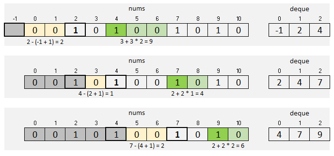

[1248.Count Number of Nice Subarrays](https://leetcode.com/problems/count-number-of-nice-subarrays/)

* Roblox
* Two Pointers
* Hints:
    * After replacing each even by zero and every odd by one can we use prefix sum to find answer.
    * Can we use two pointers to count number of sub-arrays?
    * Can we store indices of odd numbers and for each k indices count number of sub-arrays contains them?

## Method 1. atMot()
* Ref1: [[Java/C++/Python] Sliding Window, O(1) Space](https://leetcode.com/problems/count-number-of-nice-subarrays/discuss/419378/JavaC%2B%2BPython-Sliding-Window-O(1)-Space)
Key Points:
1. **The amount of subarrays with at most k odd numbers** - **The amount of subarrays with at most k-1 odd numbers**
2. `res += j - i + 1` will process no mater the amount of odd numbers is K or less. 
```java
class Solution {
    public int numberOfSubarrays(int[] nums, int k) {
        return atMost(nums, k) - atMost(nums, k-1);
    }
    
    public int atMost(int[] nums, int k) {
        int res = 0;
        for(int i=0, j=0; j < nums.length; j++) {
            k -= nums[j] % 2;
            while(k < 0) {
                k += nums[i] % 2;
                i++;
            }   // After the while loop, the range [i, j] contains at most k odd number
            res += j - i + 1;
        }
        return res;
    }
}
```


## Method 2. One Pass
Key Points:
1. Use `k` to count the odd number in the range `[i, j]`
2. Every time, when we increased `j` and find an odd number, we need to set `count = 0`;
3. When `k == 0`, this means there has exactly `k` odd numbers in the range `[i, j]`.
4. Only when facing a new odd number, we need to set `count = 0`, this means that when we have `[1, 1, 1]`, we increment 1, and when we have `[1, 1, 1, 2]` and `[1, 1, 1, 2, 2]`, we also increment res. This is because we doesn't change the value of `count` when facing an even number.
```java
class Solution {
    public int numberOfSubarrays(int[] nums, int k) {
        int res = 0;
        int count = 0;
        for(int i=0, j=0; j<nums.length; j++) {
            if(nums[j] % 2 == 1) {
                k--;
                count = 0;
            }
            while(k == 0) {
                k += nums[i++] & 1;     // 1 & 1 = 1, 0 & 1 = 0
                count++;
            }
            res += count;
        }
        return res;
    }
}
```

or

```java
class Solution {
    public int numberOfSubarrays(int[] nums, int k) {
        int res = 0;
        int count = 0;
        for(int i=0, j=0; j<nums.length; j++) {
            if(nums[j] % 2 == 1) {
                k--;
                count = 0;
            }
            while(k == 0) {
                k += (nums[i++] % 2 == 1) ? 1 : 0;
                count++;
            }   // after the while loop, [i, ..., i'], where i' = i + count - 1, i.e. the len of [i, ..., i'] is count
            res += count;
        }
        return res;
    }
}
```


## Method 3. [Java/C++ with picture, deque](https://leetcode.com/problems/count-number-of-nice-subarrays/discuss/419545/JavaC%2B%2B-with-picture-deque)

Key Points:
1. 假设我们当前有一个 nice array `arr[i, j]`,如果这个 subarray 前后都有 even numbers，那么 `arr[i, j]` 加上前后的 even numbers， 
```java
class Solution {
    public int numberOfSubarrays(int[] nums, int k) {
        LinkedList<Integer> deque = new LinkedList<>();
        deque.add(-1);
        int res = 0;
        for(int i=0; i<nums.length; i++) {
            if(nums[i] % 2 == 1) {
                deque.add(i);
            }
            if(deque.size() > k + 1) {
                deque.pop();
            }
            if(deque.size() == k + 1) { // If we meet even number, the account of nice array does not change
                res += deque.get(1) - deque.get(0);
            }
        }
        return res;
    }
}
```


## Method 4. [Equation](https://leetcode.com/problems/count-number-of-nice-subarrays/discuss/419378/JavaC++Python-Sliding-Window-O(1)-Space/377965)
```java
class Solution {
    public int numberOfSubarrays(int[] nums, int k) {
        List<Integer> oddIndexList = new ArrayList<>();
        oddIndexList.add(-1);   // left boundary, exclusive
        for(int i=0; i<nums.length; i++) {
            if(nums[i] % 2 == 1) {
                oddIndexList.add(i);
            }
        }
        
        oddIndexList.add(nums.length);  // right boundary, exclusive
        // Example: nums = [2, 2, 2, 1, 2, 2, 1, 2, 2, 2], k = 2
        // oddIndexList = {-1, 3, 6, 10}
        int res = 0;
        for(int i=1; i+k<oddIndexList.size(); i++) {
            res += (oddIndexList.get(i) - oddIndexList.get(i-1)) * (oddIndexList.get(i+k) - oddIndexList.get(i+k-1));
        }
        return res;
    }
}
```

## Reference:
1. [[Java/C++/Python] Sliding Window, O(1) Space](https://leetcode.com/problems/count-number-of-nice-subarrays/discuss/419378/JavaC%2B%2BPython-Sliding-Window-O(1)-Space)
2. [Java/C++ with picture, deque](https://leetcode.com/problems/count-number-of-nice-subarrays/discuss/419545/JavaC%2B%2B-with-picture-deque)