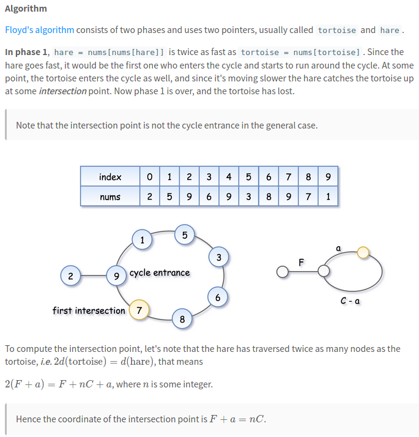
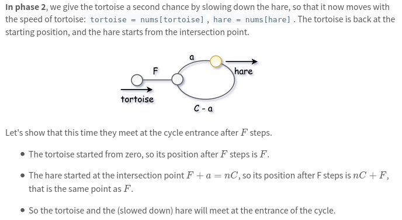
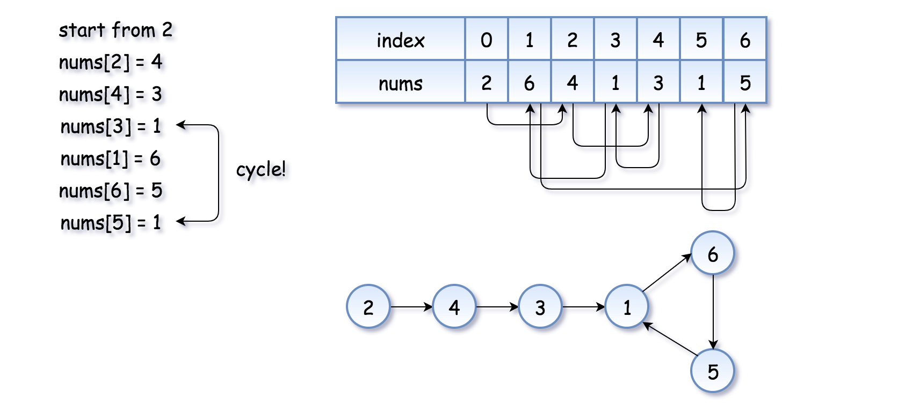

[287. Find the Duplicate Number](https://leetcode.com/problems/find-the-duplicate-number/)

* Amazon, Google, Microsoft, Facebook, Apple, Adobe
* Array, Two Pointers, Binary Search
* Similar Questions:
    * First Missing Positive
    * Single Number
    * Linked List Cycle II
    * Missing Number
    * Set Mismatch
    
    
Note:       
The first two approaches mentioned do not satisfy the constraints given in the prompt, but they are solutions that you might be likely to come up with during a technical interview.         
As an interviewer, I personally would not expect someone to come up with the cycle detection solution unless they have heard it before.     
[前两种方法可能是大部分人在面试过程中会想出来。作为面试官，个人并不会期望面试者能想出 `cycle detection` 的方法。]

分析：     
在给 n+1 个数字，每个数字都 [1-n] 之间，那么至少有一个数字是重复出现的。如果用一个 array 储存这些数字，则有一个数字出现了两次，也就是循环的入口。

## Methed 1. Sorting
```java 
class Solution {
    public int findDuplicate(int[] nums) {
        Arrays.sort(nums);
        for (int i = 1; i < nums.length; i++) {
            if (nums[i] == nums[i-1]) {
                return nums[i];
            }
        }

        return -1;
    }
}
```


## Method 2. Set
```java 
class Solution {
    public int findDuplicate(int[] nums) {
        Set<Integer> seen = new HashSet<Integer>();
        for (int num : nums) {
            if (seen.contains(num)) {
                return num;
            }
            seen.add(num);
        }

        return -1;
    }
}
```


## Method 3. Floyd's Tortois and Hare (Cycle Detection) 
[Floyd's Algorithm](https://en.wikipedia.org/wiki/The_Tortoise_and_the_Hare)

     
In phase 1: 在 Floyd's 算法中，假定 cycle 是存在的。然后一只兔子(hare)和一只乌龟(tortoise)同时从起点开始起跑，并设置 hare 的速度是 tortoise 的两倍，
则有 hare 先进入 cycle，最中会在 cycle 的某处，tortoise 和 hare 会相遇，则有下面的公式成立：
```
Since the speed of hare is two times of tortoise, d(hare) = 2 x d(tortoise), 
=> F + nC + a = 2 x (F + a), where `n` is some integer.
=> nC = F + a
=> F = nC - a
Since C is the length of the cycle, then
=> F = nC - a
     = (nC - a) % C
     = C - a 
```


In phase 2: 给乌龟(tortoise)第二次机会，让它从头开始，并且降低野兔(hare)的速度：`tortoise = nums[tortoise], hare = nums[hare]`，让野兔(hare)从**阶段1**中的交叉点开始。
1. 因为乌龟从起点开始，经过 F steps 之后，乌龟将会在 cycle entrance；
2. 而野兔在 `F + a = nC` 处，也就是 Phase 1 中的 intersection point，则在 F steps 之后，也图将会在 `(nC + F) % C = F = C - a`，也就是 cycle entrance。
3. 所以有乌龟和野兔都在 cycle entrance 处，也就是环的起点。


The idea is to reduce the problem to `Linked List Cycle II`: Given a linked list, return the node where the cycle begins.       
Each new element in the sequence is an element in nums at the index of the `previous` element.          
The cycle appears because `nums` contains duplicates. The duplicate node is a cycle entrance.



In the array, there are two 1s, i.e. `nums[3]=1` and `nums[5]=1`, which means that `3 -> 1` and `5 -> 1`

If there is no cycle in the array, just a chain will exist in the array.

```java 
class Solution {
    public int findDuplicate(int[] nums) {
        // Find the intersetion point of the two runners
        int tortoise = nums[0];
        int hare = nums[0];
        do {
            tortoise = nums[tortoise];
            hare = nums[nums[hare]];
        } while(tortoise != hare);
        
        // Find the "entrance" to the cycle.
        tortoise = nums[0];
        while(tortoise != hare) {
            tortoise = nums[tortoise];
            hare = nums[hare];
        }
        return hare;
    }
}
```


## Method 2
```java
class Solution {
    public int findDuplicate(int[] nums) {
        int slow = 0;
        int fast = 0;
        
        // Phase 1: detect a cycle
        slow = nums[slow];
        fast = nums[nums[fast]];
        while(nums[slow] != nums[fast]) {
            slow = nums[slow];
            fast = nums[nums[fast]];
        }
        
        // Phase 2: find the begining of the cycle
        fast = 0;
        while(nums[slow] != nums[fast]) {
            fast = nums[fast];
            slow = nums[slow];
        }
        
        return nums[fast];
    }
}
```


## Problem:
```java 
class Solution {
    public int findDuplicate(int[] nums) {
        int tortoise = nums[0];
        int hare = nums[nums[0]];
        while(tortoise != hare) {
            tortoise = nums[tortoise];
            hare = nums[nums[hare]];
        }
        
        tortoise = nums[0];
        while(tortoise != hare) {
            tortoise = nums[tortoise];
            hare = nums[hare];
        }
        return hare;
    }
}
```

`nums = [1, 3, 4, 2, 2]` 会出现死循环。