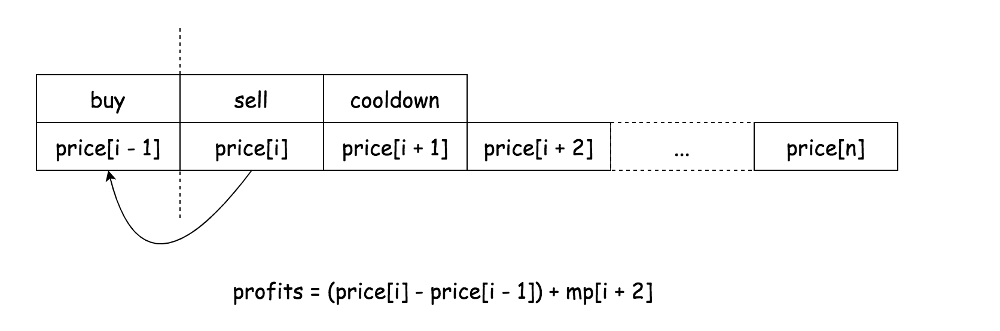

[309. Best Time to Buy and Sell Stock with Cooldown](https://leetcode.com/problems/best-time-to-buy-and-sell-stock-with-cooldown/)

* Amazon
* Dynamic Programming
* Similar Questions:
    * [121. Best Time to Buy and Sell Stock](https://leetcode.com/problems/best-time-to-buy-and-sell-stock/)   
    * [122. Best Time to Buy and Sell Stock II](https://leetcode.com/problems/best-time-to-buy-and-sell-stock-ii/)
    
    
## Method 1. DP

Algorithm:
* Each element in each array represents the maximal profits that we could gain at the specific price point `i` with the specific state. 
For instance, the element `sold[2]` represents the maximal profits we gain if we sell the stock at the price point `price[2]`.
* According to the state machine we defined before, we can then deduce the formulas to calculate the values for the state arrays, as follows:
    * `sold[i]=hold[i−1]+price[i]`
    * `held[i]=max(held[i−1],reset[i−1]−price[i])`
    * `reset[i]=max(reset[i−1],sold[i−1])`
Here is how we interpret each formulas:
    * `sold[i]`: the previous state of sold can only be held. Therefore, the maximal profits of this state is the maximal 
    profits of the previous state plus the revenue by selling the stock at the current price.
    * `held[i]`: the previous state of held could also be held, i.e. one does no transaction. Or its previous state
     could be reset, from which state, one can acquire a stock at the current price point.
    * `reset[i]`: the previous state of reset could either be reset or sold. Both transitions do not involve any transaction with the stock.
* In particular, as a base case, **the game should be kicked off from the state reset**, since initially we don't hold 
any stock and we don't have any stock to sell neither. Therefore, we assign the initial values of `sold[-1]` and `held[-1]` 
to be `Integer.MIN_VALUE`, which are intended to render the paths that start from these two states impossible.
    * `held = Math.max(held, reset - price)`, 当 `held = Integer.MIN_VALUE`，最开始的状态就可以保证是从 `reset=0`开始。
    如果 `held=0, reset=0`, 那么买 `prices[0]` 的时候，就是从 `held=0` 开始。
    
```java
class Solution {
    public int maxProfit(int[] prices) {
        int sold = Integer.MIN_VALUE;
        int held = Integer.MIN_VALUE;
        int reset = 0;
        for(int price: prices) {
            int preSold = sold;
            
            sold = held + price;
            held = Math.max(held, reset - price);
            reset = Math.max(reset, preSold);
        }
        return Math.max(sold, reset);
    }
}
```
Complexity Analysis
1. Time Complexity: `O(N)` where `N` is the length of the input price list. We have one loop over the input list, 
and the operation within one iteration takes constant time.
2. Space Complexity: `O(1)`, constant memory is used regardless the size of the input. 


## Method 2. Dynamic Programming

Key Points:
1. For a sequence of prices, denoted as `price[0,1,...,n]`, let us first define our target function called `MP(i)`. 
The function `MP(i)` gives the maximal profits that we can gain for the price subsequence starting from the index `i`, i.e. `price[i,i+1,...,n]`.
2. Given the definition of the `MP(i)` function, one can see that when `i=0` the output of the function, i.e. `MP(0)`, 
is exactly the result that we need to solve the problem, which is the maximal profits that one can gain for the price subsequence of `price[0,1,...,n]`.
3. Now, let us add a new price point `price[i−1]` into the subsequence `price[i...n]`, all we need to do is to deduce the value for the unknown `MP(i−1)`.
4. Deduction: With the newly-added price point `price[i−1]`, we need to consider all possible transactions that we can 
do to the stock at this price point, which can be broken down into two cases:
    * Case 1): we buy this stock with `price[i−1]` and then sell it at some point in the following price sequence of `price[i...n]`. See upper formula.
    * `C1=max{k∈[i,n]}(price[k]−p[i−1]+MP(k+2))`
    * `C2=MP(i)`
    * By combining the above two cases, i.e. selecting the max value among them, we can obtain the value for `MP(i−1)`, as follows:
        * `MP(i−1)=max(C1,C2)`
```java
class Solution {
    public int maxProfit(int[] prices) {
        int[] MP = new int[prices.length+2];
        
        for(int i=prices.length-1; i>=0; i--) {
            int C1 = 0;
            // Case 1: Buy and sell the stock
            for(int sell=i+1; sell<prices.length; sell++) {
                int profit = (prices[sell] - prices[i]) + MP[sell + 2];
                C1 = Math.max(profit, C1);
            }
            
            // Case 2: Do no transaction with the stock p[i]
            int C2 = MP[i+1];
            
            // Wrap up the two cases
            MP[i] = Math.max(C1, C2);
        }
        return MP[0];
    }
}
```
Complexity Analysis
1. Time Complexity: `(N^2)` where `N` is the length of the price list. As one can see, we have nested loops over the price list. 
The number of iterations in the outer loop is `N`. The number of iterations in the inner loop varies from `1` to `N`. 
Therefore, the total number of iterations that we perform is $\sum_{i=1}^{N} i = \frac{N\cdot(N+1)}{2}$.
As a result, the overall time complexity of the algorithm is `(N^2)`.
2. Space Complexity: `O(N)` where `N` is the length of the price list.
We allocated an array to hold all the values for our target function `MP(i)`. 


## My Solution, 
#### Not work
```java
class Solution {
    public int maxProfit(int[] prices) {
        if(prices == null || prices.length < 2) {
            return 0;
        }
        
        int N = prices.length;
        int[][][] dp = new int[N+1][2][2];
        // i: curr day
        // j: with or without holding stock
        // k: cooldown, when k==1, it is ok to buy stock
        dp[0][0][0] = 0;    // Do nothing on the first day
        dp[0][0][1] = 0;    // Do nothing on the first day, 
        dp[0][1][0] = -prices[0];   // Buy stock on the first day
        // After we know the status of i-th day:
        // buy
        // sell
        // do nothing
        for(int i=1; i<N; i++) {
            // Holding one stock 
            dp[i][1][0] = Math.max(dp[i-1][1][0], dp[i-1][0][1] - prices[i]);
            // Without holding one stock, sell or keep original status
            dp[i][0][1] = dp[i-1][0][0];
            dp[i][0][0] = dp[i-1][1][1]+prices[i];
        }
        
        dp[N][0][0] = dp[N-1][0][1];
        dp[N][0][1] = dp[N-1][0][0];
        int res = 0;
        for(int i=0; i<=N; i++) {
            res = Math.max(res, Math.max(dp[i][0][0], dp[i][0][1]));
        }
        // res = Math.max(res, dp[N-1][0][1]);
        return res;
    }
}
```

#### Work
```java
class Solution {
    public int maxProfit(int[] prices) {
        if(prices == null || prices.length < 2) {
            return 0;
        }
        
        int N = prices.length;
        int[][] dp = new int[N+1][3];
        dp[0][0] = Integer.MIN_VALUE;   // sold
        dp[0][1] = Integer.MIN_VALUE;   // hold
        dp[0][2] = 0;                   // reset
        for(int i=0; i<prices.length; i++) {
            // sold
            dp[i+1][0] = Math.max(dp[i][1] + prices[i], dp[i][0]);
            // hold
            dp[i+1][1] = Math.max(dp[i][2] - prices[i], dp[i][1]);
            dp[i+1][2] = Math.max(dp[i][0], dp[i][2]);
        }
        
        return Math.max(dp[N][0], dp[N][2]);
    }
}
```

## Reference
1. [Solution](https://leetcode.com/problems/best-time-to-buy-and-sell-stock-with-cooldown/solution/)
2. [Share my thinking process](https://leetcode.com/problems/best-time-to-buy-and-sell-stock-with-cooldown/discuss/75927/Share-my-thinking-process)
