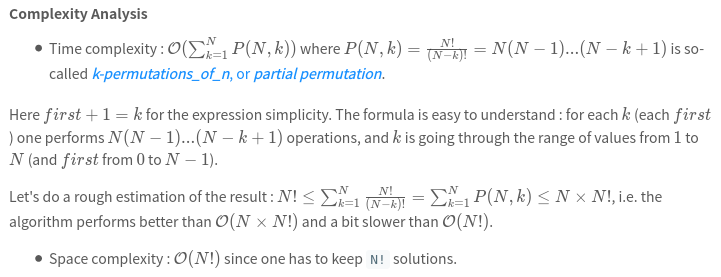

[46. Permutations](https://leetcode.com/problems/permutations/)

* Amazon, Microsoft, Facebook, Google, Apple, LinkedIn, eBay, Yahoo, Oracle, Uber, Atlassian, ByteDance
* Backtracking
* Similar Questions:
    * Next Permutation
    * Permutations II
    * Permutation Sequence
    * Combinations
    
  
## Method 1. Backtracking
> **Backtracking** is an algorithm for finding all solutions by exploring all potential candidates.         
> If the solution candidate turns to be *not* a solution (or at least not the *last* one), backtracking algorithm discards it by making some changes on the previous step, i.e. **backtracks** and then try again.
>
```java 
class Solution {
    public List<List<Integer>> permute(int[] nums) {
        List<List<Integer>> res = new ArrayList<List<Integer>>();
        
        backtrack(res, nums, 0);
        return res;
    }
    
    private void backtrack(List<List<Integer>> res, int[] nums, int start) {
        if(start == nums.length) {
            List<Integer> tmp = new ArrayList<Integer>();
            for(int num: nums) {
                tmp.add(num);
            }
            res.add(tmp);
            return;
        } 
        for(int i=start; i<nums.length; i++) {
            swap(nums, start, i);
            backtrack(res, nums, start+1);
            swap(nums, start, i);
        }
    }
    
    private void swap(int[] nums, int i, int j) {
        int tmp = nums[i];
        nums[i] = nums[j];
        nums[j] = tmp;
    }
}
```


## Method 2. Backtracking
```java 
class Solution {
    public List<List<Integer>> permute(int[] nums) {
        // Init the res list
        List<List<Integer>> res = new ArrayList<List<Integer>>();
        
        // Convert nums into list since the output is a list of lists
        ArrayList<Integer> numsList = new ArrayList<Integer>();
        for(int num: nums) {
            numsList.add(num);
        }
        
        backtrack(res, numsList, nums.length, 0);
        return res;
    }
    
    private void backtrack(List<List<Integer>> res, List<Integer> nums, int n, int first) {
        // If all integers are used up
        if(first == n) {
            res.add(new ArrayList<Integer>(nums));
        }
        
        for(int i=first; i<n; i++) {
            // Place i-th integer first in the current permutation
            Collections.swap(nums, first, i);
            // Use rest integers to complete the permutations
            backtrack(res, nums, n, first+1);
            // Backtrack
            Collections.swap(nums, first, i);
        }
    }
}
```

