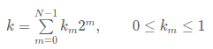

[60. Permutation Sequence](https://leetcode.com/problems/permutation-sequence/)

* Facebook, Amazon
* Math, Backtracking
* Similar Questions:
    * Next Permutation
    * Permutations
    
    
[Solution](https://leetcode.com/problems/permutation-sequence/solution/)

> There are three main type of interview questions about permutations:
> 1. Generate all permutations;
> 2. Generate next permutations;
> 3. Generate the permutation number k (current problem).
> If the order of generated permutations is not important, one could use **swap backtracking** to solve the 1st problem and to generate all `N!` permutations in `O(N x N!)` time.      
> It is better to generate permutations in lexicongraphically sorted order using **D.E. Knuth algorithm**. This could be used to solve the 2nd problem above.
> 
> The problem 3 is where the fun starts because the above two algorithms do not apply:
> * You will be asked to fit into polynomial time complexity, i.e. no backtracking;
> * The previous permutation is unknown, i.e. you cannot use D.E. Knuth algorithm.
>
> To solve the problem, one could use a pretty elegant idea that is based on the mapping. It's much easier to generate numbers than combinations or permutations.
> * So let us generate numbers, and then map them to combinations/subsets/permutations.
> This sort of encoding is widely used in password-cracking algorithms.
>
> [Factorial Number System Representation](https://en.wikipedia.org/wiki/Factorial_number_system)

## Method 1. Factorial Number System
> For example, each subset could be described by a number in binary representation:
> 
>

```java 
class Solution {
    public String getPermutation(int n, int k) {
        int[] factorials = new int[n];
        List<Integer> nums = new ArrayList<Integer>() {
            {add(1);}
        };
        factorials[0] = 1;
        for(int i=1; i<n; i++) {
            // Generate factorial system bases 0!, 1!, ..., (n-1)!
            factorials[i] = factorials[i-1] * i;
            // Generate nums 1, 2, ..., n
            nums.add(i + 1);
        }
        
        // Fit k in the interval 0, ..., (n! - 1)
        k--;
        
        // Compute factorial representation of k
        StringBuilder sb = new StringBuilder();
        for(int i=n-1; i>=0; i--) {
            int idx = k / factorials[i];
            k -= idx * factorials[i];
            
            sb.append(nums.get(idx));
            nums.remove(idx);
        }
        return sb.toString();
    }
}
```
Complexity Analysis

    Time complexity: O(N^2), because to delete elements from the list in a loop one has to perform `N+(N−1)+...+1=N(N−1)/2` operations.
    Space complexity: O(N).


## Method 2. 
If n = 4, we have {1, 2, 3, 4}. If we were to list out all permutations, we have:           
1 + {permutations of 2, 3, 4},          
2 + {permutations of 1, 3, 4},          
3 + {permutations of 1, 2, 4},          
4 + {permutations of 1, 2, 3},          

We know how to calculate the number of permutations of n numbers ==> `n!`. [如果有 n 个数字，总共可以有 `n！` 种组合。]          
There are 6 possible permutations with 3 numbers.           
If we want to look for 14-th permutation, it would be in the `3 + {permutations of 1, 2, 4}` subset.            

To programmatically get that, we take `k = 13` and divide that by the 6 we got from the factorial, which would give you the index of the number you want.       
In the array `{1, 2, 3, 4}`, k/(n-1)! = 13/(4-1)! = 13/6 = 2. The array `{1, 2, 3, 4}` have a value of 3 at index 2. So the first number should be 3.   

Then the problem repeats with less numbers. The permutations of `{1, 2, 4}` would be:       
1 + {permutations of 2, 4}          
2 + {permutations of 1, 4}          
4 + {permutations of 1, 2}          

We've already eliminated 12 4-number permutations starting with 1 and 2. So we subtract 12 from k, which gives 1. Programmatically that would be...
`k = k - (index from previous) * (n - 1)! = k - 2 * (n - 1)! = 13 - 2 * 3! = 1`         
In this second step, permutations of 2 numbers has only 2 possibilities, meaning each of the three permutations listed above a have two possibilities.
 


```java 
public class Solution {
    public String getPermutation(int n, int k) {
        int pos = 0;
        List<Integer> numbers = new ArrayList<>();
        int[] factorial = new int[n+1];
        StringBuilder sb = new StringBuilder();
        
        // create an array of factorial lookup
        int sum = 1;
        factorial[0] = 1;
        for(int i=1; i<=n; i++){
            sum *= i;
            factorial[i] = sum;
        }
        // factorial[] = {1, 1, 2, 6, 24, ... n!}
        // with 0 number, we consider that there is only one permutation
        // with 1 number, there is only one permutation
        // with 2 numbers, there are 2 permutations
        // with 3 numbers, there are 6 permutations
        // with 4 numbers, there are 24 permutations
        
        // create a list of numbers to get indices
        for(int i=1; i<=n; i++){
            numbers.add(i);
        }   // numbers = {1, 2, 3, 4}
        
        k--;    // Substract 1 is because of things always starting at 0.
        
        for(int i = 1; i <= n; i++){
            int index = k/factorial[n-i];
            sb.append(String.valueOf(numbers.get(index)));
            numbers.remove(index);
            k-=index*factorial[n-i];
        }
        
        return String.valueOf(sb);
    }
}
```
Supporse we want 14-th permutations, i.e. the 13-th (from 0-based).
1. `i = 1`, `index = k / factorial[4-1] = 13 / 6 = 2`, therefore the first digit should be `numbers.get(2) = 3`, `numbers.remove(2) = {1, 2, 4}`, `k -= 2 * factorial[4 - 1] ==> k -= 2 * 6 = 1`;
2. `i = 2`, `index = k / factorial[4 - 2] = 1 / 2 = 0`, therefore the second digit should be `numbers.get(0) = 1`, `numbers.remove(0) = {2, 4}`, `k -= 0 * factorial[4-2] ==> k -= 0 * 2 = 1`;
3. `i = 3`, `index = 1 / factorial[4 - 3] = 1 / 1 = 1`, therefore the third digit should be `numbers.get(1) = 4`, `numbers.remove(1) = {2}`, `k -= 1 * factorial[4 - 3] ==> k -= 1 * 1 = 0`;


