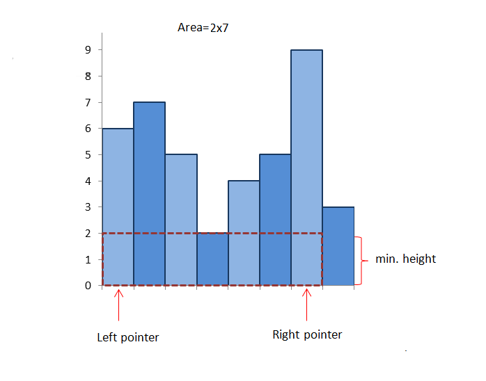
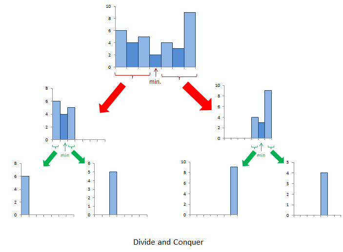

[84. Largest Rectangle in Histogram](https://leetcode.com/problems/largest-rectangle-in-histogram/)

* Amazon, Google, Bloomberg, ByteDance, Huawei
* Array, Stack
* Similar Questions:
    * [85. Maximal Rectangle](https://leetcode.com/problems/maximal-rectangle/)

## Method 1. Brute Force
Intuition:
1. Firstly, we need to take into account the fact that the height of the rectangle formed between any two bars will always
be limited by the height of the shortest bar lying between them.        

2. Then we can simply start off by considering possible pair of bars and finding the area of the rectangle formed between 
them using the height of the shortest bar lying between them as the height and the spacing between them as the width of 
the rectangle.

```java
class Solution {
    public int largestRectangleArea(int[] heights) {
        if(heights == null || heights.length == 0) {
            return 0;
        }
        
        int maxArea = 0;
        for(int i=0; i<heights.length; i++) {
            for(int j=i; j<heights.length; j++) {
                int minHeight = Integer.MAX_VALUE;
                for(int k=i; k<=j; k++) {
                    minHeight = Math.min(minHeight, heights[k]);
                }
                maxArea = Math.max(maxArea, minHeight * (j - i + 1));
            }
        }
        return maxArea;
    }
}
```
Complexity Analysis
1. Time complexity : `O(n^3)`. We have to find the minimum height bar `O(n)` lying between every pair `O(n^2)`.
2. Space complexity : `O(1)`. Constant space is used. 


## Method 2. Better Brute Force
Intuition:
1. We can do one slight modification in the previous approach to optimize it to some extent.
2. We can find the bar of minimum height for current pair by using the minimum height bar of the previous pairs.
3. In mathematical terms, `minHeight = min(minHeight, heights[j])`, where `height[j]` refers to the height of the `j-th` bar.

```java
class Solution {
    public int largestRectangleArea(int[] heights) {
        if(heights == null || heights.length == 0) {
            return 0;
        }
        
        int maxArea = 0;
        for(int i=0; i<heights.length; i++) {
            int minHeight = Integer.MAX_VALUE;
            for(int j=i; j<heights.length; j++) {
                minHeight = Math.min(minHeight, heights[j]);
                maxArea = Math.max(maxArea, minHeight * (j - i + 1));
            }
        }
        return maxArea;
    }
}
```
Complexity Analysis
1. Time complexity : `O(n^2)`. Every possible pair is considered
2. Space complexity : `O(1)`. No extra space is used. 


## Method 3. Divide and Conquer
Algorithm: This approach relies on the observation that the rectangle with maximum area will be the maximum of:
1. The widest possible rectangle with height equal to the height of the shortest bar.
2. The largest rectangle confined to the left of the shortest bar(subproblem).
3. The largest rectangle confined to the right of the shortest bar(subproblem).



```java
class Solution {
    public int largestRectangleArea(int[] heights) {
        if(heights == null || heights.length == 0) {
            return 0;
        }
        return calculateArea(heights, 0, heights.length - 1);
    }
    
    public int calculateArea(int[] heights, int start, int end) {
        if(start > end) {
            return 0;
        }
        int minIndex = start;
        for(int i=start; i<=end; i++) {
            if(heights[minIndex] > heights[i]) {
                minIndex = i;
            }
        }
        return Math.max(heights[minIndex] * (end - start + 1),
                       Math.max(calculateArea(heights, start, minIndex-1), calculateArea(heights, minIndex+1, end)));
    }
}
```
Complexity Analysis
1. Time complexity : Average Case: `O(nlog n)`. Worst Case: `O(n^2)`. If the numbers in the array are sorted, we don't gain the advantage of divide and conquer.
2. Space complexity : `O(n)`. Recursion with worst case depth nnn. 


## Method 4. Using Stack
Key Points:
1. Initially, we push a `-1` onto the stack to mark the end.
2. We start with the leftmost bar and keep pushing the current bar's index onto the stack until **we get two successive numbers in descending order**, i.e. until we get `a[i-1] > a[i]`.
3. `(i−stack[top−1]−1)×a[stack[top]].`

```java
class Solution {
    public int largestRectangleArea(int[] heights) {
        if(heights == null || heights.length == 0) {
            return 0;
        }
        
        Deque<Integer> stack = new ArrayDeque<>();
        stack.push(-1);
        int maxArea = 0;
        for(int i=0; i<heights.length; i++) {
            while(stack.peek()!=-1 && heights[stack.peek()] >= heights[i]) {
                maxArea = Math.max(maxArea, heights[stack.pop()] * (i - stack.peek() - 1)); // [stack.pop(), i)
            }
            stack.push(i);
        }
        while(stack.peek() != -1) {
            maxArea = Math.max(maxArea, heights[stack.pop()] * (heights.length - stack.peek() - 1));
        }
        return maxArea;
    }
}
```
Complexity Analysis
1. Time complexity : `O(n)`. nnn numbers are pushed and popped.
2. Space complexity : `O(n)`. Stack is used


## Reference:
1. [84. Largest Rectangle in Histogram](https://leetcode.com/problems/largest-rectangle-in-histogram/)


### My Stack Solution, doesn't work
```java
class Solution {
    public int largestRectangleArea(int[] heights) {
        if(heights == null || heights.length == 0) {
            return 0;
        }
        
        Deque<Integer> stack = new ArrayDeque<>();
        int i = 0;
        int maxArea = 0;
        int minHeight = Integer.MAX_VALUE;
        while(i < heights.length) {
            while(stack.isEmpty() || heights[stack.peek()] >= heights[i]) {
                minHeight = Math.min(minHeight, heights[i]);
                stack.push(i);
                i++;
            }   // After this while loop, we find the min height right now, i.e. heights[stack.peek()]
            
            while(!stack.isEmpty()) {
                minHeight = Math.min(minHeight, heights[stack.peek()]);
                maxArea = Math.max(maxArea, stack.size() * heights[stack.pop()]);
            }
            
            stack.push(i);
            i++;
        }
        return (maxArea > minHeight * heights.length) ? maxArea : minHeight * heights.length;
    }
}
```


