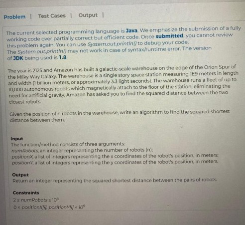
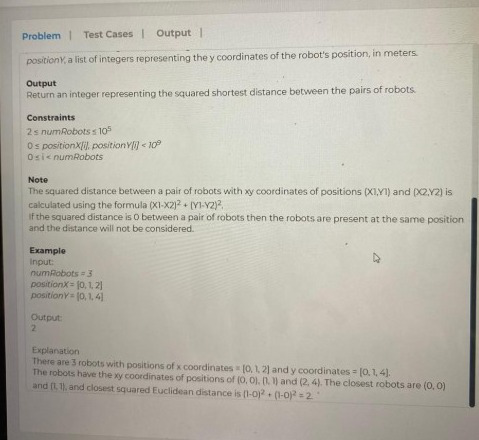

[Amazon | OA 2020 | Shortest Distance Between Robots](https://leetcode.com/discuss/interview-question/799431/AMAZON-OA-2021-NEW-GRAD/)





Given the position of `n` robots in the warehouse. 
Write an algorithm to find the squared shortest distance between them.

Input:      
1. `numRobots` (n)
2. `positionX`: A list of integers
3. `positionY`: A list of integers


## Method 1. Divide and Conquer
[Closest Distance](https://leetcode.com/playground/Pxx3rabY)
```java
public class ClosestPointPair {
    // A recursive function to find the smallest distance.
    // The points array contains all points sorted according to x coordination
    public double closestDistance(Point[] points, int n) {
        // If there are 2 or 3 points, then use brute force
        if(n <= 3) {
            return bruteForce(points, n);
        }
        
        Arrays.sort(points, (p1, p2) -> (p1.x - p2.x));
        
        // Find the middle point
        int mid = n / 2;
        Point midPoint = points[mid];
        
        // Consider the vertical line passing through the middle point,
        // calculate the smallest distance dl on left of middle point and dr on right side
        double dl = closestDistance(Arrays.copyOfRange(points, 0, mid), mid);
        double dr = closestDistance(Arrays.copyOfRange(points, mid, points.length), points.length - mid);
        
        // Find the smaller of two distances
        double d = Math.min(dl, dr);
        
        // Build a Point[] array to contains points close (closer than d) to the line 
        // passing through the middle point
        Point[] strip = new Point[n];
        int j = 0;
        for(int i=0; i<n; i++) {
            if(Math.abs(points[i].x - midPoint.x) < d) {
                strip[j++] = points[i];
            }
        }
        
        // Find the closest points in strip.
        // Return the minimum of d and closest distance in strip[]
        return Math.min(d, stripClosest(Arrays.copyOfRange(strip, 0, j), j, d));
    }
    
    // A brute force method to return the smallest distance between two points int Points[] of size n
    private double bruteForce(Point[] points, int n) {
        double min = Double.MAX_VALUE;
        double dist = 0.0;
        for(int i=0; i<n; i++) {
            for(int j=i+1; j<n; j++) {
                dist = distance(points[i], points[j]);
                if(dist < min) {
                    min = dist;
                }
            }
        }
        return min;
    }
    
    // A utility function to find the distance between two points
    private double distance(Point p1, Point p2) {
        // return Math.sqrt((p1.x - p2.x) * (p1.x - p2.x) + (p1.y - p2.y) * (p1.y - p2.y));
        return (p1.x - p2.x) * (p1.x - p2.x) + (p1.y - p2.y) * (p1.y - p2.y);
    }
    
    private double stripClosest(Point[] strip, int size, double d) {
        double min = d; // Initialize the minimum distance as d
        Arrays.sort(strip, (a, b) -> (a.y - b.y));
        // Pick all points one by one and try the next points till the difference between y coordinates is 
        // smaller than d.
        for(int i=0; i<size; i++) {
            for(int j=i+1; j<size && (strip[j].y - strip[i].y) < min; j++) {
                min = Math.min(min, distance(strip[i], strip[j]));
            }
        }
        return min;
    }
    
    
    public static void main(String[] args) {
        System.out.println("Hello World!");
        ClosestPointPair cpp = new ClosestPointPair();
        
        Point[] points1 = new Point[]{
            new Point(2, 3),
            new Point(12, 30),
            new Point(40, 50),
            new Point(5, 1),
            new Point(12, 10),
            new Point(3, 5),
        };
        double dist1 = cpp.closestDistance(points1, points1.length);
        System.out.println("Minimum distance: " + dist1);
        
        Point[] points2 = new Point[]{
            new Point(0, 0),
            new Point(1, 1),
            new Point(2, 4),
        };
        double dist2 = cpp.closestDistance(points2, points2.length);
        System.out.println("Minimum distance: " + dist2);
    }
}

/**
* A class to represent a Point in 2D plate.
*/
class Point {
    int x;
    int y;
    
    public Point(int x, int y) {
        this.x = x;
        this.y = y;
    }
}
```


## Method 2. 备选方案
[]()