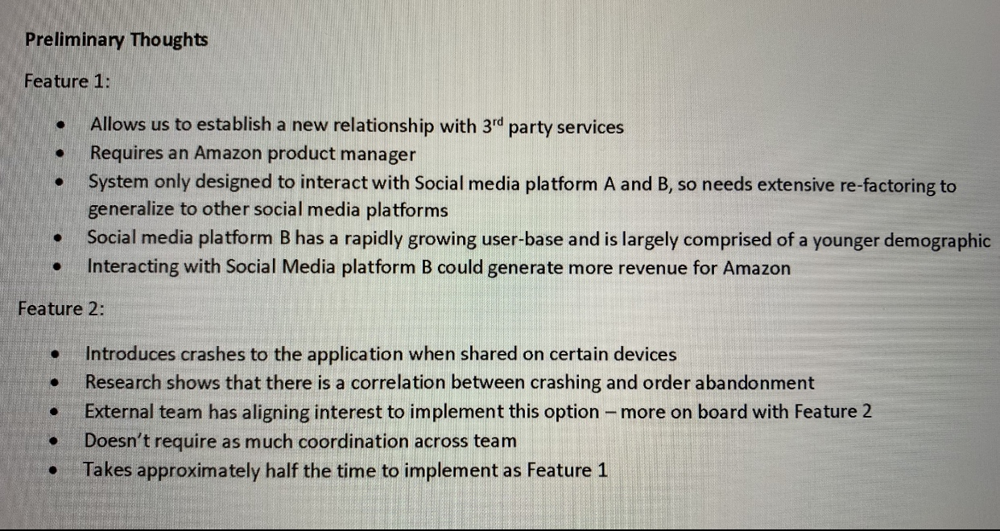

HR挺不错，prep call时还告知了军规考察重点：**earn & be curious, earn trust, deliver results, invent & simplify**

形式是3轮coding + 1轮system design，每轮2-3道军规考察，还记得的有：
1) a time when you decided to jump in and help others
2) a time when you accomlished your work in some simplified way
3) a time when 做到半路发觉在 chasing the wrong goal
4) a time when 在某个问题产生后果之前发现并解决之
5) a time when you made a difficult choice + follow up what would you have done differently

### OA3

> Module1:
> 制定deliver route plan 需要满足 1.enable 80 deliveries per day 2.should not exceed 200 miles
> 有两个备选方案，第一个每天够了80但是mile数超了好多，第二个mile数没超但送货数量不够
> Q1 问你选哪个 五个statement按effective级别排序
> Q2 问你如果可以request additional info 哪个更重要 （我选了BC）
> A 会影响efficiency的future trends data B mile数和delivery数哪个重要 C 过去100天的data D 城市地图 E 过去3天的performance data
> Q3 给了你过去3天和100天的traffic data 问你planA和B哪个好
> 我真的不知道哪个好啊！！！最后犹豫半天选了第一个 因为送货数量pattern比较符合traffic，也不知道对不对 

> Module2:
> 同组的两个人说你的code不错，一个人说不行要重做
> Q1问你怎么办
> 选项大致就是 A 有人approve了所以就按我的来 B 你说不对就按你的来吧 C meeting决定
> **应该是选和这个人单独offline meeting那个选项 因为接下来就和他讨论了**
> Q2 讨论到了下班，你还是很confused, 但记了好多笔记 问你怎么办 排序
> A 明天再full time meeting B 新方法太难了还是用旧的 C 回家过一遍笔记把能写的都写出来 不能写的记下来明天接着meeting D do as much as you can E找那两个说你做的不错的同事帮你 F 和这人再meet三十分钟（这是要把他累死啊）

> 
>
> Q1 选出4个feature1的优点
> Q2 选出2个feature2的优点
> 两个都不难 比gre阅读简单
> Q3只能implement一个 你选哪个 应该是排序 我选了feature1 应该是对的 因为最后决定做1了
> Q4 有个senior engineer说我们要implement feature 2 问这时候你怎么做
> A 和他还有high level decision makers开会 B 坚持做feature1因为已经讨论过pros and cons了 C 和这人还有external team开会 D 全组投票 E 因为他比你有经验所以听他的 F 问manager
> Q5 manager过来说我们要做feature1，而且要在social media C D E上实现，但是ddl很紧张，问你怎么做 排序
> A 直接跟manager说做不了 需要更多resource B 因为ddl紧张所以不test了 C 排序这三个social media的重要性 先做重要的 把不重要的留到ddl之后 D 先做着 过几周再找manager说你做不完了 需要additional resource（这个不太好吧） E 自己找team member寻求帮助 F 直接驳回 建议只work on 1-2 social medias G 自己work overtime

> Module4:
> 亚麻的product page出问题了，有customer无法查看product info，你manager让你解决
> Q1 What additional info would be helpful? 排序
> A customer region B URL C Screenshot of error page D session ID E Browser versions
> Q2 你怎么fix this bug？ 排序
> A search the logs B look at metrics(latency, error counts, # of requests....) C 手动去看code然后debug（好猛） D 分析有可能会fail的request的log E 跟technician说这是偶然现象 自己会fix F 只分析failed request不看valid request G 因为太urgent了所以立刻去向大佬请教
> Q3 给了log data 让你分析到底哪出错了
> 这题应该选unequal number of rate and review 

> Module5: 这个module好好笑
> 你要debug一个东西，manager跟你说大概需要三天，但PM让你今天就交因为他觉得是个小bug 可以不用test
> Q1 你怎么办 排序
> A 跟senior eng讨论一下risk再决定 B 还是先test过后再release C 跟PM manager开会再决定 D 都有理所以重新问问你manager E 相信PM 不test了
> Q2 一周以后你同事也遇到了相同情况，他想push without test，你怎么办 排序
> 这道题选项记不太清了 大致就以下几种： A 把你上次情况跟他说，劝他别这样 B 不关我事 C 建议他找senior eng讨论下 D 找他manager告状（当时看到这个选项笑得停不下来）
> Q3 马上下班时候收到同事msg，他没听你的，直接push code了，结果翻车了（哈哈哈哈哈哈哈哈哈哈）你怎么办 排序
> A 早跟你说了你不听 B ask for more info about the issue C 帮助他revert code change D 帮助他push另一个code把问题立刻解决（这真的能做到吗。。） E 找senior eng求救 F ignore the message and sign off（这个也好好笑）
> Q4 manager给你发邮件说让你come up with a plan to make sure this doesn't happen again 而且希望你把这个任务prioritize 你怎么搞 单选
> A 跟他说我做完手头的再去做（作死啊） B write up document详细描述 C set up automations来预防 D 规定以后每个code change都必须有至少一个peer review  E 和manager，PM再好好探讨下不test的风险（打PM脸啊这是）F 让之前翻车的同事跟你一起弄

### Work Simulation from 小土刀

> 时间非常充足，可以慢慢做，就是问你要是你你会怎么选，你同意谁的观点和给一下几个做法打分的题
>
> 各个员工讨论case media network 服务器最近好多complaints,有德国的，有invalid  recommendation的，给了个列表好多国家的服务器返回什么404/ german recommendation/ invalid  recom/问是什么原因。还有俩个年轻老白讨论客人要强烈要求有硬皮书的推荐，但服务器里只有digital版本的，到底要不要加这个功能，感觉后面的视频是根据你的选择来的（有待考证）；里面有个会议室白人，亚裔，烙印在讨论服务器最近好多complaints,然后我选则的要看Intenal  test，结果后面会议结束烙印站起来义正言辞跟我说，我已经写了20年服务器了，不可能有错误的，而且我刚刚才调试过机器，绝对不可能是内部错误。呵呵，里面有个选项问，烙印 is not helpful...只能呵呵~~ 大部分跟地里说的一样，类似问卷调查，选deadline更重要 和用户体验更重要。
>
> 第一个情境是给图书馆写图书推荐系统，第一问让两个人继续说，第二问选图书馆的服务器有没有开放关于实体书的api
>
> 后面有会议说系统出现bug，该做出什么反应，选看internal bug 记录。
>
> 最后是五个case看哪个可以通过，前人都提示过，注意user的构造函数没有给email赋值。
>
> simulation就是看email，chat...大家记得每收到email就要看看，我当时碰到没有题的email直接跳过，后来做题的时候做了几道发现信息很少做不出来随便乱选了，翻了翻记录才发现有些信息都在那些没题的email里了。。看log得题就找相同错误的规律，我记得有道我选了地点都在德国，有个是因为username太长没存全， testcase就是地里说的那些email没有初始化， 
>
> 找错题有5个unit test 有一个是user的payment method返回的是null，一个是user的构造函数不包含email， 一个是setPrice()传进去的参数是double,但是return是int。coding： 1 reverse right half  linkedlist example: 2->1->3->4->5->6->7->8  变成  2->1->3->4->8->7->6->5   ； 如果总是为奇数，中间的也要变  5->7->8->6->3->4->2 变成  5->7->8->2->4->3->6 很简单就不多说了
>
> ------
>
> Work Simulation一开始两个码农撕逼，一个要用old API可以满足deadline，一个要独自开发new  API可以满足requirements，这道题连续让你选三次，每次的视频都是根据你的选择不同而不同的。。楼主纠结很久后选择站在那个颜值更高的码农一边。。满足requirements。。那仨题其实是一个小测试：第一个选deadlline，因为这时没提出用户。后两个全用户优先。。。。。写这里给后人参考下。
>
> 其他不这么二选一的绝境，只要坚持deadline最好不要拖，自己辛苦一点无所谓，多咨询manager，找其他有经验的人合作啥的，随机应变吧。。
>
> 会有让你安排一个项目的计划，因为有很多不同的feature可以实现，但是要在8个月之内搞定，每个feature会有一个预计的占用时间和这个feature的重要程度。。只要坚持在占用时间一样的情况，多选牛逼的feature。。
>
> Log里德语我选的proxy，invalid recommendation是因为username太长，database的那个field定义长度短了。。
>
> ShoppingCartClass两道题三短一长选最长，之前这么选的拿到video了。。
>
> 5个Testcase选1， 3， 5过不了，2， 4能过。。
>
> 显示德语是因为proxy 推荐错误因为username 太长的被简化了。时间很充裕 完全不用着急
>
> ------
>
> 1. dealline与requirement。看着选吧。
> 2. log问题。找相同原因就行。我看的log是某个service出问题了，给了你一个report。第一问是为什么会出现德语，看report发现出现德语的共同点是locate都在德国，所以答案选的就是locate。第二问是为什么有的是invalid，看report发现共同点都是username都很长，因此选的username很长。
> 3. test case。关于shopping的代码。第一问是某个method为什么不行，答案选的performance  issue。这个不太确定（其他几个选项更不合理）。第二问是how to improve shoppingcart class。我选的是add  user.id to shoppingcart class. 第三问就是5个test  case了。地里前辈说过很多了，应该是1，3，5跑不过。第一个是getdefualtpayment会返回null。第三个是user并没有初始化email，所以getemail会出错。第5个是 setprice的method 返回的是integer，而testcase set的是double 。

[小土刀 - 如何开始找工作](https://wdxtub.com/interview/14520609088903.html)

[OA3 - [面试经验] 亚麻 OA3 超详细原题！！！！  ](https://www.1point3acres.com/bbs/thread-562078-1-1.html)

[[面试经验] 亚麻SDE VO挂经 ](https://www.1point3acres.com/bbs/forum.php?mod=viewthread&tid=708043&extra=page%3D1%26filter%3Dsortid%26sortid%3D311%26searchoption%5B3086%5D%5Bvalue%5D%3D11%26searchoption%5B3086%5D%5Btype%5D%3Dradio%26searchoption%5B3087%5D%5Bvalue%5D%3D1%26searchoption%5B3087%5D%5Btype%5D%3Dradio%26searchoption%5B3088%5D%5Bvalue%5D%3D1%26searchoption%5B3088%5D%5Btype%5D%3Dradio%26searchoption%5B3092%5D%5Bvalue%5D%3D1%26searchoption%5B3092%5D%5Btype%5D%3Dradio%26searchoption%5B3046%5D%5Bvalue%5D%3D5%26searchoption%5B3046%5D%5Btype%5D%3Dradio%26sortid%3D311%26orderby%3Ddateline)

