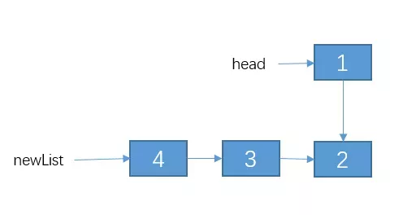
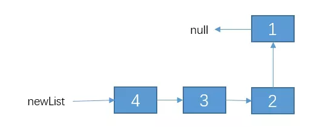

## 1. 递归的三大要素
### 要素1： 明确函数的功能
比如在 `factorial(n)`, 是为了计算 `n!`.

### 要素2： 递归结束条件
所谓递归，就是在这个函数(function)执行期间，会调用函数(function)本身。**因此我们必须要找出递归结束的条件，否则函数会一直调用自己最终陷入死循环。**
**也就是说要找出，但参数为何值的时候，递归结束，并把结果返回。** 也就是这个时候我们可以直接根据参数，返回相应的结果。
比如在上例中，当 `n==0 || n==1` 时，我们要 `return 1`, 

```java
// Compute n!, where n>=0
public int factorial(int n) {
    if(n == 0 || n == 1) {
        return 1;
    }
}
```

or

```java
// Compute n!, where n>=0
public int factorial(int n) {
    if(n >= 0) {
        return 1;
    }
}
```

### 要素3： 找出函数的等价关系式
为了不断缩小参数的范围，我们需要找到特定的关系式。比如 `f(n) = n * f(n-1)`

```java
// Compute n!, where n>=0
public int factorial(int n) {
    if(n == 0 || n == 1) {
        return 1;
    }
    // Add transformation equation
    return n * factorial(n - 1);
}
```

### 案例1： Fabonacci Sequence
```java
public int fabo(int n) {
    // Stop condition: When n==0, or n==1, we need return 1
    if(n <= 2) {
        return 1;
    }
    // Transformation Equation
    return f(n-1) + f(n-2);
}
```

### 案例2：小青蛙跳台阶
> 一只青蛙一次可以跳上1级台阶，也可以跳上2级。求该青蛙跳上一个n级的台阶总共有多少种跳法。

public int jump(n) {
    // f(0)=0, f(1)=1, 
    if(n <= 2) {
        return n;
    }
    return jump(n-1) + jum(n-2);
}

### 案例3：反转单链表
> 反转单链表。例如链表为：1->2->3->4。反转后为 4->3->2->1

        
        
        

```java
public Node reverseList(Node head) {
    // Stop condition
    if(head == null || head.next == null) {
        return head;
    }
    
    // Reverse sublist recursively
    Node newList = reverseList(head.next);
    // Change the next of node1 and node2, 
    Node t1 = head.next;
    t1.next = head;
    head.next = null;
    return newList;
}
```

## 2. 有关递归的一些优化思路

### 2.1 考虑是否重复计算 -- Memoizaton
如果你使用递归的时候不进行优化，是有非常非常非常多的**子问题**被重复计算的。
比如 `f(n) = f(n-1) + f(n-2)`


### 2.2 考虑是否可以自底向上 -- Bottom to Up
对于递归的问题，我们一般都是从上往下递归的，直到递归到最底，再一层一层着把值返回。
如果有时候 `n` 比较大的时候，一层一层往下递归调用，栈空间可能会不够用。
此时可以考虑**自底向上**的做法。

For example:
```java
public int fabo(int n) {
    if(n <= 2) {
        return n;
    }
    int f1 = 1;
    int f2 = 2;
    int sum = 0;
    
    for(int i=2; i<=n; i++) {
        sum = f1 + f2;
        f1 = f2;
        f2 = sum;
    }
    return f2;
}
```
这种方法也称之为**递推**。

## 3.最后总结
其实，递归不一定总是从上往下，也是有很多是从下往上的，例如 n = 1 开始，一直递归到 n = 1000，例如一些排序组合。对于这种从下往上的，也是有对应的优化技巧。

## Reference:
1. [为什么你学不会递归？告别递归，谈谈我的一些经验 ](https://mp.weixin.qq.com/s/mJ_jZZoak7uhItNgnfmZvQ)

