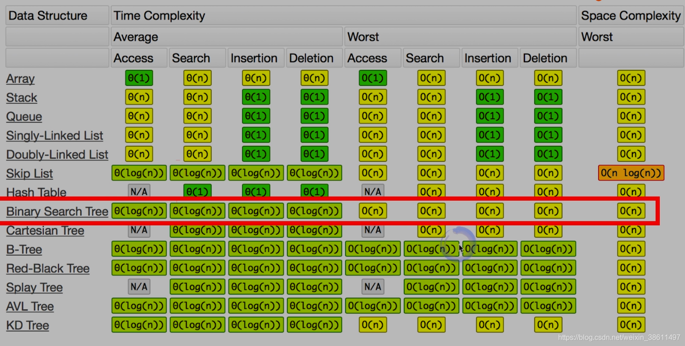

The common strategies to traverse a Tree data structure are Breadth-First Search (a.k.a BFS) and Depth-First Search (a.k.a. DFS). The DFS strategy can be further distinguished as preorder DFS, inorder DFS and postorder DFS, depending on the relative order of visit among the node itself and its child nodes.


## 1. Tree
**树(Tree)**的结构其实跟**链表(List)**很相似，区别就是，树的一个节点可以指向多个其他节点。比如，`LinkedList`就是特殊化的`Tree`。
图和树的区别在于，树是没有环的图。总结：Tree就是特殊化的Graph


## 2. Binary Tree
[How to traverse the tree](https://leetcode.com/problems/binary-tree-level-order-traversal/editorial/)

二叉树主要有四种遍历方式
1. 先序(先根)遍历：即先访问根节点，再访问左孩子和右孩子
2. 中序遍历：先访问做孩子，再访问根节点和右孩子
3. 后序遍历：先访问左孩子，再访问右孩子，再访问根节点
4. 层次遍历：按照所在层数，从下往上遍历


### 1. Depth First Search (DFS) & Breadth First Search (BFS)
#### DFS
The DFS strategy can be further distinguished as **preorder DFS**, **inorder DFS** and **postorder DFS**, depending on the relative order of visit among the node itself and its child nodes.
* Preorder traversal
* Inorder traversal
* Postorder traversal

#### BFS
* Level order traversal


### 2. Recursion & Iteration
以上四种traversal都有recursion和iteration两种写法

## 3. Binary Search Tree (BST)
Properties of a BST:
1. Left subtree of a node `N` contains nodes whose values are lesser than or equal to node `N`'s value.
2. Right subtree of a node `N` contains nodes whose values are greater than node `N`'s value.
3. Both left and right subtrees are also BSTs.


## 4. 平衡二叉树(AVL)


## 5. 红黑树
Java和C++标准库中的二叉搜索树都是用红黑树来实现的

:warning:注意: BT and BST 是不同的，BST有序。


## 6. 字典树Trie


## 7. Lowest Common Ancestor
下面代码可以适用于 LC 1644 Editorial 中的六种情况。
```Java
private TreeNode LCA(TreeNode node, TreeNode p, TreeNode q) {
    if (node == null || node == p || node == q)
        return node;
    TreeNode left = LCA(node.left, p, q);
    TreeNode right = LCA(node.right, p, q);
    if (left != null && right != null)
        return node;
    else if (left != null)
        return left;
    else
        return right;
}
```
* https://leetcode.com/problems/lowest-common-ancestor-of-a-binary-tree-ii/editorial/


## Problems
### 1. 基础中的基础--遍历
* [144. Binary Tree Preorder Traversal](https://leetcode.com/problems/binary-tree-preorder-traversal/)
* [94. Binary Tree Inorder Traversal](https://leetcode.com/problems/binary-tree-inorder-traversal/)
* [145. Binary Tree Postorder Traversal](https://leetcode.com/problems/binary-tree-postorder-traversal/)
* [102. Binary Tree Level Order Traversal](https://leetcode.com/problems/binary-tree-level-order-traversal/)
* [314. Binary Tree Vertical Order Traversal](https://leetcode.com/problems/binary-tree-vertical-order-traversal/)

### 2. 验证二叉搜索树(BST)
* [98. Validate Binary Search Tree](https://leetcode.com/problems/validate-binary-search-tree/)
* [94. Binary Tree Inorder Traversal](https://leetcode.com/problems/binary-tree-inorder-traversal/)
* [501. Find Mode in Binary Search Tree](https://leetcode.com/problems/find-mode-in-binary-search-tree/)

### 3. 二叉树&二叉搜索树的最近公共祖先
1. :exclamation:[236. Lowest Common Ancestor of a Binary Tree](https://leetcode.com/problems/lowest-common-ancestor-of-a-binary-tree/) [`p` or `q` can be `null`]
    1. [235. Lowest Common Ancestor of a Binary Search Tree](https://leetcode.com/problems/lowest-common-ancestor-of-a-binary-search-tree/) [BST的特点: `left.val < root.val < right.val`]
2. :exclamation:[1644. Lowest Common Ancestor of a Binary Tree II](https://leetcode.com/problems/lowest-common-ancestor-of-a-binary-tree-ii/) [`p` or `q` cannot be `null`]
3. :exclamation:[1650. Lowest Common Ancestor of a Binary Tree III](https://leetcode.com/problems/lowest-common-ancestor-of-a-binary-tree-iii/) [Both `p` and `q` exist. Two Pointers]
4. [1676. Lowest Common Ancestor of a Binary Tree IV](https://leetcode.com/problems/lowest-common-ancestor-of-a-binary-tree-iv/)


## Time and Space Complexity


## Reference
* [Stack and DFS](https://leetcode.com/explore/learn/card/queue-stack/232/practical-application-stack/)
* [Queue and BFS](https://leetcode.com/explore/learn/card/queue-stack/231/practical-application-queue/)
* [How to traverse the tree](https://leetcode.com/problems/binary-tree-preorder-traversal/editorial/)
* https://leetcode.com/problems/binary-tree-vertical-order-traversal/editorial/
* https://leetcode.com/problems/binary-tree-level-order-traversal/editorial/
* [【算法面试通关40讲】17 - 理论讲解：树&二叉树&二叉搜索树](https://blog.nowcoder.net/n/7ef346da89e7427c8b2aa4e6411208b0)
* [【算法面试通关40讲】18 - 面试题：验证二叉搜索树](https://blog.nowcoder.net/n/8d142c9931ef471db2a5a1960018c9fd)
* [【算法面试通关40讲】19 - 面试题：二叉树&二叉搜索树的最近公共祖先](https://blog.nowcoder.net/n/1516913505de4bf88d8e8870f0f2ab59)
    * Wiki: [Lowest common ancestor](https://en.wikipedia.org/wiki/Lowest_common_ancestor)
* [【算法面试通关40讲】20 - 理论讲解：二叉树遍历](https://blog.nowcoder.net/n/5ecf374d8b8540d7816804890512f489)
* [【算法面试通关40讲】36 - 理论讲解：字典树](https://blog.nowcoder.net/n/7b92f6b1fab14601a87955131e32252d)
* [【算法面试通关40讲】37 - 面试题：实现一个字典树](https://blog.nowcoder.net/n/cc91b737ce55412e8cc253b23391ea9c)
* [教你初步了解红黑树](https://blog.csdn.net/v_JULY_v/article/details/6105630)
* [【算法总结】五道常见的算法-二叉树](https://cloud.tencent.com/developer/article/1937902)
* [leetcode树有关的题那么多，你究竟应该刷哪些？](https://medium.com/@USTCLink/leetcode%E6%A0%91%E6%9C%89%E5%85%B3%E7%9A%84%E9%A2%98%E9%82%A3%E4%B9%88%E5%A4%9A-%E4%BD%A0%E7%A9%B6%E7%AB%9F%E5%BA%94%E8%AF%A5%E5%88%B7%E5%93%AA%E4%BA%9B-f058e6db181)
