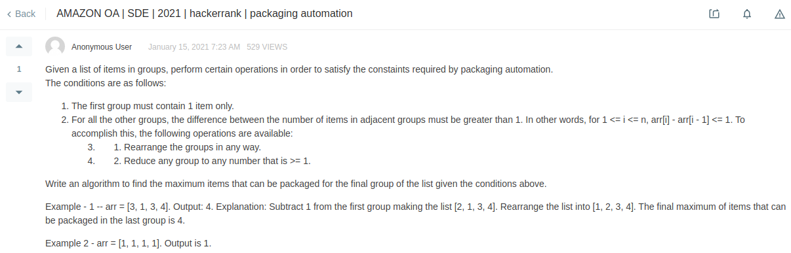

[[面试经验] 求OA2 packaging automation](https://www.1point3acres.com/bbs/interview/amazon-software-engineer-701392.html)

Amazon's Fulfillment Center consists of a packaging bay where orders are automatically packaged in groups(n). The first group can only have 1 item and all the subsequent groups can have one item more than the previous group. Given a list of items on groups, perform certain operations in order to satisfy the constraints required by packaging automation.
The conditions are as follows:

The first group must contain 1 item only.
For all other groups, the difference between the number of items in adjacent groups must not be greater than 1. In other words, for 1<=i<n, arr[i]-arr[i-1]<=1
To accomplish this, the following operations are available.

Rearrange the groups in any way.
Reduce any group to any number that is at least 1
Write an algorithm to find the maximum number of items that can be packaged in the last group with the conditions in place.

Input
The function/method consists of two arguments:
numGroups, an integer representing the number of groups(n);
arr, a list of integers representing the number of items in each group

Output
Return an integer representing the maximum items that can be packaged for the final group of the list given the conditions above.
	



```java
// "static void main" must be defined in a public class.
public class Main {
    
    // Wrong
    public static int packagingAutomation(int[] arr) {
        int N = arr.length;
        
        // O(N)
        Map<Integer, Integer> map = new HashMap<>();
        for(int a: arr) {
            map.put(a, map.getOrDefault(a, 0) + 1);
        }
        
        // O(N)
        int maxValue = 1;
        int i = 0;  // res[0] = maxValue = 1
        int[] res = new int[N];
        while(i < N) {
            if(!map.containsKey(maxValue)) {
                res[i] = maxValue;
                i++;
            } else if(map.get(maxValue) > 0) {
                for(int j=0; j<map.get(maxValue); j++) {
                    res[i+j] = maxValue;
                }
                i += map.get(maxValue);
            }
            maxValue += 1;
        }
        return res[N-1];
    }
    
    // Wrong
    public static int packagingAutomation(int numGroups, int[] arr) {
         int result = 0;
         for(int i = 0; i < numGroups; i++) {
             result += arr[i];
         }
         
         while(result < numGroups*(numGroups+1)/2) {
             result--;
             numGroups--;
         }
         return numGroups;
     }
    
    // Greedy
    public static int packagingAutomation1(int numGroups, int[] arr) {
        Arrays.sort(arr);
        
        for(int i=0; i<arr.length; i++) {
            if(i == 0) {
                arr[i] = 1;
            } else {
                if(arr[i] >= arr[i-1] + 1) {
                    arr[i] = arr[i-1] + 1;
                } else {
                    arr[i] = arr[i-1];
                }
            }
        }
        return arr[arr.length-1];
    }
    
    // with hashMap
    public static int packagingAutomation2(int numGroups, int[] arr) {
        Map<Integer, Integer> map = new HashMap<>();
        for(int a: arr) {
            map.put(a, map.getOrDefault(a, 0) + 1);
        }
        int maxValue = 1;
        int[] res = new int[numGroups];
        for(int i=0; i<numGroups; i++) {
            if(!map.containsKey(maxValue)) {
                res[i] = maxValue;
                int next = maxValue + 1;
                while(!map.containsKey(next)) {
                    next++;
                }   // after the while loop, map.keySet() contains next
                map.put(next, map.get(next) - 1);
                if(map.get(next) == 0) {
                    map.remove(next);
                }
                maxValue++;
            } else {    // i.e map.containsKey(maxValue)
                res[i] = maxValue;
                map.put(maxValue, map.get(maxValue) - 1);
                if(map.get(maxValue) == 0) {
                    map.remove(maxValue);
                    maxValue++;
                }
            }
        }
        return res[numGroups-1];
    }
    
    // Wrong
    public static void main(String[] args) {
        System.out.println("Hello World!");
        
//         int res1 = packagingAutomation(new int[]{1, 3, 2, 2});
//         System.out.println("res1: " + res1);
        
//         int res2 = packagingAutomation(new int[]{3, 2, 3, 5});
//         System.out.println("res2: " + res2);
        
//         int res3 = packagingAutomation(4, new int[]{3, 2, 3, 5});
//         System.out.println("res3: " + res3);
        
//         int res4 = packagingAutomation(4, new int[]{1, 3, 4, 10});
//         System.out.println("res4: " + res4);
        
//         int res5 = packagingAutomation1(5, new int[]{1, 1, 2, 3, 10});
//         System.out.println("res5: " + res5);
        
        int res3 = packagingAutomation2(4, new int[]{3, 2, 3, 5});
        System.out.println("res3: " + res3);    // the true result: 4

        int res4 = packagingAutomation2(4, new int[]{1, 3, 4, 10});
        System.out.println("res4: " + res4);    // the true result: 4

        int res5 = packagingAutomation2(5, new int[]{1, 1, 2, 3, 10});
        System.out.println("res5: " + res5);    // the true result: 4
        
        int res6 = packagingAutomation2(5, new int[]{1, 1, 2, 3, 1});
        System.out.println("res6: " + res6);    // the true result: 3
        
        int res7 = packagingAutomation2(4, new int[]{3, 1, 3, 4});
        System.out.println("res7: " + res7);    // the true result: 4
    }
}
```


## 别人的思路：
> packaging这题,我的思路:
  可以先sort 一下 asc order
  因为第一个是1, 第二个最大是2, 所以最后一个(第n)个理论最大只能是n. 实际上只会小于等于n,因为还要看前一个数是多少.
  sort 完之后,从左往右刷
  arr = min(arr[i-1] + 1, arr)
  刷一遍就得到arr[n] 了. sort占用了NlogN复杂度

> 用哈希表写的o(n)的解法

```python
from collections import Counter
def automation(arr):
    n = len(arr)
     
    # o(n)
    freq = Counter()
    for i in range(n):
        freq[arr[i]] += 1
     
    # o(n)
    max_value = 1
    i = 0
    res = []
    while i < n:
        if freq[max_value] == 0:
            res.append(max_value)
            i += 1
        elif freq[max_value] > 0:
            res.extend([max_value] * freq[max_value])
            i += freq[max_value]
             
        max_value += 1
         
    return res[n-1]
```