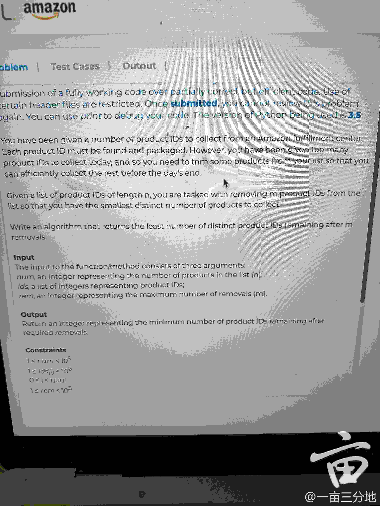

[Get Distinct Product IDS remaining](https://www.1point3acres.com/bbs/thread-661621-1-1.html)




Inputs:
1. `num`: An integer representing the number of products in the list (n);
2. `ids`: A list of integers representing product IDs;
3. `rem`: An integer representing the maximum number of removals(m).

Output:
* Return an integer representing the minimum number of product IDs remaining after required removals.


Example:

    num = 6;
    ids = [1, 1, 1, 2, 3, 2];
    rem = 2;

Explanation:
1. Since `rem = 2`, 说明我们可以删除两个 `product ID`；
2. 两种删除的方式都是相同的结果：
    * Remove `[2, 2]` ==> `[1, 1, 1, 3]`, we still have 2 product IDs;
    * Remove `[2, 3]` ==> `[1, 1, 1, 2]`, we still have 2 product IDs.
    

My Analysis: 先把数量少的id去掉，剩下的都是数量多的id，distinctive就小呀
1. 遍历整个 `ids` list，用 `HashMap` 统计每个 `id` 出现的频率, i.e. `ID --> freq`;
2. 将 `Map.Entry<ID, freq>` 放入 `PriorityQueue` 并根据 `freq` 进行排序;
3. `while(count - queue.peek().freq > 0)`


[Remaining Products IDs](https://leetcode.com/playground/8x7inJW3)
```java
public class RemainingProductIDs {
    
    public static int getRemainingProductIDs(int num, List<Integer> ids, int rem) {
        Map<Integer, Integer> map = new HashMap<>();
        for(int id: ids) {
            map.put(id, map.getOrDefault(id, 0) + 1);
        }
        PriorityQueue<int[]> pq = new PriorityQueue<int[]>((a, b) -> (a[1] - b[1]));
        for(int id: map.keySet()) {
            pq.offer(new int[]{id, map.get(id)});
        }
        while(rem - pq.peek()[1] >= 0) {
            rem -= pq.remove()[1];
        }
        return pq.size();
    }
    
    public static void main(String[] args) {
        System.out.println("Hello World!");
        
        // Example 1: 
        // num = 6, ids = [1, 1, 1, 2, 3, 2], rem = 2
        List<Integer> ids1 = Arrays.asList(1, 1, 1, 2, 3, 2);
        System.out.println(getRemainingProductIDs(6, ids1, 2));
        
        // Example 2: 
        // num = 6, ids = [1, 1, 1, 2, 3, 2], rem = 3
        List<Integer> ids2 = Arrays.asList(1, 1, 1, 2, 3, 2);
        System.out.println(getRemainingProductIDs(6, ids2, 3));
        
        // Example 3: 
        // num = 8, ids = [1, 1, 1, 2, 3, 2, 3, 4], rem = 4
        List<Integer> ids3 = Arrays.asList(1, 1, 1, 2, 3, 2, 3, 4);
        System.out.println(getRemainingProductIDs(8, ids3, 4));
    }
}
```
