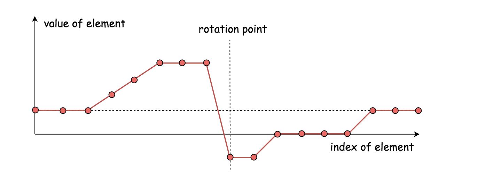

# 二分法/二分查找
二分法查找是作用于 **sorted** 序列的。   
1. 首先将要查找的元素与中间元素进行比较，
2. 如果大于中间元素，就在当前序列的后半部分继续查找；
3. 如果小于中间元素，就在当前序列的前半部分继续查找；

直到找到相同的元素为止。

## 1. 二分法的几种类型
* [二分查找、二分边界查找算法的模板代码总结](https://segmentfault.com/a/1190000016825704)

> 一般而言，当一个题目出现以下特性时，你就应该立即联想到它可能需要使用二分查找：
> 1. 待查找的数组有序或者部分有序
> 2. 要求时间复杂度低于O(n)，或者直接要求时间复杂度为O(log n)

### 1.1 标准二分查找
```java 
class BinarySearch {
    public int search(int[] nums, int target) {
        int left = 0;
        int right = nums.length - 1;
        while (left <= right) {
            int mid = left + ((right - left) >> 1);
            if (nums[mid] == target) 
                return mid;
            else if (nums[mid] > target) {
                right = mid - 1;
            } else {
                left = mid + 1;
            }
        }
        return -1;
    }
}
```
* 循环条件： `left <= right`，最后一次循环至少包含一个元素
* 中间位置计算： `mid = left + ((right -left) >> 1)`
* 左边界更新： `left = mid + 1`
* 右边界更新： `right = mid - 1`
* 返回值： `mid / -1`

**几点需要注意:**
1. **我们的循环条件中包含了 `left == right` 的情况，则我们必须在每次循环中改变 `left` 和 `right` 的指向，以防止进入死循环。**
   * 如果是 `left = mid` or `right = mid`，当 `left == right` 成立进入循环的时候，`mid = left + ((right - left) >> 1) = left`，那么下次更新的时候还是 `left = right`，最终就是进入死循环。
2. 循环终止的条件包括：
   * 找到了目标值， i.e. `nums[mid] == target`
   * `left > right` （这种情况发生于当left, mid, right指向同一个数时，这个数还不是目标值，则整个查找结束。）
3. `left + ((right -left) >> 1)` 其实和 `(left + right) / 2` 是等价的，这样写的目的一个是为了防止 `(left + right)` 出现溢出，一个是**用右移操作替代除法提升性能**。
4. `left + ((right -left) >> 1)` 对于目标区域长度为奇数而言，是处于正中间的; 对于长度为偶数而言，是中间偏左的。因此左右边界相遇时，只会是以下两种情况：
   * `left/mid` , `right` (i.e. `left, mid` 指向同一个数，`right` 指向它的下一个数)
   * `left/mid/right` （`left, mid, right` 指向同一个数）
   * 因为 `mid` 对于长度为偶数的区间总是偏左的，所以当区间长度小于等于2时，`mid` 总是和 `left` 在同一侧。

Example 1: `nums = [2, 3, 5, 7]`, `target = 1`
1. `left = 0, right = 3` --> `mid = 0 + (3 - 0) / 2 = 1` and `nums[mid] = 3 > target` --> `right = mid - 1 = 0`
2. `left = 0, right = 0` --> `mid = 0` and `nums[mid] = 2 > target` --> `right = mid - 1 = -1`
3. `return -1`

Example 2: `nums = [2, 3, 5, 7]`, `target = 6`
1. `left = 0, right = 3` --> `mid = 0 + (3 - 0) / 2 = 1` and `nums[mid] = 3 < target` --> `left = mid + 1 = 2`
2. `left = 2, right = 3` --> `mid = 2 + (3 - 0) / 2 = 2` and `nums[mid] = 5 < target` --> `left = mid + 1 = 3`
3. `left = 3, right = 3` --> `mid = 3` and `nums[mid] = 7 > target` --> `right = mid - 1 = 3 - 1 = 2`
4. `return -1`


### 1.2 二分查找左边界
> 利用二分法寻找左边界是二分查找的一个变体，应用它的题目常常有以下几种特性之一：
> 1. 数组有序，但包含重复元素
> 2. 数组部分有序，且不包含重复元素
> 3. 数组部分有序，且包含重复元素

#### 1.2.1 左边界查找类型1
> Including above case 1 and case 2, i.e. to find the left boundary in `[left, right]` or [left, right)`

> 既然要寻找**左边界**，搜索范围就需要从右边开始，不断往左边收缩，
> 1. 当 `nums[mid] < target`，`left = mid + 1`。因为 `nums[mid] < target`，所以 `left = mid + 1` 而不是 `left = mid`。
> 2. 当 `nums[mid] == target`，此时 `mid` 也不一定是最左侧的边界，还需要继续收缩，`right = mid`。
> 3. 当 `nums[mid] > target`，此时 `right = mid`。[按理来说应该设置 `right=mid-1`]
     > 此时可以将 case 2 & 3 合并，即当 `nums[mid] >= target` 时的更新规则为 `right = mid`。
```java 
class Solution {
    public int search(int[] nums, int target) {
        int left = 0;
        int right = nums.length - 1;
        while (left < right) {
            int mid = left + (right - left) / 2;
            if (nums[mid] < target) {
                left = mid + 1;
            } else {
                right = mid;
            }
        }
        return nums[left] == target ? left : -1;
    }
}
```
* 循环条件： `left < right`
* 中间位置计算： `mid = left + ((right -left) >> 1)` ==> 1. Avoid overflow; 2. speed
* 左边界更新： `left = mid + 1`
* 右边界更新： `right = mid`
* 返回值： `nums[left] == target ? left : -1`


与标准的二分查找不同：
1. 首先，这里的右边界的更新是 `right = mid`，因为我们需要在找到目标值后，继续向左寻找左边界。
2. 其次，这里的循环条件是 `left < right`。      
   因为在最后 `left` 与 `right` 相邻的时候，`mid` 和 `left` 处于相同的位置(前面说过，`mid` 偏左)，则下一步，无论怎样，`left, mid, right` 都将指向同一个位置，
   如果此时循环的条件是 `left <= right`，则我们需要再进入一遍循环，此时，如果 `nums[mid] < target` 还好说，循环正常终止；否则，我们会令 `right = mid` ，这样并没有改变 `left,mid,right` 的位置，将进入死循环。           
   事实上，我们只需要遍历到 `left` 和 `right` 相邻的情况就行了，因为这一轮循环后，无论怎样，`left,mid,right` 都会指向同一个位置，
   而如果这个位置的值等于目标值，则它就一定是最左侧的目标值；如果不等于目标值，则说明没有找到目标值，这也就是为什么返回值是 `nums[left] == target ? left : -1`。

* 当 `left` and `right` 相邻的时候：`mid = left + (right - left) / 2 = left`
  如果 `nums[mid] < target`，则有 `left = mid + 1 = right`;
  如果 `nums[mid] >= target`，则有 `right = mid = left`.
  所以当 `left` 和 `right` 相邻的时候，经过下一轮循环的时候，`left, mid, right` 总会指向同一个位置，不会进入死循环。

如果最后的位置 `left=mid=right` 指向的元素等于 target，则一定是最左侧的目标，否则就没有找到。
`return nums[left] == target ? left : -1`


#### 1.2.2 左边界查找类型2
> 左边界查找的第二种类型用于数组**部分有序**且包含**重复元素**的情况，这种条件下在我们向左收缩的时候，不能简单的令 `right = mid`，因为有重复元素的存在，这会导致我们有可能遗漏掉一部分区域，**此时向左收缩只能采用比较保守的方式**。

```java 
class Solution {
    public int search(int[] nums, int target) {
        int left = 0;
        int right = nums.length - 1;
        while (left < right) {
            int mid = left + (right - left) / 2;
            if (nums[mid] < target) {
                left = mid + 1;
            } else if (nums[mid] > target) {
                right = mid;
            } else {
                right--;
            }
        }
        return nums[left] == target ? left : -1;
    }
}
```
* 它与**类型1**的唯一区别就在于对右侧值的收缩更加保守。这种收缩方式可以有效地防止我们一下子跳过了目标边界从而导致了搜索区域的遗漏。
  


### 1.3. 二分查找右边界
#### 1.3.1 Pattern 1
```java 
class Solution {
    public int search(int[] nums, int target) {
        int left = 0;
        int right = nums.length - 1;
        while (left < right) {
            int mid = left + ((right - left) >> 1) + 1;
            if (nums[mid] > target) {
                right = mid - 1;
            } else {
                left = mid;
            }
        }
        return nums[right] == target ? right : -1;
    }
}
```
* 循环条件： `left < right`
* 中间位置计算： `mid = left + ((right -left) >> 1) + 1`
* 左边界更新： `left = mid`
* 右边界更新： `right = mid - 1`
* 返回值： `nums[right] == target ? right : -1`

> 这里大部分和寻找左边界是对称着来写的，唯独有一点需要尤其注意——**中间位置的计算变了，我们在末尾多加了1**。这样，**无论对于奇数还是偶数，这个中间的位置都是偏右的**。

> 对于这个操作的理解，从对称的角度看，寻找左边界的时候，中间位置是偏左的，那寻找右边界的时候，中间位置就应该偏右呗，但是这显然不是根本原因。
> **根本原因是**，在最后 `left` 和 `right` 相邻时，如果 `mid` 偏左，则 `left, mid` 指向同一个位置，`right` 指向它们的下一个位置，在 `nums[left]` 已经等于目标值的情况下，这三个位置的值都不会更新，从而进入了死循环。
> 所以我们应该让 `mid` 偏右，这样 `left` 就能向右移动。这也就是为什么我们之前一直强调查找条件，判断条件和左右边界的更新方式三者之间需要配合使用。


### 1.4 二分查找左右边界

#### 实战
[34. Find First and Last Position of Element in Sorted Array](https://leetcode.com/problems/find-first-and-last-position-of-element-in-sorted-array/)


### 1.5 二分查找极值
> 二分查找还有一种有趣的变体是二分查找极值点，之前我们使用 `nums[mid]` 去比较的时候，常常是和给定的目标值target比，或者和左右边界比较，在二分查找极值点的应用中，我们是**和相邻元素去比**，以完成某种单调性的检测。

#### 实战
[162. Find Peak Element](https://leetcode.com/problems/find-peak-element/)

```java 
class Solution {
    public int findPeakElement(int[] nums) {
        int left = 0;
        int right = nums.length - 1;
        while (left < right) {
            int mid = left + ((right - left) >> 1);
            if (nums[mid] < nums[mid + 1]) {
                left = mid + 1;
            } else {
                right = mid;
            }
        }
        return left;
    }
}
```


### 总结
| 查找方式 | 循环条件 | 左侧更新 | 右侧更新 | 中间点位置 | 返回值 |
|:----------:|:---------------:|:----------------:|:-------------------:|:-------------------------:|:-------------:|
| 标准二分查找 | `left <= right` | `left = mid - 1` | `right = mid + 1`   | `left + (right - left) / 2`      | `-1/mid`      |
| 二分找左边界 | `left < right`  | `left = mid - 1` | `right = mid`       | `left + (right - left) / 2`      | `-1/left`     |
| 二分找右边界 | `left < right`  | `left = mid`     | `right = mid - 1`   | `left + (right - left + 1) / 2`  | `-1/right`    |

* 标准的二分查找：标准的二分查找是找一个确定的 target，因此所有的可能的位置都要进行比较。在循环条件中包含 `left == right`，则说明当搜索范围仅仅剩下一个 element 的时候，也要对最后一个 element 进行比较。
* 找左边界的时候，就排除不可能的左边界，比如说 `mid` 不可能为左边界，则更新 `left = mid + 1`，此时 `mid+1` 有可能是左边界，但 `mid` 不可能是左边界。
* 找右边界的时候，就排除不可能的右边界，比如说 `mid` 不可能为右边界，则更新 `right = mid - 1`，此时 `mid-1` 有可能是右边界，但 `mid` 不可能是右边界。
* `mid = left + (right - left) / 2`:
  * 当数组的长度为 odd 的时候，`mid` 就指向数组的中间
  * 当数组的长度为 even 的时候，`mid` 就指向数组的中间偏左，比如 `[1, 2, 3, 4]`, `mid = 0 + (3 - 0) / 2 = 1`，此时指向 2。
* `mid = left + (right - left + 1) / 2`:
  * 当数组的长度为 odd 的时候，`mid` 就指向数组的中间
  * 当数组的长度为 even 的时候，`mid` 就指向数组的中间偏右，比如 `[1, 2, 3, 4]`, `mid = 0 + (3 - 0 + 1) / 2 = 2`，此时指向 3。
* 当 `(right - left) % 2 == 0` 的时候，没有影响；让而当 `(right - left) % 2 == 1` 的时候，`(right - left) / 2` 就会自动向 0 靠近，因此偏左；
  如果是 `(right - left + 1) / 2` 的话，当 `right - left == 0` 的时候，此时有没有 `+1` 并没有影响；
  当 `right - left == 1` 的时候，此时有 `+1`，就自动向右靠近。


## 2. Binary Search 痛点
### 2.1 溢出
`mid = (left + right) / 2;`
1. 在对两个 signed 32-bit 数字进行相加的时候，有可能出现溢出；比如  `left=1` and `right=Integer.MAX_VALUE`；
2. 当left和right之和超过所在类型的表示范围的话，这个和就是一个很随机的值，那么mid就不会得到正确的值。

所以，更稳妥的做法是
```
mid = left + (right - left) / 2;
mid = left + ((right - left) >> 1);
```

### 2.2 边界错误
> 二分法查找法的边界一般来说分为两种情况：左闭右开，即`[left, right)`；左闭右闭，即`[left, right]`。    

> 需要注意的是，循环体外的初始化条件，与循环体内的迭代条件，都必须遵守**一致的区间规则**。
也就是说，如果循环体初始化时，是以左闭右开区间为边界的，那么循环体内部的迭代也应该如此。如果两者不一致, 会造成程序的错误。

#### 2.2.1 Wrong Example
下面是个错误的例子：
Wrong Example: 
```python
def binarySearch(arr, target):
    l = 0
    r = len(arr)
    while l < r:
        mid = (l + r) // 2
        if arr[mid] == target:
            return mid
        if target > arr[mid]:
            l = mid + 1
        else:
            r = mid - 1
    return -1
```
算法初始化的时候，搜索范围是左闭右开 `[l, r)`，
* 当满足 `target > arr[mid]` 的时候，更新 `l = mid + 1;`，因为 `arr[mid]` 不可能是 `target`，所以继续在 `[mid+1, r)` 中搜索是正确的；
* 当满足 `target < arr[mid]` 的时候，更新 `r = mid - 1;`，所所范围就变成了 `[l, mid - 1)`，然而从判断条件可以得出 `arr[mid] != target`，但是不能确定 `arr[mid-1]` 是否为 `target`，而新的搜索范围就会跳过 `arr[mid-1]`，这将导致错误。

#### 2.2.2 左闭右闭: [l, r], end inclusive
正确的左闭右闭 `[l, r]` 写法：
```python
def binarySearch(arr, target):
    """
    定义：在[l...r]的范围里寻找target, 因为这里定义是需要将r归入范围区间, inclusive，所以while循环的边界需要包含r
    :param arr:
    :param target:
    :return:
    """
    l = 0               # index of the first element
    r = len(arr) - 1    # index of the last element
    while l <= r:
        mid = l + (r - l) / 2
        if arr[mid] == target:
            return mid
        elif target > arr[mid]:
            l = mid + 1     # 明确区间的要求，只要使用过的，一律绕过。
        else:
            r = mid - 1     # 明确区间的要求，只要使用过的，一律绕过。
    return -1
```
外循环的条件是在 `[l, r]` 范围内寻找，也就是包括 `r`，所以循环条件应该为 `while l <= r`；
* 考虑一个最极端的情况 `[l, r]`, where `l == r`, 此时两个 index 都指向同一个元素，该元素也是需要比较的，因此外循环的条件应该包括 `l == r`；
* 内循环的条件是 `l = mid + 1` 和 `r = mid - 1`，此时 `mid` 不是要找的元素，所以下一轮循环要找的范围不包括 `mid`，但是应该包括 `mid` 旁边的元素，也就是 `[mid+1, r]` and [l, mid-1]。

#### 2.2.3 左闭右开: [l, r), end exclusive
```python
def binarySearch(arr, target):
    """
    定义：在[l...r)的范围里寻找target, 因为这里定义是不需要将end归入范围区间 exclusive，
    所以while循环的边界小于End即可，因为length本身长度会比index大1相对应的，
    每次target的value小于arr[mid]的时候，我们在重新定义新的end时候，也选择exclusive的模式，r = mid即可
    :param arr:
    :param target:
    :return:
    """
    l = 0           # index of the first element
    r = len(arr)    # r-1 is the index of the last element
    while l < r:
        mid = l + (r - l) / 2
        if arr[mid] == target:
            return mid
        elif target > arr[mid]:
            l = mid + 1     # mid is not the target, so it should be exclusive
        else:
            r = mid         # mid is the right bounday, it is alreay exclusive
    return -1
```
外循环的条件是在 `[l, r)` 范围内寻找，也就是不包括 `r`，所以循环条件应该为 `while l < r`；
* 极端情况比如 `[l, l+1)`，此时搜索范围只有一个 element，进入循环内部后 `arr[mid] == arr[l]`，如果此时 `arr[mid] != target`，更新完搜索范围后会有两种情况：`[l+1, l+1)` or `[l, l)`，此时都会终止循环；
* 内循环的条件是 `l = mid` 和 `r = mid`，此时 `mid` 不是要找的元素，所以下一轮循环要找的范围不包括 `mid`，但是应该index 为 `mid` 的元素不在循环范围内，也就是 `[mid+1, r)` and [l, mid-1]。

### 2.3 死循环
> 上面的情况还只是把边界的其中一个写错，也就是右边的边界值写错，如果两者同时都写错的话，可能会造成死循环。
```python
def binarySearch(arr, target):
    """
    只是把边界的其中一个写错，也就是右边的边界值写错，如果两者同时都写错的话，可能会造成死循环。
    :param arr:
    :param target:
    :return:
    """
    l = 0
    r = len(arr) - 1    # inclusive
    while l <= r:
        mid = l + (r - l) / 2
        if arr[mid] == target:
            return mid
        elif target > arr[mid]:
            l = mid
        else:
            r = mid
    return -1
```
外循环 `while-loop` 的条件，采用的是左闭右闭 `[l, r]` 的区间，但是
* 当 `target < arr[mid]` 的时候，那么下一次查找的区间应该为 `[l, mid-1]`，而上述代码中却是 `[l, mid]`；
* 当 `target > arr[mid]` 的时候，那么下一次查找的区间应该为 `[mid+1, r]`，而上述代码中却是 `[mid, r]`;
* 如果 `l == r`，并且 `arr[l] == arr[r] == arr[mid] != target`, 此时无论更新左边界或右边界，搜索范围都不会改变，因而出现 Dead Loop。
因此，有可能出现某次查找时始终在这两个范围中轮换，造成了程序的死循环。


## 3. Templates
模板尽量符合一致性的观点；并且要有自己熟悉的模板。

### 3.1 常用模板
95% 的情况下会用这种模板。
```python
def binarySearch4(arr, target):
    """
    采用 [l, r] 的搜索范围。
    :param arr: 
    :param target: 
    :return: 
    """
    l = 0
    r = len(arr) - 1
    while l <= r:
        mid = l + (r - l) / 2
        if target == arr[mid]:
            return mid
        elif target > arr[mid]:
            l = mid + 1
        else:
            r = mid - 1
    return -1
```
* 此时采用的是 `[l, r]`，左右边界都在搜索范围内，因此当 `arr[mid] != target` 的时候，可以直接跳过 `mid`，采用 `l = mid + 1` or `r = mid - 1`。

### 3.2 备用模板
针对第一个模板的短板
```python
def binarySearch(arr, target):
    """
    [l, r]
    i.e. l <= r,
    :param arr:
    :param target:
    :return:
    """
    l = 0
    r = len(arr) - 1
    while l+1 < r:  # i.e. l < r - 1,
        mid = (l + r) // 2
        if target == arr[mid]:
            return mid
        elif target > arr[mid]:
            l = mid
        else:
            r = mid
    
    if arr[l] == target:
        return l
    if arr[r] == target:
        return r
    return -1
```
第二个模板专门针对的是第一个模板的短板：当要 access 数组边界的数，如果边界的数在运行中出现更改，可能越界。虽然这种情况也可以用 `Edge Case` 来写，但太过麻烦。
* 搜索范围是 `[l, r]`, 终止条件是 `[l, l+1]`；
* 可以用于模糊搜索，如大于 target 的最小的数是多少，小于 target 的最大的数是多少等。


## 4. Binary Search 题型


### 4.1 有明确的 Target 的题型
[367.  Valid Perfect Square]()     
[33. Search in Rotated Sorted Array]()


### 4.2 没有明确的 Target 的题型
[边界处理图像化网站](http://pythontutor.com/visualize.html#mode=edit)
这一类的题比较多变，可能会要你找
* 比 Target 大的最小值
* 比 Target 小的最大值
* 满足要求的第一个值
* 不满足要求的最后一个值
* ...

思考下面的模板，在迭代退出的时候，`left` 和 `right` 的位置：  


#### case 1: `arr = [1, 2, 3, 5, 6], target = 4`   
     
根据模板代码中对 while-loop 的定义 `while l <= r:`，也就是只用 `l > r` 的时候，while-loop 才会终止。
* Steps:
    1. l=0, r=4, => mid=(0+4)/2=2, target=4 > arr[mid]=3, therefore l=mid+1=3;
    2. l=3, r=4, => mid=(3+4)/2=3, target=4 < arr[mid]=5, therefore r=mid-1=2;
所以迭代结束后，`l` 和 `r` 的位置分别对应两个条件：
* `l`对应的是：第一个比4大的坐标, 根据这道题的定义就是比Target大的最小值，也就是 5；
* `r`对应的是：最后一个比4小的坐标，根据这道题的定义就是比Target小的最大值，也就是 3。

方便的理解：在循环还在进行的时候，`l`总指向比 Target 小的值，`r`总指向比 Target 大的值；当循环停止的时候，`l`第一次指向了比 Target 大的值，同理 `r` 第一次指向了比 Target 小的值。

#### case 2: `arr = [1, 2, 3, 5, 6], target = 7`
根据 while-loop 的特性，有个 edge 的情况是，`l` 最大可以等于 `len(arr)`
   
* Steps:
    1. l=0, r=4, => mid=(0+4)/2=2, target=7 > arr[mid]=3, therefore l=mid+1=3;
    2. l=3, r=4, => mid=(3+4)/2=3, target=7 > arr[mid]=5, therefore l=mid+1=4;
    3. l=4, r=4, => mid=(4+4)/2=4, target=7 > arr[mid]=6, therefore l=mid+1=5; ==> over the bounday
可以看出，如果要返回 `arr[l]` 则会出现系统报错，因为 `l` 已经越界，这就是这个模板的局限性。所以要记住这一点，要对相应的 edge case 处理。

* 返回 `l` 的情况
> 给定一个 Target 值，找到其在 Array 里，Target应该插入的位置：
```python
class Solution:
    def searchInsert(nums, target):
        l, r = 0, len(nums) - 1
        while l <= r:
            mid = l + (r-l)//2
            if nums[mid] == target:
                return mid
            if target > nums[mid]:
                l = mid + 1
            else:
                r = mid - 1
        return l
```

Example：        
`nums = [1, 3, 5, 6], target = 2`, `output = 1`     
1). l=0, r=3, ==> mid=0+(3-0)/2=1, target<nums[mid]=3, ==> r=mid-1=0
2). l=0, r=0, ==> mid=0+(0-0)/2=0, target>nums[mid]=1, ==> r=mid+1=1
3). return `l`

在迭代结束后，
`l` 的下标是 1, 定义是第一个满足条件的最小值；
`r` 的下标是 0, 定义是最后一个不满足条件的最大值。

所以最后返回 `l` 即可。另外，这个模板对这道题而言，不需要考虑当 Target 插入的下标等于 `len(nums)` 的 Edge Case，因为 `l` 本身就自带这个特性。

* 返回 `r` 的情况
[458. Last Position of Target (Lintcode)]()

> 给定一个 Target 值，找到其在 Array 里，Target 出现的最后坐标：
```python
class Solution:
    def lastPosition(self, nums, target):
        if not nums:
            return -1
        l , r = 0 , len(nums) - 1
        while l <= r:
            mid = l + (r-l)//2
            if nums[mid] <= target:
                l = mid + 1
            else:
                r = mid - 1
        if nums[r] == target:
            return r
        else:
            return -1
```

Example：            
`nums = [1, 2, 2, 4, 5, 5], target = 2`, `return 2`         
1). l=0, r=5, ==> mid=0+(5-0)/2=2, nums[mid]<=target, ==> l=mid+1=2+1=3
2). l=3, r=5, ==> mid=3+(5-3)/2=4, nums[mid]>target,  ==> r=mid-1=4-1=3
3). l=3, r=3, ==> mid=3+(3-3)/2=3, nums[mid]>target,  ==> r=mid-1=3-1=2
4). r=2, ==> nums[r]==target ==> `return r`

在本题中，Array 出现了重复，去重的方式就是当 `nums[mid] == target` 的时候，对 `l` 进行增值。这样可以去掉左边重复的数。
如果 `mid+1` 不等于 target 呢？此时 `nums[l]` 肯定会比 target 大，因此 `l` 的位置不会发生改变。
在后面的循环中，`r` 会逐步变小，直到 `r=l-1` 时，停止循环，此时再判断 `nums[r] ~ target`。如果相等，则返回 `r`，否则返回 `-1`。

* 上两题的合体
[34. Search for a Range]()      
分别找到地一个位置和最后一个位置，然后返回一个区间。
```python
class Solution:
    def searchRange(self, nums, target):
        l = self.findLeft(nums, target)
        r = self.findRight(nums, target)
        return [l, r] if l <= r else [-1, -1]


    def findLeft(self, nums, target):
        l, mid, r = 0, 0, len(nums)-1
        while l <= r:
            mid = l + (r-l)//2
            if nums[mid] < target:
                l = mid + 1
            else:
                r = mid - 1
        return l   


    def findRight(self, nums, target):
        l, mid, r = 0, 0, len(nums)-1
        while l <= r:
            mid = l + (r-l)//2
            if nums[mid] <= target:
                l = mid + 1
            else:
                r = mid - 1
        return r
```

### 4.3 没有明确的 Target 的题型，可越界类型
这种类型的题目，用 `l <= r` 的模板可能会越界，我们可以填写个别的Edge Case处理，或者套用其他比如 `l < r` 或者 `l + 1 < r`的模板解决。
`l < r`, 要进入循环体的时候，`[l, r)` 中至少有一个元素，所以当循环结束的时候，`l == r` 同时指向一个元素。
`l < r + 1`, 要进入循环体的时候，`[l, r)` 中至少有两个元素，所以当循环结束的时候，`[l, r)` 包含两个元素，也就是 `l` 和 `r` 指向两个相邻的元素。

[162. Find Peak Element](https://leetcode.com/problems/find-peak-element/)     
找峰值，`nums[mid]` 比对的 `nums[mid+1]`。这种情况下，当 `l` 越界等于 `len(nums)` 就会报错，所以可以选择用 `while l+1 < r` 的区间，最终对 `l` 和 `r` 进行对比。
```
class Solution:
    def findPeakElement(self, nums):
        """
        :type nums: List[int]
        :rtype: int
        """
        l , mid , r = 0, 0, len(nums) - 1
        while l + 1 < r:
            mid = l + (r-l)//2
            if nums[mid] < nums[mid + 1]:
                l = mid
            else:
                r = mid
        if nums[l] > nums[r]: return l
        else: return r
```

[153. Find Minimum in Rotated Sorted Array](https://leetcode.com/problems/find-minimum-in-rotated-sorted-array/)
> 这道题最终要求返回的是 `nums[l]`。同样，可以写成 Edge Case 处理，也可以使用 `while l < r` or `while l+1 < r` 来解。
```
class Solution(object):
    def findMin(self, nums):
        """
        :type nums: List[int]
        :rtype: int
        """
        l, r = 0, len(nums) - 1
        while l + 1 < r:
            mid = l + (r - l) // 2
            if nums[mid] > nums[r]:
                l = mid
            else:
                r = mid
        return min(nums[l], nums[r])
```


## 5. Other's conclusion
### 5.1 Conclusion 1
> 可以自己推一下，如果遵循下面的基本原则，就只需要一种写法。推导过程就省略了，建议大家举几个例子帮助理解，以免理解错误，毕竟自然语言是有歧义的。
> 
> 基本原则就是：
> 1. 使用闭区间 `[L, R]` (用左闭右开区间也可以，只不过要相应地修改下面的几个原则)
> 2. 永远使用 `while(L <= R)`
> 3. 永远使用 `L = mid + 1; R = mid - 1`
> 4. 退出 `while` 循环之后，`L` 和 `R` 一定满足 `L = R + 1`
> 5. `return L` 或者 `return R`
>
> 第5条需要自己现场稍微推一下，但是不难。基本规律是, 如果是按照下面的代码（假设数组 a 是单调递增序列）
```C++
if(a[mid] < target)  
    L = mid + 1;
else   
    R = mid - 1;
```
> 那么，退出 while-loop 之后，`L` 的位置一定在所有 `＜ target` 的数的右边；`R` 的位置一定在所有 `≥ target` 的熟的左边。也就是说，`a[R] <= target < a[L]`.         
> 换言之，使得 `L = mid  + 1` 的 if 语句用了什么条件，在退出 while-loop 之后，所有满足这个条件的数全都在 `L` 的左边；使得 `R = mid - 1` 的 if 语句用了什么条件，在退出 while-loop 之后，所有满足这个条件的数全都在 `R` 的右边。并且 `L = R + 1`.
> 
> 所以，如果把上面的代码改成
```C++
if(a[mid] <= target)  
    L = mid + 1;
else   
    R = mid - 1;
```
退出while循环之后，最后会得到，`a[R] < target <= a[L]，L = R + 1` 如果知道这样的表达式，最后应该 `return L` 还是 `return R`，就根据题目的具体要求来看了。


## 5.1 
> 里面把重点写出来了，我感觉主要是理解这三种模板的不同
> 1. `start, end`
> 2. loop condition, `start <= end`, `start < end`, `start + 1 < end`
> 3. move `start` or `end`, this is the key, if array have duplicate number, how to move?  这个如果不理解就很难应用好
> 4. Process the left elements(处理剩下的 elements). 

## 5.2 From  Reference 2 [二分查找学习札记](http://www.cppblog.com/converse/archive/2009/10/05/97905.aspx)
```
int search4(int array[], int n, int v)
{
    int left, right, middle;

    left = -1, right = n;

    while (left + 1 != right)
    {
        middle = left + （right － left) / 2;

        if (array[middle] < v)
        {
            left = middle;
        }
        else
        {
            right = middle;
        }
    }

    if (right >= n || array[right] != v)
    {
        right = -1;
    }

    return right;
}
```


## Reference:
1. [Binary Search的总结帖](https://www.1point3acres.com/bbs/thread-432793-1-1.html)
2. [二分查找学习札记](http://www.cppblog.com/converse/archive/2009/10/05/97905.aspx)
3. [Search in Rotated Sorted Array 解题报告 ](http://fisherlei.blogspot.com/2013/01/leetcode-search-in-rotated-sorted-array.html)
4. [Binary Search 总结帖 (更新完)](https://github.com/yuzhoujr/leetcode/issues/8)
5. [总结1](https://github.com/yuzhoujr/leetcode/issues/8#issuecomment-401414085)
6. Bilibili: [二分查找 红蓝染色法](https://www.bilibili.com/video/BV1AP41137w7/?vd_source=bd5e1cdd20d83feef8e77a781b33f083)


## Others
# [二分查找有几种写法？它们的区别是什么？]


### [二分查找有几种写法？它们的区别是什么？ - Jason Li的回答 - 知乎](https://www.zhihu.com/question/36132386/answer/530313852)
* 搜索区间**左开右闭** `[left, right)`
*


### 遍历长度为 `n` 的数组，下标 `i` 该怎么写？
通常来说使用的是左闭右开的区间，也就是 `[0, n)`。这样一来循环执行的次数为 `n`，`for-loop` 结束时 `i == n`，一目了然，且无需对多余边界进行 `+/-1` 的调整。
```
for(int i=0; i<n; i++) {
    // i is in [0, n)
}
```

### 数组下标的表示方法
假设有一个长度为 4 的数组，用整数边界表示它的下标 0, 1, 2, 3：`[0, 4)` 最为合适和人道，避免了负数出现在范围表示中。

这样做的优点有：
1. 区间两端的差正好是数组的长度，如 `[0, 4)` 中的 `4 - 0 = 4` 正好是数组的长度 4。
2. 刚好相邻的区间，如 `[0, 2)` and `[2, 4)`，中间值 (即 2) 相同，一眼可见。

[off-by-one error](https://en.wikipedia.org/wiki/Off-by-one_error)


### 中点选择
```python
def lower_bound(array, first, last, value):
    while first < last:                     # Search range [first, last) is not empty.
        mid = first + (last - first) // 2   # Avoid overflow
        if array[mid] < value:
            first = mid + 1
        else:
            last = mid
    return first                            # or last, because the first and last are the same point
```

* If we use `mid = (first + last) / 2`, it may overflow in C++ or Java.
```python
mid = (first + last) / 2
    = (2 * first + last - first) / 2
    = first + (last - first) / 2
    = first + length / 2
```
其中 `length = last - first` 为区间 `[first, last)` 为区间长度。

另外，中点的选择并不唯一：
1. 上位中位数：`upperMid = first + length / 2` (不用 `-1`)
2. 下位中位数：`lowerMid = first + (length - 1) / 2`


### while-loop 的循环不变量 - loop invariants
怎样缩小区间才不会出错？        
首先要理解 `while` 循环里的 `loop invariants`(循环不变量)，也就是**代码跑到 `while` 里面时一定成立的条件**：
1. 搜索范围 `[first last)` 不为空，即 `first < last`； ==> 当 `first < last` 时，则有 `[first, last)` 不为空；
2. 搜索范围 `[first last)` 左侧，即 `[first0, first)` 内所有元素(若存在)，都小于 `value`，其中 `first0` 是 `first` 的初始值；
3. 搜索范围 `[first last)` 右侧，即 `[last, last0)` 内所有元素(若存在)，都大于等于 `value`，其中 `last0` 是 `last` 的初始值。

[example](https://www.zhihu.com/question/36132386/answer/530313852)
