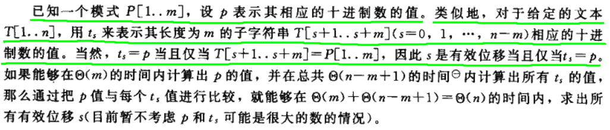
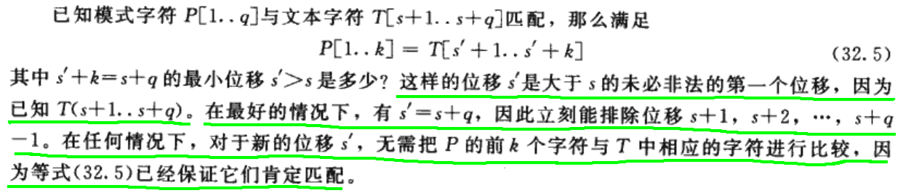

# Chap 32. 字符串匹配

在文本编辑中，常常会遇到一类问题：在一个片段的文字中(text)中搜索符合某种要求的字段(pattern)，比如一个单词、一个句子。这就涉及到**字符串匹配算法**。

1. 文本用 `T[1,...,n]` 表示，说明 text 中总共有 `n` 个字符；模式用 `P[1,...,m]` 表示，说明 pattern 中总共有 `m` 个字符；并且 `m<=n`，也就是 text 的长度不小于 pattern 的长度。
2. `T` and `P` 中的元素都属于 `\Sigma` 集合。
3. 如果在 text 中发现了符合 pattern 的字符串，如果位移为 `s`，则有 `T[s+1,...,s+m] = P[1,...,m]`(即对于所有的 `1<=j<=m`，都有 `T[s+j]==P[j]`)，或者等价地说，模式 `P` 在文本 `T` 中从位置 `s+1` 开始出现。

## 32.0 记号与术语
* `\Sigma` 表示所有最基本元素的组合，比如 `\Sigma = {a,b,...,z}`, `\Sigma = {0,1,...,9}`；
* 字符串 `x` 的长度用 `|x|` 表示；
* `x = wy`, `w` 是 `x` 的**前缀**，`y` 是 `x` 的**后缀**；
* 空字符串 `\epsilon` 既是每个字符串的前缀，也是每个字符串的后缀。

### 1. 重叠后缀引理

* 如果 `x` and `y` 都是 `z` 的后缀，则有短的字符串是长的字符串的后缀。也就是说，如果 `|x| <= |y|`，则 `x` 是 `y` 的后缀。

## 32.1 朴素的字符串配额陪算法(Naive String Matching)
通过一个循环找出所有的有效位移，该循环对 `n-m+1` 个可能的每一个 `s` 值检查条件 `P[1,...,m] == T[s+1,...,s+m]`.      

* for-loop 遍历每一个可能的 start position `s`，总共有 `n-m+1` 个可能的 start position；

* 对每个 start position 进行匹配的时候，需要进行 `m` 次对比；
* `n-m+1` 个可能的 start position。
* 最坏的情况 `O(n^2)`。

## 32.2 Rabin-Karp算法
Rabin-Karp 算法的预处理时间为 `θ(m)`，在最坏的情况下的运行时间为 `O((n-m+1)m)`，但基于某种假设，它的平均运行时间还是比较好的。        
       

* 在 `θ(m)` 的时间内求解 pattern 的数值编码，其中 `m` 是 pattern 的长度；
* 在 `θ(m)` 的时间内求解 t0 的数值编码，其中 `m` 是 pattern 的长度；
* 在已知 `t0` 的基础上，可以通过一次简单的计算求出剩余的值 `t1, t2, ..., t(n-m)`
* 因此，可以在 `θ(m)` 时间内计算出 `p`，在 `θ(n-m+1)` 时间内计算出 `t0, t1, ..., t(n-m)`，因而能够用 `θ(m)` 的预处理时间和 `θ(n-m+1)` 的匹配时间，找出模式 `P]1,...,m]` 在文本 `T[1,...,n]` 中的所有出现。

* 通过霍纳法则 (Horner's rule) 就算 pattern 和 text 片段的编码的方法可能会出现问题，比如 `p` 和 `ts` 的值太大，导致不能处理或处理不便，比如 出现 overflow 这种情况；
* 引入 `mod(q)` 来处理 `p` 和 `ts`，比如上图中 `31415 mod 13 = 7, 67399 mod 13 = 7`，出现这种情况的原因是 `q` 太小，很多数值模 13 后会出现相同的 remainder，因此就会出现**伪命中点**；

* 未进行模q处理：`t(s+1)=d(t(s) - d^(m-1) * T[s+1]) + T[s+m+1]`
* 进行模q处理：`t(s+1)=(d(t(s) - d^(m-1) * T[s+1]) + T[s+m+1]) mod q = (d(t(s) - h * T[s+1]) + T[s+m+1]) mod q`，其中 `h = d^(m-1) mod q`；
* 引入模q处理后，根据 remainder 去判断两个值是否相等，不一定正确：因为 remainder 相等不能说明编码相等；但是反过来，如果编码相等则 remainder 一定相等。所以可以用 remainder 进行第一步判读，如果 remainder 不相等，则直接跳过，如果相等，则继续判断。
* 如果 remainder 相等，则编码值可能相等，因此再进一步判断，检查每一位的字符是否匹配。

## 32.3 利用有限自动机进行字符串匹配

## 32.4 Knuth-Morris-Pratt 算法
> The basic idea behind KMP's algorithm: whenever we detect a mismatch (after some matches), we already know some of the characters in the text (since they matched the pattern characters prior to the mismatch).
> We take advantage of this information to avoid matching the characters that we know will anyway match.            
> 
> 这些信息可以避免在朴素的字符串匹配算法中，对无用位移进行测试。
> 
> 部分匹配表(Partial Match Table)

该算法的匹配时间为 `θ(n)`，只需要用到辅助函数 `π[1,m]`，它是在 `Θ(m)` 时间内，根据模式(pattern)预先计算出来的。

### 1. 关于模式的前缀函数
**模式的前缀函数 `π` 包含有模式与其自身的位移进行匹配的信息**。这些信息可以用于避免在朴素的字符串匹配算法中，对无用位移进行测试。也就是减少了无效位移的测试。

### 2. 

* 因为prefix table的作用，就是用来保证前面有多少个字符能够完整匹配上。所以，按照prefix table移动的话，前面已经成功匹配的部分，可以完全保证不用重新匹配一次
* -1对应第一个元素，0对应第二个: 这个是根据index来的。原本前缀表发明的时候，是以1为最小index来创建的。但是，现在大部分的语言的index都是从0开始。所以，全部移动一位，强迫对齐。
* KMP利用了匹配失败之前成功匹配的子串信息减少了不必要的匹配次数这点（也就是为什么计算前缀表）没有直接讲出来。
## Reference:
1. [KMP字符串匹配算法1](https://www.youtube.com/watch?v=dgPabAsTFa8)
2. [字符串匹配算法](https://www.cnblogs.com/gaochundong/p/string_matching.html)
美中不足的是，看完这个视频我只知道了怎么做，而不知道为什么要这么做。具体原理和为什么不够清晰，如果只是强记算法流程忘得很快。
能想到的几个问题是：

1. 为什么要找最大公共前后缀，原理是什么，具体作用是什么。
2. 前缀表的长度要与搜索字符的pattern相同，但为什么可以不看最后一个最长公共前后缀而要在index[0]的位置补充-1. 比如 ABAB的前缀表应该是[0,0,1,2],为什么用这个前缀表算法就行不通（已亲测貌似行不通），而非要改成[-1,0,0,1]?
3.为什么当字符不匹配发生的时候，能够放心的通过前缀表对应的数值进行移动？原理是什么？我个人理解是为了最大限度的保留已经成功匹配的字符串，避免做无用功像brute force那样重复的去试验。但是具体是如何实现了最大限度的保留了成功匹配，视频中没有例子支撑，所以不好理解。