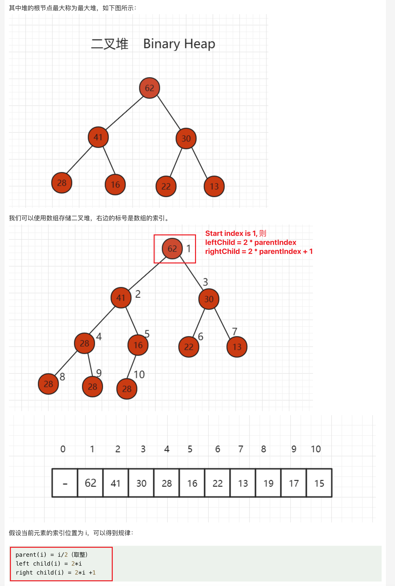

A heap is a very powerful data structure that allows us to efficiently find the maximum or minimum value in a dynamic dataset.

* In a **Min-Heap** the key present at the root node must be less than or equal among the keys present at all of its children. The same property must be recursively true for all sub-trees in that Binary Tree. In a Min-Heap the minimum key element present at the root. 在Min-Heap中，root node是最小元素。
* In a **Max-Heap** the key present at the root node must be greater than or equal among the keys present at all of its children. The same property must be recursively true for all sub-trees in that Binary Tree. In a Max-Heap the maximum key element present at the root. 在Max-Heap中，root node是最大元素。

## 堆的基本存储
* 堆(Heap)通常是一个可以被看做一棵**完全二叉树**的**数组对象**。
* 堆是利用**完全二叉树**的结构来维护一组数据，然后进行相关操作，一般的操作进行一次的时间复杂度在 `O(1)~O(logn)` 之间，堆通常用于动态分配和释放程序所使用的对象。


### 1. 堆的 shift up (即向heap中添加元素)
1. 新元素是添加在完全二叉树的结尾处
2. 与父节点进行比较，然后决定是否要往上升

### 2. 堆的 shift down (即从heap中删除元素)
1. 如果是`maxHeap`，则根节点是最大的，`poll()`时先将根节点弹出
2. 然后左右子树合并
   1. 先将最底层、最右侧的元素放置在根节点位置
   2. 再根据大小判断，将新根节点往下移动

## minHeap vs maxHeap
* `minHeap` poll the smallest element first
   ```java
   PriorityQueue<Integer> queue = new PriorityQueue<>((a, b) -> (a - b));
   ```
* `maxHeap` polls the largest element first
   ```java
   PriorityQueue<Integer> queue = new PriorityQueue((a, b) -> (b - a));
   ```


## Reference
* https://leetcode.com/explore/learn/card/heap/
* [Difference between Min Heap and Max Heap](https://www.geeksforgeeks.org/difference-between-min-heap-and-max-heap/)
* [Min Heap in Java with Examples](https://codegym.cc/groups/posts/min-heap-in-java)
* [Min Heap in Java](https://www.geeksforgeeks.org/min-heap-in-java/)
* [215. Kth Largest Element in an Array](https://leetcode.com/problems/kth-largest-element-in-an-array/)
