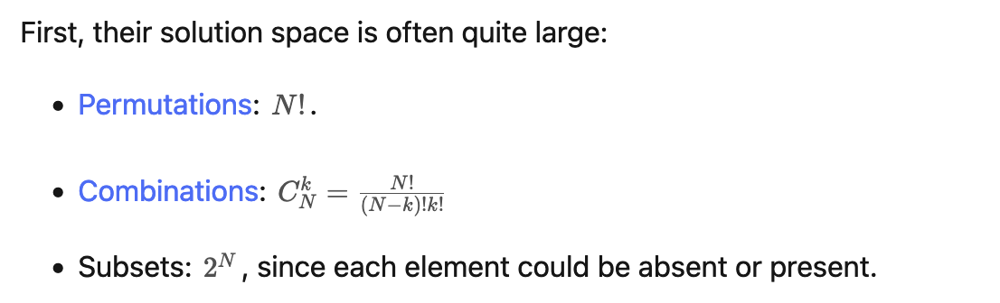

## Lowest Common Multiple & Greatest Common Divisor
### Lowest Common Multiple (LCM, 最小公倍数)
* **Multiple**: A **multiple** is the product result of one number multiplied by another number. 倍数是一个数字乘以另一个数字的乘积结果。
* **Common Multiple**: If a number is a multiple of two or more numbers, it is called a common multiple. For example, 2 x 5 = 10. Therefore, 10 is a multiple of both 2 and 5. Thus, 10 is said to be a common multiple of both 2 and 5. 即10是2和5的公倍数。
* **Least Common Multiple**(LCM, 最小公倍数): The Least Common Multiple (LCM) of two non-zero integers (a, b) is the smallest positive integer that is perfectly divisible by both a and b.
* `lcm(a, b) = |a * b|/gcd(a, b)`

### Greatest Common Divisor (GCD, 最大公约数)
* 几个数公有的约数，叫做这几个数的公约数，其中**最大的**一个叫做这几个数的**最大公约数**。
* 在数学上，a和b的最大公约数记为`(a, b)`
* 在编程中，计算两个数最大公约数的方法通常记为`gcd(a, b)`
* **Greatest Common Divisor**(GCD, 最大公约数): The GCD of two integers, which are non-zero, is the largest positive integer that divides each of the integers evenly. 比如6和9都可以被3整除，则3就是6和9的最大公约数。
* Euclidean algorithm(欧几里德算法，辗转相除法): 


```java
// Greatest Common Divisor, 最大公因数
private int gcd(int a, int b) {
    return b == 0 ? a : gcd(b, a % b);
}
```
* Example 1: `gcd(2,7) = gcd(7,2%7) = gcd(7,2) = gcd(2,7%2) = gcd(2, 1) = gcd(1,2%1) = gcd(1, 0) = 1`
* Complexity: `O(Log min(n1, n2))`


## Permutations & Combinations



## Top Interview 150
* [9. Palindrome Number](https://leetcode.com/problems/palindrome-number/)
* [66. Plus One](https://leetcode.com/problems/plus-one/)
* [172. Factorial Trailing Zeroes](https://leetcode.com/problems/factorial-trailing-zeroes/description/)
* [69. Sqrt(x)](https://leetcode.com/problems/sqrtx/)
* [50. Pow(x, n)](https://leetcode.com/problems/powx-n/)
* [149. Max Points on a Line](https://leetcode.com/problems/max-points-on-a-line/description/)


## Reference
* [Least Common Multiple – Definition, Method, Solved Examples](https://www.splashlearn.com/math-vocabulary/number-sense/least-common-multiple)
* [Finding the Least Common Multiple in Java](https://www.baeldung.com/java-least-common-multiple)
* [Finding Greatest Common Divisor in Java](https://www.baeldung.com/java-greatest-common-divisor)
* [歐幾里得演算法(輾轉相除法)](https://www.youtube.com/watch?v=fGesPF3QA1U)