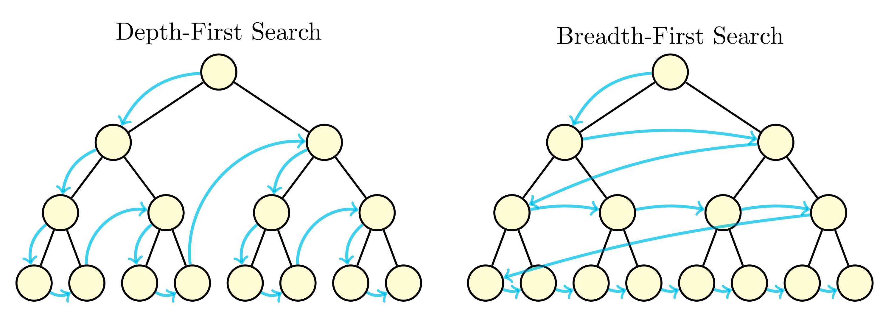

## 分析
✅⭐ 对 Tree 有关类型的题目，考虑访问到每个节点时，应该返回什么值。
* [124. Binary Tree Maximum Path Sum](https://leetcode.com/problems/binary-tree-maximum-path-sum/)

## Tree 的遍历
### 1. **Preorder**: `root -> left -> right`
* Recursion: Classical + Straightforward
* Iteration: Stack + `stack.push(root)` + `while(!stack.isEmpty())` + `res.add(curr.val)` + **push from right to left**
    * 注意要 **push from right to left**, 然后才能在 `pop` 的时候遵循 **from left to right** 的顺序

### 2. **Inorder**: `left -> root -> right`
* Recursion: Classical + Straightforward
* Iteration: Stack + `while(!stack.isEmpty() || root!=null)` + `res.addFirst(curr.val)` + `root = root.right`

### 3. **Postorder**: `left -> right -> root`
* Recursion: Classical + Straightforward
* Iteration: Stack + `stack.push(root)` + `while(!stack.isEmpty())` + **push from left to right** + `res.addFirst(curr.val)`. **Must use `res.addFirst(val)`**
    * `LinkedList<Integer> res = new LinkedList<>()`: 此处要用 `LinkedList`, 因为后面要用到 `LinkedList.addFirst()`

* Traversal related questions:
- [x] 94.Binary Tree Inorder Traversal
- [x] 144.Binary Tree Preorder Traversal    : recursion + iteration, without morris
- [x] 145.Binary Tree Postorder Traversal   : recursion + iteration, without morris
- [x] 589.N-ary Tree Preorder Traversal     : recursion + iteration
- [x] 590.N-ary Tree Postorder Traversal    : recursion + iteration

## Tree 的搜索
- [x] 700.Search in a Binary Search Tree    : recuresion + iteration
- [x] 270.Closest Binary Search Tree Value
- [x] 272.Closest Binary Search Tree Value II

## Tree 的 Merge, Split, Delete and Insert
- [x] 617.Merge Two Binary Trees    : recursion + iteration
- [x] 776.Split BST
- [x] 450.Delete Node in a BST      : predecessor & successor
- [x] 701.Insert into a Binary Search Tree  : recursion + iteration

## ✅二叉树 (from 灵茶山艾府)

✅**学习递归，从二叉树开始。**

带着问题去做下面的题目(Tree 相关的问题)：
1. 一般来说，DFS 的递归边界是空节点。在什么情况下，要额外把叶子节点作为递归边界？
2. 在什么情况下，DFS 需要有返回值？什么情况下不需要有返回值？
3. 在什么情况下，题目更适合用自顶向下的方法解决？什么情况下更适合用自底向上的方法解决？

### 1. 遍历二叉树
* [144. Binary Tree Preorder Traversal](https://leetcode.com/problems/binary-tree-preorder-traversal/)
* [94. Binary Tree Inorder Traversal](https://leetcode.com/problems/binary-tree-inorder-traversal/)
* [145. Binary Tree Postorder Traversal](https://leetcode.com/problems/binary-tree-postorder-traversal/)
* [102. Binary Tree Level Order Traversal](https://leetcode.com/problems/binary-tree-level-order-traversal/)
* [872. Leaf-Similar Trees](https://leetcode.com/problems/leaf-similar-trees/description/)
* [404. Sum of Left Leaves](https://leetcode.com/problems/sum-of-left-leaves/description/)
* [671. Second Minimum Node In a Binary Tree](https://leetcode.com/problems/second-minimum-node-in-a-binary-tree/description/)
* [1469. Find All The Lonely Nodes](https://leetcode.com/problems/find-all-the-lonely-nodes/description/)
* [1214. Two Sum BSTs](https://leetcode.com/problems/two-sum-bsts/)

### 2. 自顶向下 DFS
在「递」的过程中维护值。
* [104. Maximum Depth of Binary Tree](https://leetcode.com/problems/maximum-depth-of-binary-tree/)
* [111. Minimum Depth of Binary Tree](https://leetcode.com/problems/minimum-depth-of-binary-tree/)
* [112. Path Sum](https://leetcode.com/problems/path-sum/)
* [129. Sum Root to Leaf Numbers](https://leetcode.com/problems/sum-root-to-leaf-numbers/)
* [199. Binary Tree Right Side View](https://leetcode.com/problems/binary-tree-right-side-view/)

### 10. 创建二叉树
* [105. Construct Binary Tree from Preorder and Inorder Traversal](https://leetcode.com/problems/construct-binary-tree-from-preorder-and-inorder-traversal/)
* [106. Construct Binary Tree from Inorder and Postorder Traversal](https://leetcode.com/problems/construct-binary-tree-from-inorder-and-postorder-traversal/)
* [889. Construct Binary Tree from Preorder and Postorder Traversal](https://leetcode.com/problems/construct-binary-tree-from-preorder-and-postorder-traversal/)
  * 灵茶山艾府: [【图解】从 O(n^2) 到 O(n)（Python/Java/C++/Go/JS/Rust）](https://leetcode.cn/problems/construct-binary-tree-from-preorder-and-inorder-traversal/solutions/2646359/tu-jie-cong-on2-dao-onpythonjavacgojsrus-aob8/)

### 14. 链表 + 二叉树
* 114
* 1367
* 109
* [116.Populating Next Right Pointers in Each Node](https://leetcode.com/problems/populating-next-right-pointers-in-each-node/solution/)
* [117. Populating Next Right Pointers in Each Node II](https://leetcode.com/problems/populating-next-right-pointers-in-each-node-ii/)
* 426

## Reference
* ✅灵茶山艾府: [分享丨【题单】链表、二叉树与回溯（前后指针/快慢指针/DFS/BFS/直径/LCA/一般树）](https://leetcode.cn/discuss/post/3142882/fen-xiang-gun-ti-dan-lian-biao-er-cha-sh-6srp/)
* ✅灵茶山艾府: [深入理解递归【基础算法精讲 09】](https://leetcode.cn/problems/construct-binary-tree-from-inorder-and-postorder-traversal/solutions/2647794/tu-jie-cong-on2-dao-onpythonjavacgojsrus-w8ny/)
* ✅灵茶山艾府: [二叉树 DFS【基础算法精讲 09】](https://www.bilibili.com/video/BV1UD4y1Y769/)
* ✅灵茶山艾府: [验证二叉搜索树【基础算法精讲 11】](https://www.bilibili.com/video/BV14G411P7C1/)