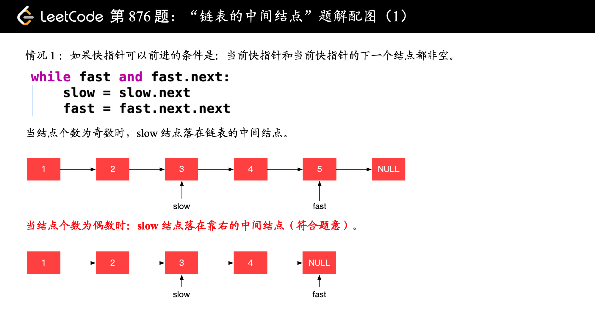

# 快慢指针总结
在链表问题中，借助快慢指针 (`fast, slow`)，快指针(`fast`)每次走2步，慢指针(`slow`)每次走1步。`fast`的步数恒为`slow`的2倍，因此当快指针遍历完整个链表时，慢指针就指向链表的中间节点。
由于长度为偶数的链表有两个中间节点，因此需要分两种情况考虑：
* 链表长度为奇数：当`fast`走到链表的结尾时(即,`fast.next == null`)，`slow`正好走到中间节点。
* 链表长度为偶数：当`fast`走到`null`时(即越过尾节点, `fast == null`)，`slow`指向第二个中间节点

* [876. Middle of the Linked List]
* [2095. Delete the Middle Node of a Linked List]
* [234. Palindrome Linked List]
* [2130. Maximum Twin Sum of a Linked List]
* [143. Reorder List]
* [141. Linked List Cycle]
* [142. Linked List Cycle II]

## Reference
* ✅[分享丨【题单】链表、二叉树与回溯（前后指针/快慢指针/DFS/BFS/直径/LCA/一般树）](https://leetcode.cn/discuss/post/3142882/fen-xiang-gun-ti-dan-lian-biao-er-cha-sh-6srp/)
* [876. 链表的中间结点（双指针，清晰图解）](https://leetcode.cn/problems/middle-of-the-linked-list/solutions/1646119/by-jyd-aphd/)
* [快慢指针（注意链表长度为偶数时，返回第 2 个结点的细节）](https://leetcode.cn/problems/middle-of-the-linked-list/solutions/165152/kuai-man-zhi-zhen-zhu-yao-zai-yu-diao-shi-by-liwei/)