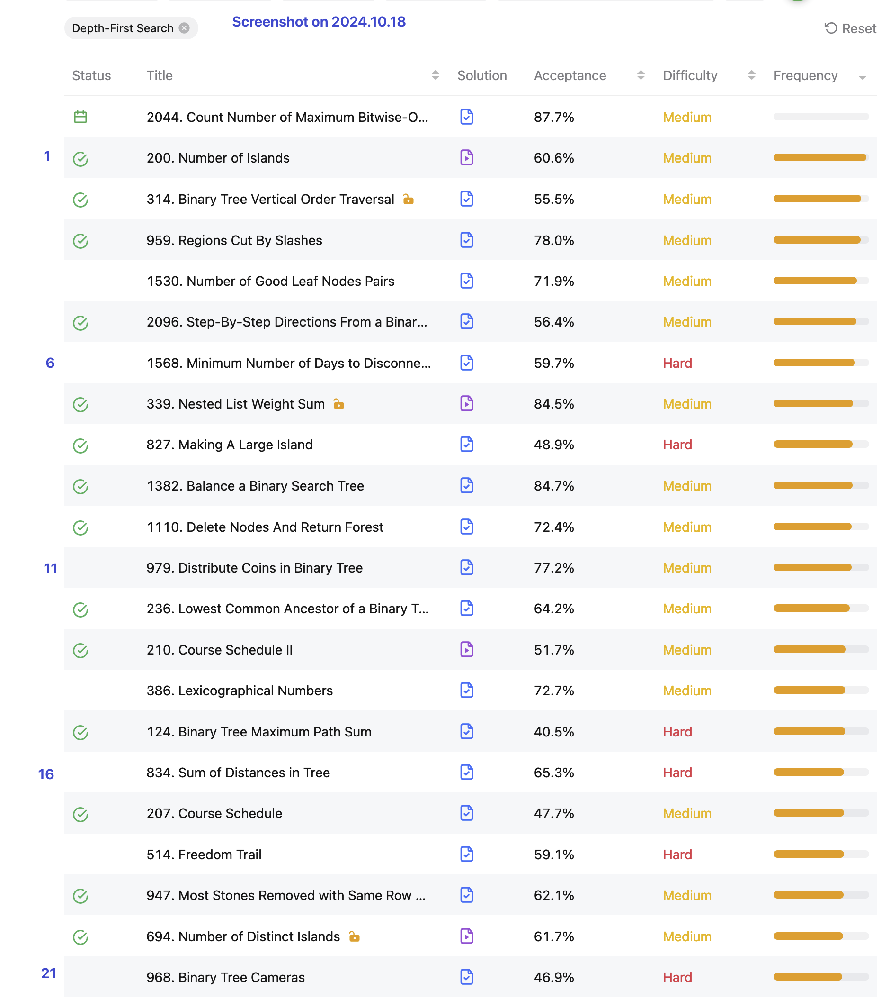

## BFS & DFS

## 1. BFS (Breadth-First Search)
* Tree 的 BFS 是典型的「单源 BFS」，首先把 root 节点入队，再一层一层无脑遍历就行了。
* Graph 的 BFS 则是「多源 BFS」，做法其实也是一样的
  * Tree 只有 1 个 root，而图可以有多个源点，所以首先需要把多个源点都入队；
  * Tree 是有向的因此不需要标识是否访问过，而对于无向图来说，必须得标志是否访问过哦！并且为了防止某个节点多次入队，需要在其入队之前就将其设置成已访问！


## 2. DFS


## 1. Graph Representation


## 2. A template for **iterative depth-first search**
```java 
// Use a stack to keep track of unexplored nodes.
Stack<Integer> stack = new Stack<>();
stack.push(0);
// Use a set to keep track of already seen nodes to
// avoid infinite looping. 
Set<Integer> seen = new HashSet<>();
seen.add(0);

// While there are nodes remaining on the stack...
while (!stack.isEmpty()) {
    int node = stack.pop(); // Take one off to visit.
    // Check for unseen neighbours of this node:
    for (int neighbour : adjacencyList.get(node)) {
        if (seen.contains(neighbour)) {
            continue; // Already seen this node.
        }
        // Otherwise, put this neighbour onto stack
        // and record that it has been seen.
        stack.push(neighbour);
        seen.add(neighbour);
    }
}
```

## LeetCode题目
* [269. Alien Dictionary](https://leetcode.com/problems/alien-dictionary/)


## Reference
1. [261. Solution](https://leetcode.com/problems/graph-valid-tree/solution/)
2. [Stack and DFS](https://leetcode.com/explore/learn/card/queue-stack/232/practical-application-stack/)


## LeetCode题目
* ✅ [1091. Shortest Path in Binary Matrix](https://leetcode.com/problems/shortest-path-in-binary-matrix/description/)
* [269. Alien Dictionary](https://leetcode.com/problems/alien-dictionary/)


## Reference
* ✅灵茶山艾府: [分享丨【题单】网格图（DFS/BFS/综合应用）](https://leetcode.cn/discuss/post/3580195/fen-xiang-gun-ti-dan-wang-ge-tu-dfsbfszo-l3pa/)
* LeetCodeCN: [2种BFS，详解DP， 🤷‍♀️必须秒懂！](https://leetcode.cn/problems/01-matrix/solutions/203486/2chong-bfs-xiang-jie-dp-bi-xu-miao-dong-by-sweetie/)