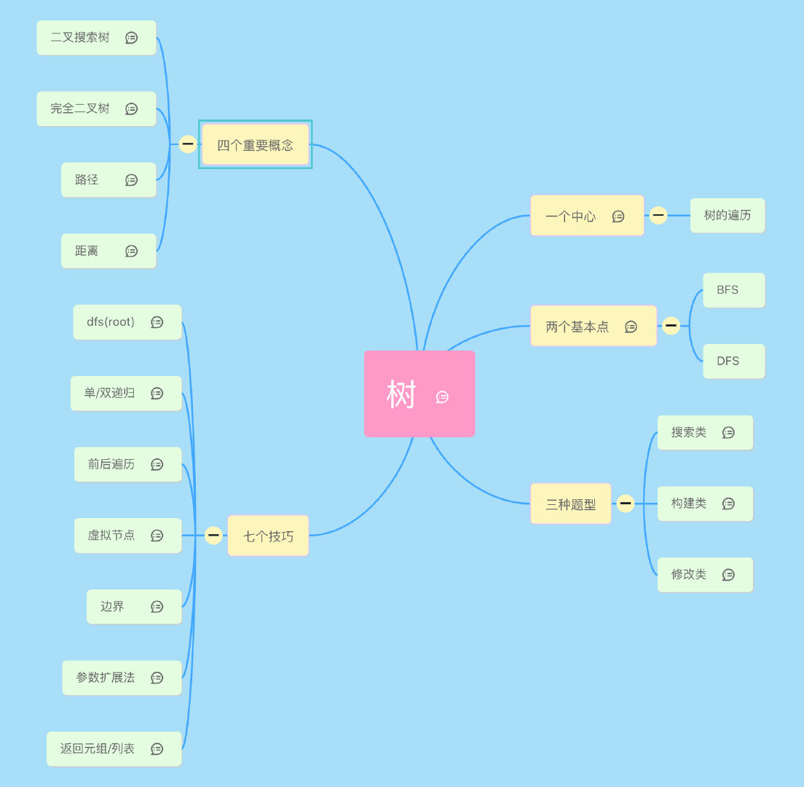
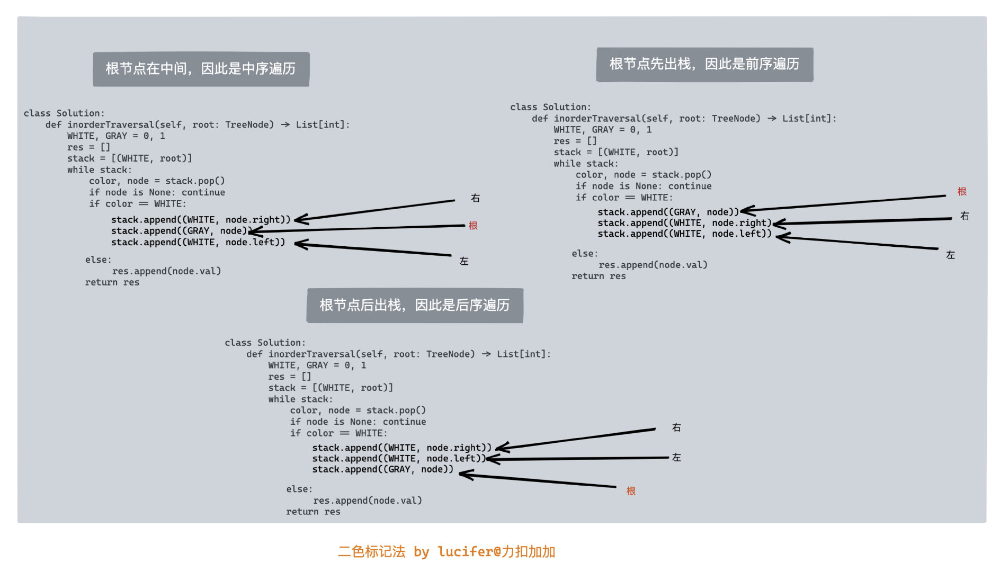

The common strategies to traverse a Tree data structure are Breadth-First Search (a.k.a BFS) and Depth-First Search (a.k.a. DFS). The DFS strategy can be further distinguished as preorder DFS, inorder DFS and postorder DFS, depending on the relative order of visit among the node itself and its child nodes.




## 1. Tree
* **树(Tree)**的结构其实跟**链表(List)**很相似，区别就是，树的一个节点可以指向多个其他节点。比如，`LinkedList`就是特殊化的`Tree`。
* **树**和**图**的区别在于，树是没有环的图。总结：Tree就是特殊化的Graph

:bangbang:其它重要概念：
* 树的高度：节点到叶子节点的最大值就是其高度。
* 树的深度：高度和深度是相反的，高度是从下往上数，深度是从上往下。因此根节点的深度和叶子节点的高度是 0。
* 树的层：根开始定义，根为第一层，根的孩子为第二层。
* 二叉树，三叉树，...，N叉树，由其子节点最多可以有几个决定，最多有N个就是N叉树。

**Reference:**
* [What is the difference between depth and height in a tree?](https://stackoverflow.com/questions/2603692/what-is-the-difference-between-depth-and-height-in-a-tree)


## 2. 树的遍历
### 1. 根据遍历顺序
二叉树主要有四种遍历方式
1. 先序(先根)遍历：即先访问根节点，再访问左孩子和右孩子, `根->左->右`
2. 中序遍历：先访问做孩子，再访问根节点和右孩子, `左->根->右`
3. 后序遍历：先访问左孩子，再访问右孩子，再访问根节点, `左 ->右->根`

另外有两种比较tricky的遍历方式
1. 层次遍历：按照所在层数，从下往上遍历, 用Queue来实现
    1. Binary Right Side View
    2. Zigzag level-order traversal
2. 垂直遍历：


### 2. 根据实现方法 (Recursion & Iteration)
1. Recursive的方法，递归条件的选择
2. Iterative的方法, 用`Stack`来实现, 需要一个current指向root的当前节点，注意判断current是否为空，跟stack是否为空都是很重要的条件。


### 3. 根据实现方法 (DFS vs BFS)
#### DFS (Depth First Search)
The DFS strategy can be further distinguished as **preorder DFS**, **inorder DFS** and **postorder DFS**, depending on the relative order of visit among the node itself and its child nodes.
* Preorder traversal
* Inorder traversal
* Postorder traversal


* 根节点在中间，因此是中序遍历
* 根节点先出，因此是前序遍历
* 根节点后出栈，因此是后序遍历

深度优先搜索算法(Depth First Search, DFS)是一种遍历树或图的算法。沿着**树的深度**遍历树的节点，**尽可能深**的搜索树的分支。

**深度优先遍历**在LeetCode中的题型是超级大户。对于树的题目，基本上都可以用DFS来解决，甚至我们可以基于DFS来做层次遍历，而且由于DFS可以基于递归(recursion)去做，因此算法会更简洁。在对性能有很高要求的场合，建议使用迭代(iteration)，否则尽量使用递归(recursion)，不仅写起来简单快速，还不容易出错。

用Stack实现DFS时，这里的栈可以有两种理解：自己实现的栈(like `ArrayDeque`) 🆚 调用栈。
1. 如果是自己实现的栈，就是迭代(iteration)
2. 如果是调用栈，就是迭代(recursion)

Reference: https://leetcode-solution-leetcode-pp.gitbook.io/leetcode-solution/thinkings/tree

#### BFS (Breadth First Search)
* Level order traversal


## 3. Binary Tree
Binary Tree是比较特殊的Tree，每个节点最多包涵两个子节点，我们习惯称之为左节点和右节点。
二叉树也是我们做算法题最常见的一种树，也要花大量时间重点掌握。

### 3.1 二叉树分类
* 完全二叉树
* 满二叉树
* 二叉搜索树
* 平衡二叉树
* 红黑树
* 。。。

### 3.2 二叉树的表示
* 链表存储
* 数组存储。非常适合完全二叉树

[How to traverse the tree](https://leetcode.com/problems/binary-tree-level-order-traversal/editorial/)

### 3.1 Binary Search Tree (BST)
Binary Search Tree又是比较特殊的Binary Tree
Properties of a BST:
1. Left subtree of a node `N` contains nodes whose values are lesser than or equal to node `N`'s value，`left.val <= root.val`
2. Right subtree of a node `N` contains nodes whose values are greater than node `N`'s value, `root.val <= right.val`
3. Both left and right subtrees are also BSTs.

### 2. Recursion & Iteration
以上四种traversal都有recursion和iteration两种写法


## 4. 平衡二叉树(AVL)


## 5. 红黑树
Java和C++标准库中的二叉搜索树都是用红黑树来实现的

:warning:注意: BT and BST 是不同的，BST有序。


## 6. 字典树Trie


## 7. Lowest Common Ancestor
下面代码可以适用于 LC 1644 Editorial 中的六种情况。
```Java
private TreeNode LCA(TreeNode node, TreeNode p, TreeNode q) {
    if (node == null || node == p || node == q)
        return node;
    TreeNode left = LCA(node.left, p, q);
    TreeNode right = LCA(node.right, p, q);
    if (left != null && right != null)
        return node;
    else if (left != null)
        return left;
    else
        return right;
}
```
* https://leetcode.com/problems/lowest-common-ancestor-of-a-binary-tree-ii/editorial/


## Problems
### 1. 基础中的基础--遍历
* [144. Binary Tree Preorder Traversal](https://leetcode.com/problems/binary-tree-preorder-traversal/)
* [94. Binary Tree Inorder Traversal](https://leetcode.com/problems/binary-tree-inorder-traversal/)
* [145. Binary Tree Postorder Traversal](https://leetcode.com/problems/binary-tree-postorder-traversal/)
* [102. Binary Tree Level Order Traversal](https://leetcode.com/problems/binary-tree-level-order-traversal/)
* [314. Binary Tree Vertical Order Traversal](https://leetcode.com/problems/binary-tree-vertical-order-traversal/)
* [987. Vertical Order Traversal of a Binary Tree](https://leetcode.com/problems/vertical-order-traversal-of-a-binary-tree/description/)

### 2. Vertical Order Traversal of a Binary Tree
* [314. Binary Tree Vertical Order Traversal](https://leetcode.com/problems/binary-tree-vertical-order-traversal/)
* [987. Vertical Order Traversal of a Binary Tree](https://leetcode.com/problems/vertical-order-traversal-of-a-binary-tree/description/) [Interface `Comparable<T>`]

### 3. 验证二叉搜索树(BST)
* [98. Validate Binary Search Tree](https://leetcode.com/problems/validate-binary-search-tree/)
* [94. Binary Tree Inorder Traversal](https://leetcode.com/problems/binary-tree-inorder-traversal/)
* [501. Find Mode in Binary Search Tree](https://leetcode.com/problems/find-mode-in-binary-search-tree/)

### 4. 二叉树&二叉搜索树的最近公共祖先(Lowest Common Ancestor)
1. [235. Lowest Common Ancestor of a Binary Search Tree](https://leetcode.com/problems/lowest-common-ancestor-of-a-binary-search-tree/) [BST的特点: 有序, `left.val < root.val < right.val`]
2. :exclamation:[236. Lowest Common Ancestor of a Binary Tree](https://leetcode.com/problems/lowest-common-ancestor-of-a-binary-tree/) [Binary Tree，无序]
   * 那么二叉树如何可以自底向上查找呢？**回溯啊，二叉树回溯的过程就是从低到上。**
3. :exclamation:[1644. Lowest Common Ancestor of a Binary Tree II](https://leetcode.com/problems/lowest-common-ancestor-of-a-binary-tree-ii/) [If either node `p` or `q` does not exist in the tree, return `null`.]
4. :exclamation:[1650. Lowest Common Ancestor of a Binary Tree III](https://leetcode.com/problems/lowest-common-ancestor-of-a-binary-tree-iii/) [Both `p` and `q` exist. Two Pointers]
5. :exclamation:[1676. Lowest Common Ancestor of a Binary Tree IV](https://leetcode.com/problems/lowest-common-ancestor-of-a-binary-tree-iv/)
6. [865. Smallest Subtree with all the Deepest Nodes](https://leetcode.com/problems/smallest-subtree-with-all-the-deepest-nodes/description/)
7. [1123. Lowest Common Ancestor of Deepest Leaves](https://leetcode.com/problems/lowest-common-ancestor-of-deepest-leaves/description/)

### 5. Diameter
* [543. Diameter of Binary Tree](https://leetcode.com/problems/diameter-of-binary-tree/)
* [1522. Diameter of N-Ary Tree](https://leetcode.com/problems/diameter-of-n-ary-tree/)
* [1245. Tree Diameter](https://leetcode.com/problems/tree-diameter/description/)

### 6. Full Binary Tree
* [894. All Possible Full Binary Trees] (https://leetcode.com/problems/all-possible-full-binary-trees/description/)


### 距离
与**路径**类似，距离也是一个相似且频繁出现的一个考点，并且二者都是搜索类题目的考点。
1. [834. Sum of Distances in Tree](https://leetcode.com/problems/sum-of-distances-in-tree/)
2. [863. All Nodes Distance K in Binary Tree](https://leetcode.com/problems/all-nodes-distance-k-in-binary-tree/)


### 4. Tree Path Sum
1. [112. Path Sum](https://leetcode.com/problems/path-sum/)
2. [113. Path Sum II](https://leetcode.com/problems/path-sum-ii/)
    1. [257. Binary Tree Paths](https://leetcode.com/problems/binary-tree-paths/)
3. [437. Path Sum III](https://leetcode.com/problems/path-sum-iii/)
    1. Prefix Sum: https://leetcode.com/problems/path-sum-iii/editorial/
    2. Recursive preorder traversal: https://leetcode.com/problems/sum-root-to-leaf-numbers/editorial/
4. [666. Path Sum IV](https://leetcode.com/problems/path-sum-iv/)


### 5. Tree Depth


## LeetCode
* [314. Binary Tree Vertical Order Traversal](https://leetcode.com/problems/binary-tree-vertical-order-traversal/description/)
  * [102. Binary Tree Level Order Traversal](https://leetcode.com/problems/binary-tree-level-order-traversal/description/)
  * [987. Vertical Order Traversal of a Binary Tree](https://leetcode.com/problems/vertical-order-traversal-of-a-binary-tree/description/)
* [1650. Lowest Common Ancestor of a Binary Tree III](https://leetcode.com/problems/lowest-common-ancestor-of-a-binary-tree-iii/)
  * [236. Lowest Common Ancestor of a Binary Tree](https://leetcode.com/problems/lowest-common-ancestor-of-a-binary-tree/description/)
* [426.Convert Binary Search Tree to Sorted Doubly Linked List](https://leetcode.com/problems/convert-binary-search-tree-to-sorted-doubly-linked-list/)


## Time and Space Complexity


## Reference
* [Stack and DFS](https://leetcode.com/explore/learn/card/queue-stack/232/practical-application-stack/)
* [Queue and BFS](https://leetcode.com/explore/learn/card/queue-stack/231/practical-application-queue/)
* [How to traverse the tree](https://leetcode.com/problems/binary-tree-preorder-traversal/editorial/)
* https://leetcode.com/problems/binary-tree-vertical-order-traversal/editorial/
* https://leetcode.com/problems/binary-tree-level-order-traversal/editorial/
* [【算法面试通关40讲】17 - 理论讲解：树&二叉树&二叉搜索树](https://blog.nowcoder.net/n/7ef346da89e7427c8b2aa4e6411208b0)
* [【算法面试通关40讲】18 - 面试题：验证二叉搜索树](https://blog.nowcoder.net/n/8d142c9931ef471db2a5a1960018c9fd)
* [【算法面试通关40讲】19 - 面试题：二叉树&二叉搜索树的最近公共祖先](https://blog.nowcoder.net/n/1516913505de4bf88d8e8870f0f2ab59)
    * Wiki: [Lowest common ancestor](https://en.wikipedia.org/wiki/Lowest_common_ancestor)
* [【算法面试通关40讲】20 - 理论讲解：二叉树遍历](https://blog.nowcoder.net/n/5ecf374d8b8540d7816804890512f489)
* [【算法面试通关40讲】36 - 理论讲解：字典树](https://blog.nowcoder.net/n/7b92f6b1fab14601a87955131e32252d)
* [【算法面试通关40讲】37 - 面试题：实现一个字典树](https://blog.nowcoder.net/n/cc91b737ce55412e8cc253b23391ea9c)
* [教你初步了解红黑树](https://blog.csdn.net/v_JULY_v/article/details/6105630)
* [【算法总结】五道常见的算法-二叉树](https://cloud.tencent.com/developer/article/1937902)
* [leetcode树有关的题那么多，你究竟应该刷哪些？](https://medium.com/@USTCLink/leetcode%E6%A0%91%E6%9C%89%E5%85%B3%E7%9A%84%E9%A2%98%E9%82%A3%E4%B9%88%E5%A4%9A-%E4%BD%A0%E7%A9%B6%E7%AB%9F%E5%BA%94%E8%AF%A5%E5%88%B7%E5%93%AA%E4%BA%9B-f058e6db181)
* [What is the difference between depth and height in a tree?](https://stackoverflow.com/questions/2603692/what-is-the-difference-between-depth-and-height-in-a-tree)
* [大兔Leetcode刷题手册 -- Tree的总结](https://dyang2016.wordpress.com/2016/10/15/tree%E7%9A%84%E6%80%BB%E7%BB%93/)
* [LeetCode-tree类总结（会持续更新...）](https://zxth93.github.io/2017/10/20/LeetCode-tree%E7%B1%BB%E6%80%BB%E7%BB%93/index.html)


