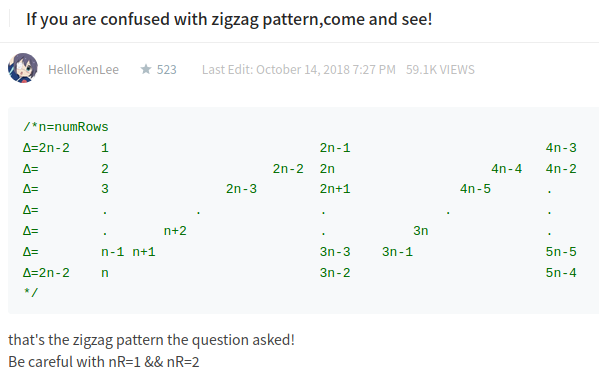

[6. ZigZag Conversion](https://leetcode.com/problems/zigzag-conversion/)

* Bloomberg, Microsoft
* String


## Method 1. 

```java
class Solution {
    public String convert(String s, int numRows) {
        char[] cs = s.toCharArray();
        int len = cs.length;
        StringBuffer[] sb = new StringBuffer[numRows];
        for(int i=0; i<sb.length; i++) {
            sb[i] = new StringBuffer();
        }
        
        int i = 0;
        while(i < len) {
            for(int idx=0; idx<numRows && i<len; idx++) {       // Down: Increase row index and string index at the same time
                sb[idx].append(cs[i++]);
            }
            for(int idx=numRows-2; idx>=1 && i<len; idx--) {    // To top right: Decrease row index, increase string index
                sb[idx].append(cs[i++]);
            }
        }
        for(int idx=1; idx<sb.length; idx++) {
            sb[0].append(sb[idx]);
        }
        return sb[0].toString();
    }
}s
```


## Method 2. The Fastest


* The pattern contains repeat cycle, i.e. top-down line and diagonal.
* From top to down, i.e. `1, 2, 3, ..., n`
* From bottom left to top right, i.e. `n+1, n+2, ..., 2n-2`

```java
class Solution {
    public String convert(String s, int numRows) {
        if(numRows == 1) {
            return s;
        }
        
        StringBuilder res = new StringBuilder();
        int len = s.length();
        int cycleLen = 2 * numRows - 2;
        for(int i=0; i<numRows; i++) {
            for(int j=0; j+i<len; j+=cycleLen) {
                res.append(s.charAt(j+i));      // From top to down
                if(i != 0 && i != numRows-1 && j+cycleLen-i < len) {
                    res.append(s.charAt(j + cycleLen - i)); // diagonal
                }
            }
        }
        
        return res.toString();
    }
}
```
Complexity:
1. Space complexity: `O(n)`, 与String s的length一致。
2. Time complexity: `O(n)`, 遍历了整个String s。


## Reference

[Easy to understand Java solution](https://leetcode.com/problems/zigzag-conversion/discuss/3403/Easy-to-understand-Java-solution)

[If you are confused with zigzag pattern,come and see!](https://leetcode.com/problems/zigzag-conversion/discuss/3435/If-you-are-confused-with-zigzag-patterncome-and-see!)
