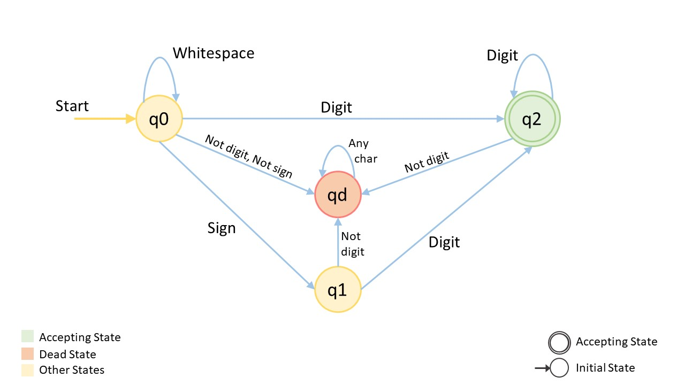
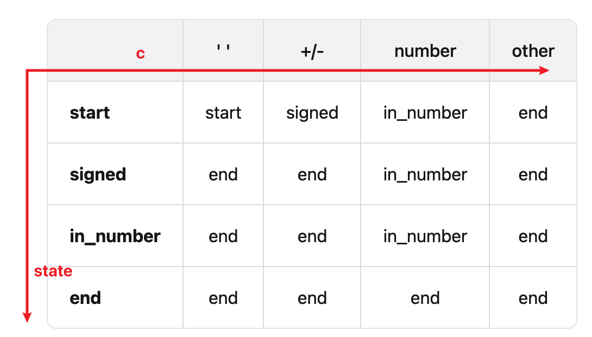

[8. String to Integer (atoi)](https://leetcode.com/problems/string-to-integer-atoi/)

* Facebook, Amazon, Microsoft, Google, Goldman Sachs, Apple, Adobe, Bloomberg, Intel
* Math, String
* Similar Questions
  * [7. Reverse Integer](https://leetcode.com/problems/reverse-integer/)
  * [65. Valid Number](https://leetcode.com/problems/valid-number/)


## Method 1. Scan from left to right

> **Steps:** The algorithm can be summarized as follows
>
> 1. Discard all the whitespace at the beginning of the string.
> 2. There could be an optional sign of a numerical value `+/-`. It should be noted that the integer is positive by default if there is no sign present and there could be at most one sign character.
> 3. Build the result using the above algorithm until there exists a non-whitespace character that is a number (`0` to `9`). Simultaneously, check for overflow/underflow condition at each step.
>
> **Note:** If there exists any non-integer character at step 3, we return 0 by default since it is not a valid integer. Also, we have to just discard all the characters after the first numerical value.

```java
class Solution {
    public int myAtoi(String s) {
        int i = 0;  // index for the string s
        int sign = 1;
        int res = 0;
        
        // Corner case
        if(s == null || s.length() == 0) {
            return 0;
        }
        
        // Discard whitespace in the beginning
        while(i < s.length() && s.charAt(i) == ' ') {
            i++;
        }
        
        // Check if optional sign if it exists
        if(i < s.length() && (s.charAt(i) == '+' || s.charAt(i) == '-')) {
            sign = (s.charAt(i++) == '-') ? -1 : 1;     // Remember increase the index
        }
        
        // Build the result and check for overflow/underflow condition
        while(i < s.length() && s.charAt(i) >= '0' && s.charAt(i) <='9') {  // s.charAt(i) is a digit
            if(res > Integer.MAX_VALUE / 10 || (res == Integer.MAX_VALUE / 10 && s.charAt(i)-'0' > Integer.MAX_VALUE % 10)) {
                return (sign == 1) ? Integer.MAX_VALUE : Integer.MIN_VALUE;
            }
            res = 10 * res + (s.charAt(i++) - '0');     // Remember increase the index
        }
        return sign * res;
    }
}
```
**Complexity Analysis**
- Time Complexity: `O(N)`. Here, N is the length of string `str`. We perform only one iteration over string `str`.
- Space Complexity: `O(1)`  We use constant extra space for storing sign of the result.

or

## Method 2. Follow the rules (1ms, beats 100%)
Read through the problem statement very carefully. Let's see what are all the possible characters in the input string:
* Whitespaces (' ')
* Digits ('0', '1', '2', '3', '4', '5', '6', '7', '8', '9')
* A sign ('+' or '-')
* Anything else (alphabetic characters, symbols, special characters, etc.)

And write down all the rules for building the integer for each one these characters which will help us in writing down the conditions while building the algorithm.
```java
class Solution {
    public int myAtoi(String s) {
        int i = 0;
        int N = s.length();
        int sign = 1;
        int result = 0;

        // Step 1: Skip leading spaces
        while(i < N && s.charAt(i) == ' ') {
            i++;
        }

        // Step 2. Check for optional sign
        if(i < N && (s.charAt(i) == '-' || s.charAt(i) == '+')) {
            sign = s.charAt(i) == '-' ? -1 : 1;
            i++;
        }

        // Step 3. Convert digits to integer
        while(i < N && Character.isDigit(s.charAt(i))) {
            int digit = s.charAt(i) - '0';
            // Check for overflow
            if(result > (Integer.MAX_VALUE - digit) / 10) {
                return (sign == 1) ? Integer.MAX_VALUE : Integer.MIN_VALUE;
            }
            result = result * 10 + digit;
            i++;
        }

        return sign * result;
    }
}
```

## Method 2. Deterministic Finite Automaton (DFA, 确定性有限自动机)



```java
class Solution {
    public int myAtoi(String str) {
        Automaton automaton = new Automaton();
        int length = str.length();
        for (int i = 0; i < length; ++i) {
            automaton.get(str.charAt(i));
        }
        return (int) (automaton.sign * automaton.ans);
    }
}

class Automaton {
    public int sign = 1;
    public long ans = 0;
    private String state = "start";
    private Map<String, String[]> table = new HashMap<String, String[]>() {{
        put("start", new String[]{"start", "signed", "in_number", "end"});
        put("signed", new String[]{"end", "end", "in_number", "end"});
        put("in_number", new String[]{"end", "end", "in_number", "end"});
        put("end", new String[]{"end", "end", "end", "end"});
    }};

    public void get(char c) {
        state = table.get(state)[get_col(c)];
        if ("in_number".equals(state)) {
            ans = ans * 10 + c - '0';
            ans = sign == 1 ? Math.min(ans, (long) Integer.MAX_VALUE) : Math.min(ans, -(long) Integer.MIN_VALUE);
        } else if ("signed".equals(state)) {
            sign = c == '+' ? 1 : -1;
        }
    }

    private int get_col(char c) {
        if (c == ' ') {
            return 0;   // Go to column 0
        }
        if (c == '+' || c == '-') {
            return 1;   // Go to column 1
        }
        if (Character.isDigit(c)) {
            return 2;   // Go to column 2
        }
        return 3;       // Go to column 3
    }
}
```
**复杂度分析**
* 时间复杂度：O(n)，其中 n 为字符串的长度。我们只需要依次处理所有的字符，处理每个字符需要的时间为 O(1)。
* 空间复杂度：O(1)。自动机的状态只需要常数空间存储。


## Reference
* https://leetcode.com/problems/string-to-integer-atoi/submissions/1455465373/
* LeetCode: [✅ 🔥 1 ms Runtime Beats 100% User 🔥 ✅|| Step By Steps Solution ✅ || Easy to Understand ✅🔥 ||](https://leetcode.com/problems/string-to-integer-atoi/solutions/6000040/1-ms-runtime-beats-100-user-step-by-steps-solution-easy-to-understand/)
* LeetCodeCN: [字符串转换整数 (atoi)](https://leetcode.cn/problems/string-to-integer-atoi/solutions/183164/zi-fu-chuan-zhuan-huan-zheng-shu-atoi-by-leetcode-/)