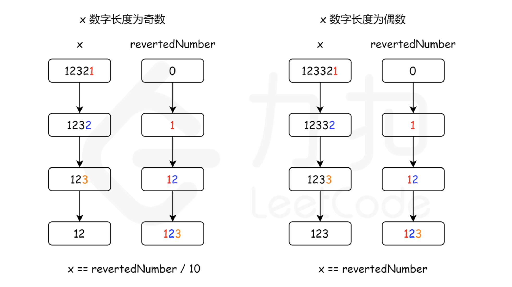

[9. Palindrome Number](https://leetcode.com/problems/palindrome-number/)

* Microsoft, Adobe, Bloomberg, Facebook, Google, Yahoo
* Math
* Similar Question:
    * [234. Palindrome Linked List](https://leetcode.com/problems/palindrome-linked-list/)
* Hint: Beware of overflow when you reverse the integer.


## Analysis

* First of all, we should take care of some edge cases. All negative numbers are not palindrome, so we can return false for all negative numbers.
* Reverse the last half of the number.


## Method 1. Reverse half of the number

```java
class Solution {
    public boolean isPalindrome(int x) {
        // Special cases:
        // When x < 0, x is not a palindrome. Also if the last digit of the number is 0, in order to be a palindrome,
        // the first digit of the number also needs to be 0, and only 0 satisfy this property.
        // Corner case:
        // 1. x is a negative number, like -123
        // 2. x ends with 0, like, 1230, --> 0321 (invalid)
        if (x < 0 || (x % 10 == 0 && x != 0)) {
            return false;
        }

        int reversedNumber = 0;
        while (x > reversedNumber) {     // x > reverseNumber, not x > 0
            reversedNumber = reversedNumber * 10 + x % 10;
            x = x / 10;
        }

        // When the length is an odd number, we can get rid of the middle digit by reversedNumber/10
        // Since the middle digit doesn't matter in palindrome(it will always equal to itself), 
        // we can simply get rid of it.
        // 12321, x = 123, revertedNumber = 12
        // 1221, x = 12, revertedNumber = 12
        return x == reversedNumber || x == reversedNumber / 10;
    }
}
```
**Complexity Analysis**
* Time complexity : `O(log10(n))`. We divided the input by 10 for every iteration, so the time complexity is `O(log10(n))`.
* Space complexity : `O(1)`.


## Reference
* https://leetcode.com/problems/palindrome-number/editorial/?envType=company&envId=facebook&favoriteSlug=facebook-three-months