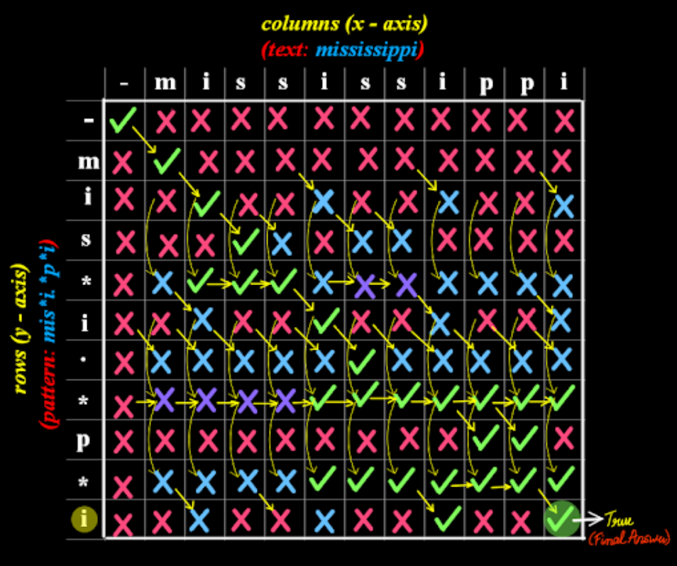

[10. Regular Expression Matching](https://leetcode.com/problems/regular-expression-matching/)

* Facebook, Amazon, Google, Bloomberg, Coldman Sachs, Coursera, Microsoft, Apple, Databricks
* String, Dynamic Programming, Backtracking
* Similar Questions:
    * [44. Wildcard Matching](https://leetcode.com/problems/wildcard-matching/)


## Method 1. Dynamic Programming, Bottom-Up

**Key Points:**

1. Def: `dp[i][j]` represents whether `s[0,...,i-1]` matches `p[0,...,j-1]` or not.
   1. `dp[i][j]`, `i` and `j` 只代表`s`和`p`子字符串的长度, `dp[i][j]`表示长度为`i`的`s`的子字符串与长度为`j`的`p`的子字符串是否匹配。
      *  
2. Rel: 
    * If `p.charAt(j)==s.charAt(i) || p.charAt(j)=='.'`, then `dp[i+1][j+1] = dp[i][j]`
    * If `p.charAt(j)=='*'`:
        1. If `s.charAt(i-1) != p.charAt(j-1) && p.charAt(j-1) != '.'`, then we have to skip `p.charAt(j-1)`, which means `s[0,...,i]` matching with `p[0,...,j-2]`,
        2. If `s.charAt(i-1)` matches `p.charAt(j-1)`: (只有当 `s.charAt(i-1)` 与 `p.charAt(j-1)` match的时候, `p.charAt(j)=='*'` 才可以匹配 0 or more of preceding)
            * `'*'` matches zero preceding element, i.e. skip `p.charAt(j-1)`, which means `s[0,...,i]` matching with `p[0,...,j-2]`, 
            then `dp[i+1][j+1] = dp[i+1][j-1]`
            * `'*'` matches one preceding element, i.e. skip `p.charAt(j)`, which means `s[0,...,i]` matching with `p[0,...,j-1]`, then `dp[i+1][j+1] = dp[i][j]+1`
            * `'*'` matches more of the precessing element, i.e. `p.charAt(j)` still match `s.charAt(i-1)`, then `dp[i+1][j+1] = dp[i-1][j]`

```java
class Solution {
    public boolean isMatch(String s, String p) {
        if(s == null && p == null) {
            return true;
        }
        if(s == null || p == null) {
            return false;
        }
        
        boolean[][] dp = new boolean[s.length() + 1][p.length() + 1];
        // Initialization: s="", p="", ==> dp[0][0] = true
        dp[0][0] = true;
        // s="", p=".*" or p="x*", where x could be any character, dp[0][j+1]=dp[i][j-1]
        for(int j=0; j<p.length(); j++) {
            if(p.charAt(j) == '*' && dp[0][j-1]) {  // Since dp[0][j-1] does not throw exception, it means '*' cannot be the first character
                dp[0][j+1] = true;
            }
        }
        
        for(int i=0; i<s.length(); i++) {
            for(int j=0; j<p.length(); j++) {
                // Case 1: curr s and  curr p are matched
                if(p.charAt(j) == s.charAt(i) || p.charAt(j) == '.') {
                    dp[i+1][j+1] = dp[i][j];
                }
                // Case 2: p.charAt(j) is a '*'
                // 1. Match zero of the preceding element, i.e. skip p.charAt(j-1) ==> dp[i+1][j+1] = dp[i+1][j-1];    // skip p.charAt(j-1)
                // 2. Match only one of the preceding element, i.e. skip '*' itself ==> dp[i+1][j+1] = dp[i+1][j]
                // 3. Match more of the preceding element, i.e. p.charAt(j-1) can match with s.charAt(i) ==> dp[i+1][j+1] = dp[i+1][j]
                if(p.charAt(j) == '*') {
                    if(p.charAt(j-1)!=s.charAt(i) && p.charAt(j-1)!='.') {
                        dp[i+1][j+1] = dp[i+1][j-1];    // skip p.charAt(j-1)
                    } else {
                        dp[i+1][j+1] = (dp[i+1][j] || dp[i][j+1] || dp[i+1][j-1]);
                    }
                }
            }
        }
        return dp[s.length()][p.length()];
    }
}
```

**Complexity Analysis:**

1. Time Complexity: Let `T`, `P` be the lengths of the text and the pattern respectively. The
 work for every call to `dp(i, j)` for `i=0,...,T`; `j=0,...,P` is done once, and it is `O(1 )` work. 
 Hence, the time complexity is `O(TP)`.  
2. Space Complexity: The only memory we use is the `O(TP)` boolean entries in our cache. Hence
, the space complexity is `O(TP)`. 


## Method 2. Dynamic Programming, Top-Down Variation (fastest)
**Key Points:**

1. The bottom case is `i == s.length()` and `j == p.length()`, i.e. `dp[s.length()][p.length()] == true`.
2. If `s.charAt(i)` matches `p.charAt(j)`, then we only need to consider if `s[i+1, s.length()]` match `p[j+1, p.length()]` or not.
3. Skip `p[j,j+1]`, i.e. consider `isMatch(s, i, p, j+2, dp)`, i.e. we try to match `s.charAt(i)` with `p.charAt(j+2)`, which means `p[j,j+1]` are skipped.
4. `(isFirstMatch && isMatch(s, i+1, p, j, dp))`, i.e. `p.charAt(j)` are used multiple times.


```java
class Solution {
    public boolean isMatch(String s, String p) {
        Boolean[][] dp = new Boolean[s.length() + 1][p.length() + 1];
        return isMatch(s, 0, p, 0, dp); // Try to match s[0, s.length()] with p[0, p.length()]
    }
    
    private boolean isMatch(String s, int i, String p, int j, Boolean[][] dp) {
        if(dp[i][j] != null) {
            return dp[i][j];
        }
        boolean res;
        if(j == p.length()) {   // j == p.length()
            res = (i == s.length());    // All characters of s and p are matched
        } else {                // j != p.length()
            boolean isFirstMatch = (i < s.length() && j < p.length() && (p.charAt(j) == s.charAt(i) || p.charAt(j) == '.'));
            if(j+1 < p.length() && p.charAt(j+1)=='*') {
                // when s.charAt(i) != p.charAt(j), then we can skip p.charAt(j) because p.charAt(j+1), isMatch(s, i, p, j+2, dp)
                // s.charAt(i) matches with p.charAt(j-1) and p.charAt(j-1) can be repeated multi times 
                res = isMatch(s, i, p, j+2, dp) || (isFirstMatch && isMatch(s, i+1, p, j, dp));
            } else {
                res = isFirstMatch && isMatch(s, i+1, p, j+1, dp);  // Proceed i and j at the same time
            }
        }
        dp[i][j] = res;
        return res;
    }
}
```
**Complexity Analysis:**

1. Time Complexity: Let T, P be the lengths of the text and the pattern respectively. The work for every call to `dp(i, j)` 
for `i=0,...,T`, `j=0,...,P` is done once, and it is `O(1)` work. Hence, the time complexity is `O(TP)`.
2. Space Complexity: The only memory we use is the `O(TP)` boolean entries in our cache. Hence, the space complexity is `O(TP)`.


## Method 3. Dynamic Programming: Bottom-Up Variation

```java
class Solution {
    public boolean isMatch(String s, String p) {
        boolean[][] dp = new boolean[s.length() + 1][p.length() + 1];
        dp[s.length()][p.length()] = true;
        
        for(int i=s.length(); i>=0; i--) {
            for(int j=p.length()-1; j>=0; j--) {
                boolean isFirstMatch = (i < s.length() && (p.charAt(j)==s.charAt(i) || p.charAt(j)=='.'));
                if(j+1 < p.length() && p.charAt(j+1) == '*') {
                    dp[i][j] = dp[i][j+2] || (isFirstMatch && dp[i+1][j]);  // skip or match one more
                } else {
                    dp[i][j] = isFirstMatch && dp[i+1][j+1];
                }
            }
        }
        return dp[0][0];
    }
}
```
**Complexity Analysis:**

1. Time Complexity: Let T, P be the lengths of the text and the pattern respectively. The work for every call to `dp(i, j)` 
for `i=0,...,T`, `j=0,...,P` is done once, and it is `O(1)` work. Hence, the time complexity is `O(TP)`.
2. Space Complexity: The only memory we use is the `O(TP)` boolean entries in our cache. Hence, the space complexity is `O(TP)`.


## Reference
* https://leetcode.com/problems/regular-expression-matching/solutions/3401751/detailed-explaination-with-pictures-in-c-java-python-dp-bottom-up-tabulation/

