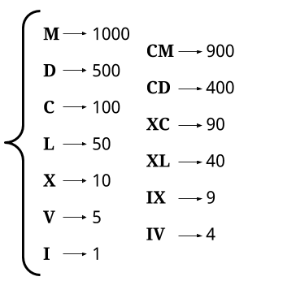

[12. Integer to Roman](https://leetcode.com/problems/integer-to-roman/)

* Amazon, Microsoft, Adobe, Bloomberg, Google
* Math, String
* Similar Questions:
    * [13. Roman to Integer](https://leetcode.com/problems/roman-to-integer/)
    * [Integer to English Words](https://leetcode.com/problems/integer-to-english-words/)
    
    

## Method 1. Greedy (先处理最高位)
> Representing a given integer as a Roman Numerical requires finding a sequence of the following
> 13 symbols, where their corresponding values add up to the integer.
> This sequence must be in order from largest to smallest, based on symbol value.
> 


```java
class Solution {
    private static final int[] values = {1000, 900, 500, 400, 100, 90, 50, 40, 10, 9, 5, 4, 1};
    private static final String[] symbols = {"M", "CM", "D", "CD", "C", "XC", "L", "XL", "X", "IX", "V", "IV", "I"};
    
    public String intToRoman(int num) {
        StringBuilder sb = new StringBuilder();
        // Loop through each symbol, stopping if number becomes 0.
        for(int i=0; i<values.length && num > 0; i++) {
            // Repeat while the current symbol still fits into num
            while(values[i] <= num) {
                num -= values[i];
                sb.append(symbols[i]);
            }
        }
        
        return sb.toString();
    }
}
```

**Complexity Analysis:**
* Time complexity : `O(1)`.
    As there is a finite set of roman numerals, there is a hard upper limit on how many times the loop can iterate. This upper limit is 15 times, and it occurs for the number 3888, which has a representation of `MMMDCCCLXXXVIII`. Therefore, we say the time complexity is constant, i.e. `O(1)`.
* Space complexity : `O(1)`.
    The amount of memory used does not change with the size of the input integer, and is therefore constant.


**Example:**
* Input=`2994` ==> Output=`"MMCMXCIV"`
1. 首先，2994 > 1000, 所以可以用 1000 + XXX表示，XXX又可以分出一个1000，...
2. 其次，最高位的值可能不止一个1000，比如2994，所以需要在内部有个while-loop


## Method 2. 拆分
把 num 拆分成千位数、百位数、十位数和个位数，分别用罗马数字表示。
例如示例 1 的 num=3749，拆分后对应的罗马数字分别为 MMM,DCC,XL,IX。
```java
class Solution {
    private static final String[][] ROMANS = new String[][] {
        {"", "I", "II", "III", "IV", "V", "VI", "VII", "VIII", "IX"},   // 0 --> 9
        {"", "X", "XX", "XXX", "XL", "L", "LX", "LXX", "LXXX", "XC"},   // 10 --> 90
        {"", "C", "CC", "CCC", "CD", "D", "DC", "DCC", "DCCC", "CM"},   // 100 --> 900
        {"", "M", "MM", "MMM"}
    };

    public String intToRoman(int num) {
        return ROMANS[3][num / 1000] + ROMANS[2][num / 100 % 10] + ROMANS[1][num / 10 % 10] + ROMANS[0][num % 10];
    }
}
```


## Reference
* LeetCodeCN: https://leetcode.cn/problems/integer-to-roman/solutions/2848775/jian-ji-xie-fa-pythonjavaccgojsrust-by-e-kmp6/