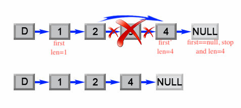
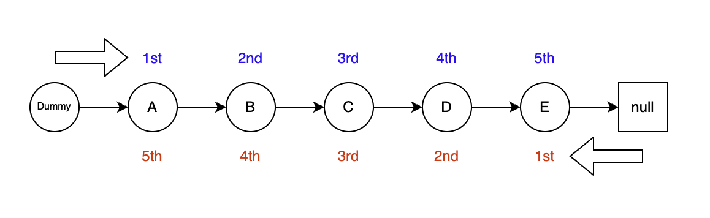

[19. Remove Nth Node From End of List](https://leetcode.com/problems/remove-nth-node-from-end-of-list/)

* Facebook, Amazon, Apple, Bloomberg
* Linked List, Two Pointers
* Similar Question:
    * [1721. Swapping Nodes in a Linked List](https://leetcode.com/problems/swapping-nodes-in-a-linked-list/)
    * [1474. Delete N Nodes After M Nodes of a Linked List](https://leetcode.com/problems/delete-n-nodes-after-m-nodes-of-a-linked-list/)
    

## Method 1. Two Pass Algorithm
> The problem could be simply reduced to another one: Remove the `(L - n + 1)`th node from the
> beginning in the list, where `L` is the list length. This problem is easy to solve once we
> found list Length.
>
> The "dummy" node is used to simplify some corner case such as a list with only one node, or
> removing the head of the list.
>
> 

```java
/**
 * Definition for singly-linked list.
 * public class ListNode {
 *     int val;
 *     ListNode next;
 *     ListNode() {}
 *     ListNode(int val) { this.val = val; }
 *     ListNode(int val, ListNode next) { this.val = val; this.next = next; }
 * }
 */
class Solution {
    public ListNode removeNthFromEnd(ListNode head, int n) {
        ListNode dummy = new ListNode(0);
        ListNode first = head;
        dummy.next = head;
        // The first pass: Get the length of this list.
        int length = 0;
        while(first != null) {
            length++;   // Since node `first` is not null, increase the length by 1.
            first = first.next;
        }
        
        // The second pass: Find the (L - N + 1)th node and remove it.
        // Since this time we start from dummy node, i.e. the node before head, we remove (L - N)th node.
        length -= n;
        first = dummy;
        while(length > 0) {
            length--;
            first = first.next;
        }   // Find the (L - N)th node.
        
        // Remove the (L - N)th node.
        first.next = first.next.next;
        
        return dummy.next;
    }
}
```

Complexity Analysis
* Time complexity : `O(L)`. The algorithm makes two traversal of the list, first to calculate list length LLL and second to find the `(L−n)`th node. There are `2L−n` operations and time complexity is `O(L)`.
* Space complexity : `O(1)`. We only used constant extra space. 


## Method 2. One Pass Algorithm
> The first pointer advances the list by `n + 1` steps from the beginning, while the second
> pointer starts from the beginning of the list. Now, both pointers are exactly separated by `n` 
> nodes apart.
>
> 

```java
/**
 * Definition for singly-linked list.
 * public class ListNode {
 *     int val;
 *     ListNode next;
 *     ListNode() {}
 *     ListNode(int val) { this.val = val; }
 *     ListNode(int val, ListNode next) { this.val = val; this.next = next; }
 * }
 */
class Solution {
    public ListNode removeNthFromEnd(ListNode head, int n) {
        ListNode dummy = new ListNode(0);
        dummy.next = head;
        ListNode first = dummy;
        ListNode second = dummy;
        
        // Advances the first pointer so that the gap between first and second is n nodes apart.
        for(int i=1; i<=n+1; i++) {
            first = first.next;
        }
        
        // Move first to the end, maintaining the gap
        while(first != null) {
            first = first.next;
            second = second.next;
        }
        
        second.next = second.next.next;
        return dummy.next;
    }
}
```

Complexity Analysis
* Time complexity : `O(L)`. The algorithm makes one traversal of the list of LLL nodes. Therefore time complexity is `O(L)`.
* Space complexity : `O(1)`. We only used constant extra space.


## My Analysis

In order to delete node 4, we need the reference to its previous node, 3
1. fast --> 5, slow --> 3, i.e. fast is 2 steps ahead of slow
2. when `fast.next == null`, stop
3. The first node could also be deleted, therefore we need a dummy node

```java
 /**
dummy 1   2   3   4   5   null
              s           f
f: moves 6
s: moves 3
f is 3 steps ahead of s, i.e. n+1

dummy   1   2   3   4   5
                s       f
f: moves 5
s: moves 3
f is 2 steps ahead of s
 
 */
class Solution {
    public ListNode removeNthFromEnd(ListNode head, int n) {
        // Since the head node could be removed, we need a dummy node
        ListNode dummy = new ListNode(0, head);
        
        ListNode slow = dummy;
        ListNode fast = dummy;
        for(int i=0; i<n; i++) {
            fast = fast.next;
        }

        while(fast.next != null) {
            slow = slow.next;
            fast = fast.next;
        }
        slow.next = slow.next.next;
        return dummy.next;
    }
}
```


## Appendix
### 1. How to get the length of a linked list?


```java
ListNode first = head;
int length = 0;
while(first != null) {
    length++;
    first = first.next;
}
```

### 2. How to find the N-th node from the beginning?

如果起始点是`dummy`, whose next is real `head`
1. If N=1，move to next once
2. If N=2, move to next twice
3. If N=3, move to next three time
```java
ListNode dummy = ListNode(0);
dummy.next = head;
first = dummy;
for(int i=0; i<N; i++) {
    first = first.next;
}

// or
first = dummy;
for(int i=1; i<=N; i++) {
    first = first.next;
}
```

### 3. How to find the N-th node from the end?

If length=5, N=2, then we need to find out node `D`.
* `N-th` node from the end, i.e. `(L-N+1)th` node from the beginning
* 如果要删除`N-th` node，则要找到它前一个node，即`(N+1)th` node
```java
// The second pass: Find the (L - N + 1)th node and remove it.
// Since this time we start from dummy node, i.e. the node before head, we remove (L - N)th node.
length -= n;    // 5-2=3, 即要删除节点的前一个
first = dummy;
while(length > 0) {
    length--;
    first = first.next;
}   // Find the (L - N)th node.

// or
length -=;
first = dummy;
for(int i=0; i<length; i++) {
    length--;
    first = first.next;
}
```