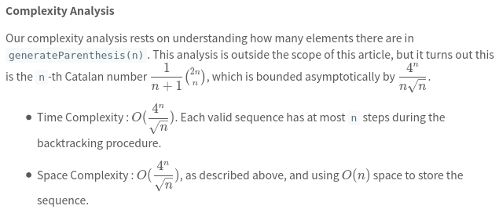

[22. Generate Parentheses](https://leetcode.com/problems/generate-parentheses/)

* Facebook, Amazon, Microsoft, Adobe, Walmart Labs, Google, Apple, ByteDance, Spotify, Yandex, Cisco, Atlassian
* String, Backtracking
* Similar Questions:
    * [20. Valid Parentheses](https://leetcode.com/problems/valid-parentheses/)
    * [17. Letter Combinations of a Phone Number](https://leetcode.com/problems/letter-combinations-of-a-phone-number/)
    
    
## Method 1. Brute Force
> To check whether a sequence is valid, we keep track of **balance**, the net number of opening brackets minus closing brackets.
> 
> 在Brute Force方法中, 无论当前的substring是否合理, 都会持续添加'('或')', 直到结束. 在这个过程中, 就会有一些invalid substring也会持续添加字符, 这回消耗过多的时间.

```java
class Solution {
    public List<String> generateParenthesis(int n) {
        List<String> combinations = new ArrayList<>();
        generateAll(new char[2 * n], 0, combinations);
        return combinations;
    }
    
    private void generateAll(char[] current, int pos, List<String> result) {
        if(pos == current.length) {
            if(valid(current)) {
                result.add(new String(current));
            }
        } else {
            current[pos] = '(';
            generateAll(current, pos + 1, result);
            current[pos] = ')';
            generateAll(current, pos + 1, result);
        }
    }
    
    private boolean valid(char[] current) {
        int balance = 0;
        for(char c: current) {
            if(c == '(') {
                balance++;
            } else {
                balance--;
            }
            if(balance < 0) {
                return false;
            }
        }
        return balance == 0;
    }
}
```

Complexity Analysis
* Time Complexity : `O(2^{2n} n)`. For each of `2^{2n}` sequences, we need to create and validate the sequence, which takes `O(n)` work.
* Space Complexity : `O(2^{2n}n)`. Naively, every sequence could be valid. See Approach 3 for development of a tighter asymptotic bound. 


    
## Method 2. Backtracking
> Instead of adding '(' or ')' every time as Brute Force, we **only add '(' or ')' when we know it will remain a valid sequence.**
> 如果已经知道当前的substring是invalid, 就无需继续往下执行.
>
> We can do this by keeping track of the number of opening and closing brackets we have placed so far.          
> We can start on opening bracket if we still have `1` or `n` opening bracket to place. And we can start a closing bracket if it would not exceed the number of opening brackets.

```java
class Solution {
    public List<String> generateParenthesis(int n) {
        List<String> res = new ArrayList<String>();
        if(n == 0) {
            return res;
        }
        generateParenthesis(new StringBuilder(), 0, 0, n, res);
        return res;
    }
    
    private void generateParenthesis(StringBuilder sb, int left, int right, int n, List<String> res) {
        if(left < right) {  // Invalid StringBuilder sb
            return;
        }
        if(left==n && right==n) {   // 终止条件
            res.add(sb.toString());
            return;
        }
        int len = sb.length();
        if(left < n) {
            generateParenthesis(sb.append('('), left+1, right, n, res);
        }
        sb.setLength(len);  // Append '(' or ')', so we need to reset length
        if(right < n) {
            generateParenthesis(sb.append(')'), left, right+1, n, res);
        }
    }
}
```



## My Solution -- Backtracking
Key Points:
1. Constraint Condition: 
    * `left > n` || `right > n` || `right > left`, invalid parenthesis, directly return.
    * Set to original left before backtracking, since when `left == right == n`, `sb` will not set to original length.
```java
class Solution {
    public List<String> generateParenthesis(int n) {
        List<String> res = new ArrayList<>();
        
        backtracking(n, 0, 0, new StringBuilder(), res);
        return res;
    }
    
    private void backtracking(int n, int left, int right, StringBuilder sb, List<String> res) {
        if(left > n || right > n || right > left) {
            return;
        }
        if(left == n && right == n) {
            res.add(sb.toString());
            return;
        }
        
        int len = sb.length();
        backtracking(n, left+1, right, sb.append("("), res);
        sb.setLength(len);  // set to original left before backtracking, since when `left == right == n`, `sb` will not set to original length.
        backtracking(n, left, right+1, sb.append(")"), res);
    }
}
```

**Complexity**, the same with *Method 2. Backtracking*.