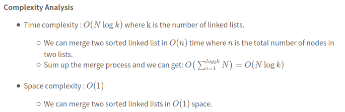

[23. Merge k Sorted Lists](https://leetcode.com/problems/merge-k-sorted-lists/)

* Amazon, Facebook, Microsoft, Apple, Uber, Google, Bloomberg, eBay, ByteDance
* LinkedList, Divide and Conquer, PriorityQueue (Heap)
* Similar Questions:
    * [21.Merge Two Sorted List](https://leetcode.com/problems/merge-two-sorted-lists/)
    * [264. Ugly Number II](https://leetcode.com/problems/ugly-number-ii/)
    
    

## Method 1. Priority Queue (4ms, beat 71%)
> Optimize the **comparison process** by **priority queue**.

```java
class Solution {
    public ListNode mergeKLists(ListNode[] lists) {
        if(lists==null || lists.length==0) {
            return null;
        }
        
        PriorityQueue<ListNode> queue = new PriorityQueue<ListNode>(lists.length, (a, b) -> (a.val - b.val));
        ListNode dummy = new ListNode(0);
        ListNode curr = dummy;
        
        for(ListNode list: lists) {
            if(list != null) {
                queue.offer(list);
            }
        }
        
        while(!queue.isEmpty()) {
            curr.next = queue.poll();
            curr = curr.next;
            if(curr.next != null) {
                queue.offer(curr.next);
            }
        }
        return dummy.next;
    }
}
```
Complexity Analysis
* Time complexity : `O(Nlogk)` where `k` is the number of linked lists. The comparison cost will be reduced to `O(logk)` for every pop and insertion to priority queue. But finding the node with the smallest value just costs `O(1)` time. There are N nodes in the final linked list. 
* Space complexity : `O(n)` Creating a new linked list costs `O(n)` space. `O(k)` The code above present applies in-place method which cost `O(1)` space. And the priority queue (often implemented with heaps) costs `O(k)` space (it's far less than NNN in most situations).


## Method 2. Merge with Divide and Conquer (i.e. Merge with Divide and Conquer, Faster, 1ms, beat 100%)
> We don't need to traverse most nodes many times repeatedly.
>
> 

```java
/**
 * Definition for singly-linked list.
 * public class ListNode {
 *     int val;
 *     ListNode next;
 *     ListNode() {}
 *     ListNode(int val) { this.val = val; }
 *     ListNode(int val, ListNode next) { this.val = val; this.next = next; }
 * }
 */
class Solution {
    public ListNode mergeKLists(ListNode[] lists) {
        //corner case
        if (lists == null || lists.length == 0) return null;
        
        int n = lists.length;
        
        return merge(lists, 0, n - 1);
    }
    
    private ListNode merge(ListNode[] lists, int left, int right) {
        //base case
        if (left == right) {
            return lists[left];
        }
        
        int mid = left + (right - left) / 2;
        ListNode n1 = merge(lists, left, mid);
        ListNode n2 = merge(lists, mid + 1, right);
        
        return merge2(n1, n2);
    }
    
    private ListNode merge2(ListNode n1, ListNode n2) {
        ListNode dummy = new ListNode(0);
        
        ListNode curr = dummy;
        
        while (n1 != null && n2 != null) {
            if (n1.val <= n2.val) {
                curr.next = n1;
                n1 = n1.next;
                curr = curr.next;
            } else if (n2.val < n1.val) {
                curr.next = n2;
                n2 = n2.next;
                curr = curr.next;
            }
        }
        
        if (n1 != null) curr.next = n1;
        if (n2 != null) curr.next = n2;
        
        return dummy.next;
    }
}
```




```java
/**
 * Definition for singly-linked list.
 * public class ListNode {
 *     int val;
 *     ListNode next;
 *     ListNode() {}
 *     ListNode(int val) { this.val = val; }
 *     ListNode(int val, ListNode next) { this.val = val; this.next = next; }
 * }
 */
class Solution {
    public ListNode mergeKLists(ListNode[] lists) {
        if(lists == null || lists.length == 0) {
            return null;
        }
        int n = lists.length;
        
        return mergeKLists(lists, 0, n-1);
    }
    
    private ListNode merge(ListNode l1, ListNode l2) {
        if(l1 == null) {
            return l2;
        }
        if(l2 == null) {
            return l1;
        }
        if(l1.val <= l2.val) {
            l1.next = merge(l1.next, l2);
            return l1;
        } else {
            l2.next = merge(l1, l2.next);
            return l2;
        }
    }
    
    private ListNode mergeKLists(ListNode[] lists, int left, int right) {
        if(left == right) {
            return lists[left];
        }

        int mid = (right - left) / 2 + left;
        return merge(mergeKLists(lists, left, mid), mergeKLists(lists, mid+1, right));
    }
}
```


## Reference
* https://leetcode.com/problems/merge-k-sorted-lists/editorial/