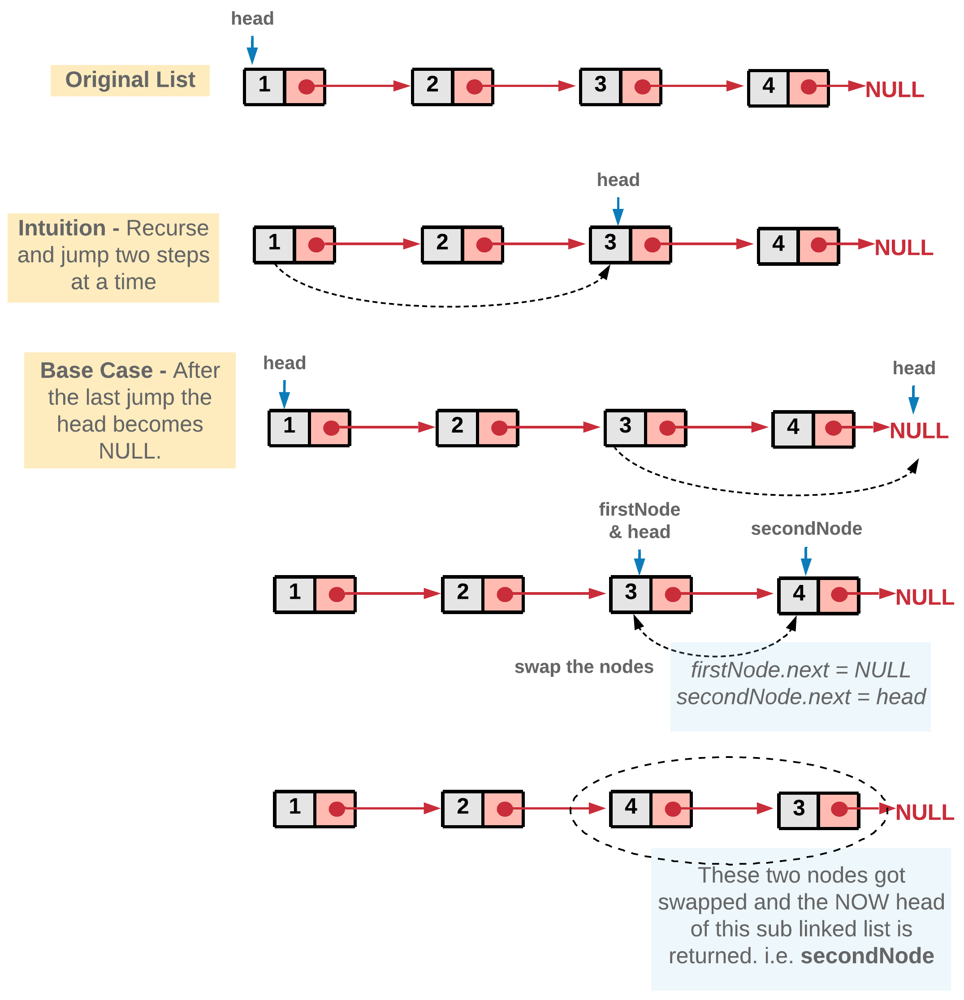
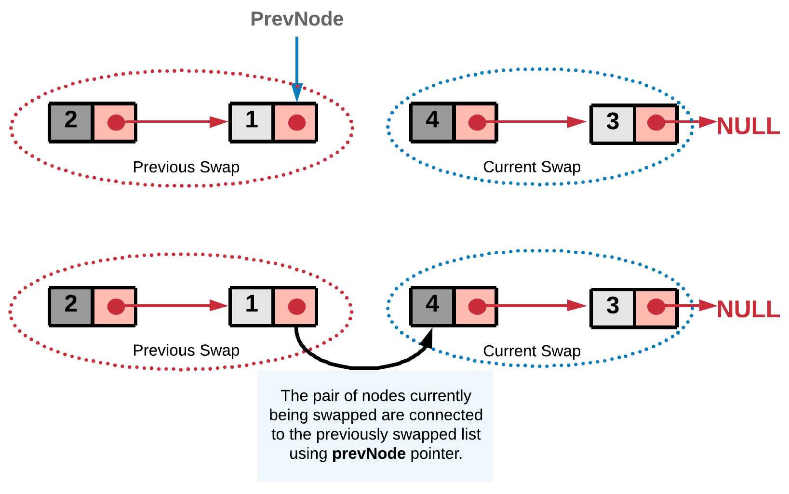

[24. Swap Nodes in Pairs](https://leetcode.com/problems/swap-nodes-in-pairs/)

* Microsoft, eBay, Amazon
* Linked List, Recursion
* Similar Questions:
    * [25. Reverse Nodes in k-Group](https://leetcode.com/problems/reverse-nodes-in-k-group/)
    * [1721. Swapping Nodes in a Linked List](https://leetcode.com/problems/swapping-nodes-in-a-linked-list/)
    
 

## Method 1. Recursion Approach (recursive(递归))
> In every function call we take out two nodes which would be swapped and the remaining nodes are
> passed to the next recursive call.
> 
> The reason we are adopting a recursive approach here is because **a sub-list** of the original
> list would still be a linked list and hence, it would adapt to recursive strategy.
>
> Algorithm:
> 1. Start the recursion with `head` node of the original linked list.
> 2. Every recursion call is responsible for swapping a pair of nodes. Let's represent the two nodes to be swapped by `firstNode` and `secondNode`.
> 3. Next recursion is made by calling the function with head of the next pair of nodes. This call would swap the next nodes and make further recursive calls if there are nodes left in the linked list.
> 4. Once we get the pointer to the remaining swapped list from the recursion call, we can swap the `firstNode` and `secondNode`, i.e. the nodes in the current recursive call and then return the pointer to the `secondNode` since it will be the new head after swapping.
> 
> 

```java
/**
 * Definition for singly-linked list.
 * public class ListNode {
 *     int val;
 *     ListNode next;
 *     ListNode() {}
 *     ListNode(int val) { this.val = val; }
 *     ListNode(int val, ListNode next) { this.val = val; this.next = next; }
 * }
 */
class Solution {
    public ListNode swapPairs(ListNode head) {
        // If the list has no node or has only one node.
        if(head == null || head.next == null) {
            return head;
        }
        
        // Nodes to be swapped.
        ListNode firstNode = head;
        ListNode secondNode = head.next;
        
        // Swapping
        firstNode.next = swapPairs(secondNode.next);
        secondNode.next = firstNode;
        
        // Now the head is the second node.
        return secondNode;
    }
}
```

Complexity Analysis
* Time Complexity: `O(N)` where `N` is the size of the linked list.
* Space Complexity: `O(N)` stack space utilized for recursion. 


or 

```java
/**
 * Definition for singly-linked list.
 * public class ListNode {
 *     int val;
 *     ListNode next;
 *     ListNode() {}
 *     ListNode(int val) { this.val = val; }
 *     ListNode(int val, ListNode next) { this.val = val; this.next = next; }
 * }
 */
class Solution {
    public ListNode swapPairs(ListNode head) {
        if(head == null || head.next == null) {
            return head;
        }
        
        ListNode newHead = head.next;
        ListNode tmp = head.next.next;
        newHead.next = head;
        head.next = swapPairs(tmp);
        return newHead;
    }
}
```

## Method 2. Iterative Approach
> The concept is similar to the recursive approach. We break the linked list into pairs by
> jumping in steps of two. The only difference is, unlike recursion, we swap the nodes on the go. 
> After swapping a pair of nodes, say `A` and `B`, we need to link the node `B` to the node that
> was right before `A`. 
> To establish this linkage we save the previous node of `A` in `prevNode`.
> 
> 

```java
/**
 * Definition for singly-linked list.
 * public class ListNode {
 *     int val;
 *     ListNode next;
 *     ListNode() {}
 *     ListNode(int val) { this.val = val; }
 *     ListNode(int val, ListNode next) { this.val = val; this.next = next; }
 * }
 */
class Solution {
    public ListNode swapPairs(ListNode head) {
        // Dummy node acts as the prevNode for the head node of the list and hence stores pointer to the head node.
        ListNode dummy = new ListNode(-1);
        dummy.next = head;
        
        ListNode prevNode = dummy;
        
        while(head != null && head.next != null) {  // `head.next != null` means the rest list has at least two nodes. 
            // Nodes to be swapped.
            ListNode firstNode = head;
            ListNode secondNode = head.next;
            
            // Swapping
            prevNode.next = secondNode;
            firstNode.next = secondNode.next;
            secondNode.next = firstNode;
            
            // Reinitializing the head and prevNode for next swap
            prevNode = firstNode;
            head = firstNode.next;  // Jump
        }
        
        return dummy.next;
    }
}
```

Complexity Analysis
* Time Complexity : `O(N)` where N is the size of the linked list.
* Space Complexity : `O(1)`. 
