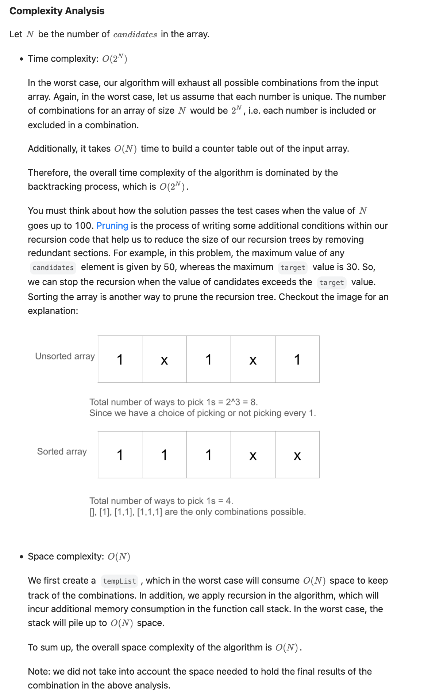

[40. Combination Sum II](https://leetcode.com/problems/combination-sum-ii/)

* Facebook, eBay, Amazon
* Array, Backtracking
* Similar Questions:
    * [39. Combination Sum](https://leetcode.com/problems/combination-sum/)
    
Each number in candidates may only be used once in the combination. 跟 39 相比，每个 number 只能用一次。
    
## Method 1. Backtracking
Intuition:
1. **Backtracking** is a general algorithm for finding all (or some) solutions to some
computational problems. The idea is that it **incrementally** builds candidates to the
solutions, and abandons a candidate ("backtrack") as soon as it determines that this 
candidate cannot lead to a final solution.
2. An important details on choosing the next number for the combination is that we select
the candidates **in order**, where the total candidates are treated as a list. Once a 
candidate is added into the current combination, we will not **look back** to all the previous
candidates in the next explorations.

```java
class Solution {
    public List<List<Integer>> combinationSum2(int[] candidates, int target) {
        List<List<Integer>> res = new ArrayList<List<Integer>>();
        
        Arrays.sort(candidates);
        backtrack(candidates, 0, new int[target], 0, target, res);
        return res;
    }
    
    private void backtrack(int[] candidates, int start, int[] ans, int idx, int target, List<List<Integer>> res) {
        for(int i=start; i<candidates.length; i++) {
            if(i!=start && candidates[i]==candidates[i-1]) {
                continue;
            }
            if(candidates[i] == target) {
                ans[idx++] = candidates[i];
                List<Integer> tmp = new ArrayList<Integer>();
                for(int j=0; j<idx; j++) {
                    tmp.add(ans[j]);
                }
                res.add(tmp);
            } else if(candidates[i] < target) {
                ans[idx] = candidates[i];   // idx does not increase here, therefore we do not need to remove after backtracking
                backtrack(candidates, i+1, ans, idx+1, target - candidates[i], res);
            } else {
                return;
            }
        }
    }
}
```

or 

```java
class Solution {
    public List<List<Integer>> combinationSum2(int[] candidates, int target) {
        List<List<Integer>> res = new ArrayList<List<Integer>>();
        
        Arrays.sort(candidates);
        backtrack(candidates, 0, new int[target], 0, target, res);
        return res;
    }
    
    private void backtrack(int[] candidates, int start, int[] ans, int idx, int target, List<List<Integer>> res) {
        for(int i=start; i<candidates.length; i++) {
            if(i!=start && candidates[i]==candidates[i-1]) {
                continue;
            }
            if(candidates[i] == target) {
                ans[idx++] = candidates[i];
                List<Integer> tmp = new ArrayList<Integer>();
                for(int j=0; j<idx; j++) {
                    tmp.add(ans[j]);
                }
                res.add(tmp);
            } else if(candidates[i] < target) {
                ans[idx++] = candidates[i];   // idx does not increase here, therefore we do not need to remove after backtracking
                backtrack(candidates, i+1, ans, idx, target - candidates[i], res);
                ans[idx--] = 0;
            } else {
                return;
            }
        }
    }
}
```

## ✅⭐Method 2. Backtracking + Prune
```java
class Solution {
    public List<List<Integer>> combinationSum2(int[] candidates, int target) {
        List<List<Integer>> res = new ArrayList<>();
        
        Arrays.sort(candidates);
        backtracking(candidates, 0, target, res, new ArrayList<>());

        return res;
    }

    private void backtracking(int[] candidates, int idx, int target, List<List<Integer>> res, List<Integer> tmp) {
        if(target == 0) {
            res.add(new ArrayList<>(tmp));
            return;
        }

        for(int i=idx; i<candidates.length; i++) {
            // 大剪枝：减去 candidates[i] 小于 0，减去后面的 candidates[i + 1]、candidates[i + 2] 肯定也小于 0，因此用 break
            if(candidates[i] > target) {
                break;
            }

            // 小剪枝：同一层相同数值的结点，从第 2 个开始，候选数更少，结果一定发生重复，因此跳过，用 continue
            if(i > idx && candidates[i] == candidates[i-1]) {
                continue;
            }

            tmp.add(candidates[i]);
            backtracking(candidates, i+1, target - candidates[i], res, tmp);
            tmp.remove(tmp.size() - 1);
        }

    }
}
```



## Method 2. [DFS](https://leetcode.com/problems/combination-sum-ii/discuss/16861/Java-solution-using-dfs-easy-understand)
```java
 public List<List<Integer>> combinationSum2(int[] cand, int target) {
    Arrays.sort(cand);
    List<List<Integer>> res = new ArrayList<List<Integer>>();
    List<Integer> path = new ArrayList<Integer>();
    dfs_com(cand, 0, target, path, res);
    return res;
}
void dfs_com(int[] cand, int cur, int target, List<Integer> path, List<List<Integer>> res) {
    if (target == 0) {
        res.add(new ArrayList(path));
        return ;
    }
    if (target < 0) return;
    for (int i = cur; i < cand.length; i++){
        if (i > cur && cand[i] == cand[i-1]) continue;
        path.add(path.size(), cand[i]);
        dfs_com(cand, i+1, target - cand[i], path, res);
        path.remove(path.size()-1); // Remember to remove the last element
    }
}
```


## Reference
* LeetCodeCN: [回溯算法 + 剪枝（Java、Python）](https://leetcode.cn/problems/combination-sum-ii/solutions/14753/hui-su-suan-fa-jian-zhi-python-dai-ma-java-dai-m-3/)
