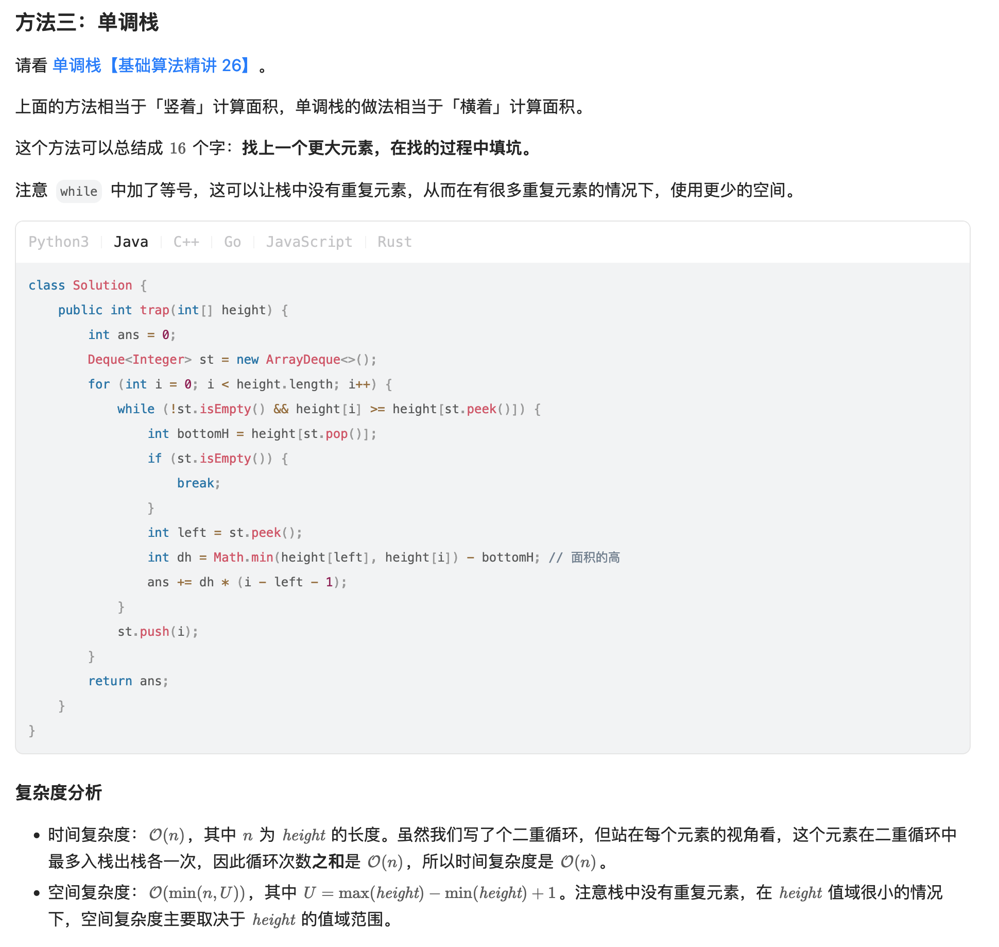

[42. Trapping Rain Water](https://leetcode.com/problems/trapping-rain-water/)

* Array, Two Pointers, Stack, Monotonic Stack, Dynamic Programming
* Google, Amazon, Goldman Sachs, Microsoft, Bloomberg, Meta, Oracle, TikTok, Snowflake, Apple, Uber
* Similar Questions:
    * [11. Container With Most Water](https://leetcode.com/problems/container-with-most-water/)
    * [238. Product of Array Except Self](https://leetcode.com/problems/product-of-array-except-self/description/)
    * Trapping Rain Water II
    * Pour Water


## ✅⭐Method 1. Using Two Pointers (0ms, beats 100%)

Key Points:
1. Two pointers, update the results according to the lower bar.
2. **双指针解法(two pointer)**。思路是对于任意位置`i`，在`i`位置上的积水，是由其左右两边较矮的`bar`(可以想象为挡板)的高度和`i`位置的高度的差值决定的。即 `volume[i] = (Math.min(left[i], right[i]) - A[i]) * 1`。这里的 1 是宽度。
```Java
class Solution {
    public int trap(int[] height) {
        if(height == null || height.length == 0) {
            return 0;
        }
        
        int left = 0;
        int right = height.length - 1;
        int res = 0;
        int leftMax = 0;
        int rightMax = 0;
        while(left < right) {
            if(height[left] < height[right]) {  // 意味着右边一定有一个挡板 height[right] 可以使当前位置存得住水,所以只要确定左边的bar即可
                leftMax = Math.max(leftMax, height[left]);
                res += (leftMax - height[left]);
                left++;
            } else {    // 左边一定有一个挡板 height[left] 可以使当前位置存得住水
                rightMax = Math.max(rightMax, height[right]);
                res += (rightMax - height[right]);
                right--;
            }
        }
        return res;
    }
}
```
**Complexity Analysis:**
1. Time: `O(N)`, single iteration.
2. Space: `O(1)`, only constant space required for `left`, `right` `leftMax` and `rightMax`.


## Method 2. Monotonic Stack
这个方法可以总结成 16 个字：**找上一个更大元素，在找的过程中填坑**。

```java
class Solution {
    public int trap(int[] height) {
        int res = 0;
        Deque<Integer> stack = new ArrayDeque<>();
        for(int i=0; i<height.length; i++) {
            while(!stack.isEmpty() && height[i] >= height[stack.peek()]) {
                int bottomH = height[stack.pop()];
                
                if(stack.isEmpty()) {
                    break;
                }

                int left = stack.peek();
                int deltaH = Math.min(height[left], height[i]) - bottomH;

                res += deltaH * (i - left - 1);
            }
            
            stack.push(i);
        }
        return res;
    }
}
```


## Method 1. Dynamic Programming (1ms, beats 71%)

1. Find the max height upto the given point from left end
2. Find the max height upto the given point from right end
3. The shared portion represents the trapped water

Key Points:
1. Use **two arrays** to keep the height bars from left and right.
2. Trapped water must be in the range of `[1, N-2]`

```java
class Solution {
    public int trap(int[] height) {
        if(height == null || height.length == 0) {
            return 0;
        }
        
        int res = 0;
        int N = height.length;
        int[] leftMax = new int[N];
        int[] rightMax = new int[N];
        leftMax[0] = height[0];
        rightMax[N-1] = height[N-1];
        // From left to right
        for(int i=1; i<N; i++) {
            leftMax[i] = Math.max(leftMax[i-1], height[i]);
        }
        // From right to left
        for(int i=N-2; i>0; i--) {
            rightMax[i] = Math.max(rightMax[i+1], height[i]);
        }
        
        for(int i=1; i<N-1; i++) {
            res += Math.min(leftMax[i], rightMax[i]) - height[i];
        }
        return res;
    }
}
```
**Complexity Analysis:**
1. Time: `O(N)`
   1. We need store the maximum heights upto a point using 2 iterations of `O(N)` each.
   2. We finally update `res` using the stored values in `O(N)`.
2. Space: `O(N)`
   1. Additional `O(N)` space for `leftMax` and `rightMax` arrays.


## Method 3. Using two pointers
Key Points:
1. Only use one variable `barHeight` to store the lower bar for the current position, since the water the current pointer can trap is only determined by the lower bar.

```java
class Solution {
    public int trap(int[] height) {
        int res = 0;
        // Corner case
        if(height == null || height.length < 3) {
            return res;
        }
        
        int i = 0;
        int j = height.length - 1;
        int barHeight = Integer.MIN_VALUE;
        while(i < j) {
            if(height[i] < height[j]) {
                barHeight = Math.max(barHeight, height[i]);
                res += (barHeight - height[i]);
                i++;
            } else {
                barHeight = Math.max(barHeight, height[j]);
                res += (barHeight - height[j]);
                j--;
            }
        }
        return res;
    }
}
```
**Complexity Analysis:**
1. Time: `O(N)`, single iteration.
2. Space: `O(1)`, only constant space required for `i`, `j` `leftMax` and `rightMax`.


## Method 4. Using Stack
Key Points:
1. we can use stack to keep track of the bars that are bounded by longer bars and hence, may store water. 我们可以使用堆栈来跟踪由较长条形包围的条形，因此可以储存水。
2. We keep a stack and iterate over the array. We add the index of the bar to the stack if bar is smaller than or equal to the bar at top of stack, which means that the current bar is bounded by the previous bar in the stack. If we found a bar longer than that at the top, we are sure that the bar at the top of the stack is bounded by the current bar and a previous bar in the stack, hence, we can pop it and add resulting trapped water to `res`.

我们在遍历数组时维护一个栈。
1. 如果当前的条形块小于或等于栈顶的条形块(`height[idx] <= height[stack.peek()]`)，我们将条形块的索引入栈，意思是当前的条形块被栈中的前一个条形块界定。
2. 如果我们发现一个条形块长于栈顶(`height[idx] > height[stack.peek()]`)，我们可以确定栈顶的条形块被当前条形块和栈的前一个条形块界定，因此我们可以弹出栈顶元素并且累加答案到`result`。
* 时间复杂度`O(N)`，空间复杂度`O(N)`

```Java
class Solution {
    public int trap(int[] height) {
        int res = 0;
        int idx = 0;

        Deque<Integer> stack = new ArrayDeque<>();
        while(idx < height.length) {
            while(!stack.isEmpty() && height[idx] > height[stack.peek()]) {
                int top = stack.pop();
                if(stack.isEmpty()) {
                    break;
                }
                int distance = idx - stack.peek() - 1;
                int boundedHeight = Math.min(height[idx], height[stack.peek()]) - height[top];
                res += distance * boundedHeight;
            }
            stack.push(idx++);
        }
        return res;
    }
}
```
**Complexity analysis:**
1. Time complexity: `O(n)`. Single iteration of `O(n)` in which each bar can be touched at most twice(due to insertion and deletion from stack) and insertion and deletion from stack takes `O(1)` time.
2. Space complexity: `O(n)`. Stack can take upto `O(n)` space in case of stairs-like or flat structure. 


```Java
class Solution {
    
    public int trap(int[] height) {
    
        if (height==null) return 0;
        int current = 0, res = 0;
        Deque<Integer> stack = new LinkedList<Integer>();
        while (current < height.length) {
    
            while (stack.isEmpty()!=true && height[current] > height[stack.peek()]) {
    
                int pointer = stack.pop();
                if (stack.isEmpty()) break; // 两个元素之间没有间隙可以容得下水
                int distance = current - stack.peek() - 1;
                res += (Math.min(height[current], height[stack.peek()]) - height[pointer]) * distance;
            }
            stack.push(current++);
        }
        return res;
    }
}
```


## Reference
* https://leetcode.com/problems/trapping-rain-water/editorial/
* [Stack堆栈类题目总结#Leetcode- 42. 接雨水](https://blog.nowcoder.net/n/3d600a3bd5c84117adef75d6736e303a)
* [CNoodle: [LeetCode] 42. Trapping Rain Water](https://www.cnblogs.com/cnoodle/p/12156238.html)
* [CNoodle: [LeetCode] 84. Largest Rectangle in Histogram](https://www.cnblogs.com/cnoodle/p/12849361.html)
* [力扣: 单调栈O(n)解决，动图预警](https://leetcode.cn/problems/trapping-rain-water/solutions/185879/dan-diao-zhan-jie-jue-jie-yu-shui-wen-ti-by-sweeti/)
* LeetCodeCN: https://leetcode.cn/problems/trapping-rain-water/solutions/692342/jie-yu-shui-by-leetcode-solution-tuvc/