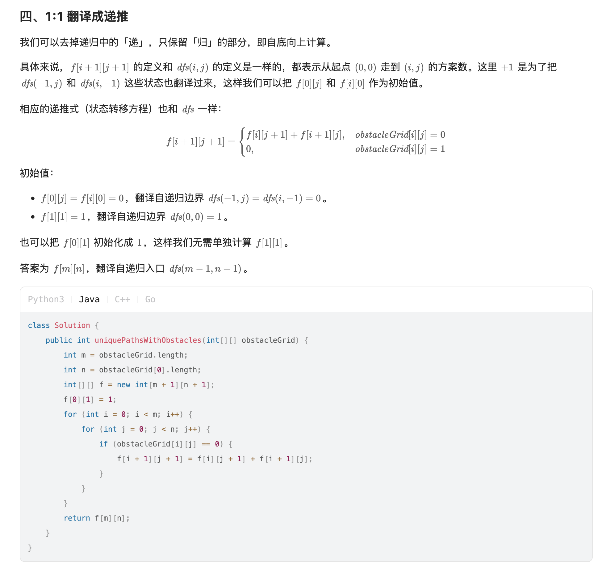

[63. Unique Paths II](https://leetcode.com/problems/unique-paths-ii/)

* Google, Amazon, Microsoft, VMware
* Array, Dynamic Programming
* Similar Questions:
    * [62. Unique Paths](https://leetcode.com/problems/unique-paths/)
    * [980. Unique Paths III](https://leetcode.com/problems/unique-paths-iii/)
* Hints:
    *
  

## ✅Method 1. Recursion + Memoization
```java
class Solution {
    public int uniquePathsWithObstacles(int[][] obstacleGrid) {
        int m = obstacleGrid.length;
        int n = obstacleGrid[0].length;
        int[][] memo = new int[m][n];
        for(int[] row: memo) {
            Arrays.fill(row, -1);
        }
        return dfs(obstacleGrid, m-1, n-1, memo);
    }

    private int dfs(int[][] obstacle, int i, int j, int[][] memo) {
        if(i < 0 || j < 0 || obstacle[i][j] == 1) {
            return 0;
        }
        if(i == 0 && j == 0) {
            return 1;
        }
        if(memo[i][j] != -1) {
            return memo[i][j];
        }
        memo[i][j] = dfs(obstacle, i-1, j, memo) + dfs(obstacle, i, j-1, memo);
        return memo[i][j];
    }
}
```
**复杂度分析:**
* 时间复杂度：`O(mn)`，其中 m 和 n 分别为 obstacleGrid 的行数和列数。由于每个状态只会计算一次，动态规划的时间复杂度 = 状态个数 × 单个状态的计算时间。本题状态个数等于 O(mn)，单个状态的计算时间为 O(1)，所以总的时间复杂度为 O(mn)。
* 空间复杂度：`O(mn)`。保存多少状态，就需要多少空间。

    
## Method 2. [Dynamic Programming](https://leetcode.com/problems/unique-paths-ii/solution/)
* If any cell has an obstacle, we won't let that cell contribute to any path.

Key Points:
1. Check the value of `grid[0][0]`, if `grid[0][0] == 1`, then directly `return 0`.
2. Initialize the first row and column first.
3. Iterate through the array starting from cell `grid[1][1]`.

```java
class Solution {
    public int uniquePathsWithObstacles(int[][] obstacleGrid) {
        int M = obstacleGrid.length;
        int N = obstacleGrid[0].length;
        int[][] dp = new int[M][N];
        
        if(obstacleGrid[0][0] == 1) {
            return 0;
        }
        
        dp[0][0] = 1;
        // Initialize the first row
        for(int j=1; j<N; j++) {
            dp[0][j] = (obstacleGrid[0][j] == 0 && dp[0][j-1] == 1) ? 1 : 0;
        }
        
        // Initialize the first col
        for(int i=1; i<M; i++) {
            dp[i][0] = (obstacleGrid[i][0] == 0 && dp[i-1][0] == 1) ? 1 : 0;
        }
        
        // DP
        for(int i=1; i<M; i++) {
            for(int j=1; j<N; j++) {
                if(obstacleGrid[i][j] == 1) {
                    dp[i][j] = 0;
                } else {
                    dp[i][j] = dp[i-1][j] + dp[i][j-1];
                }
            }
        }
        return dp[M-1][N-1];
    }
}
``` 
or
```java
class Solution {
    public int uniquePathsWithObstacles(int[][] obstacleGrid) {
        int m = obstacleGrid.length;
        int n = obstacleGrid[0].length;
        
        // If the starting cell has an obstacle, then directly return 0
        if(obstacleGrid[0][0] == 1) {
            return 0;
        }

        int[][] dp = new int[m][n];
        for(int i=0; i<m; i++) {
            for(int j=0; j<n; j++) {
                if(i == 0 && j == 0) {
                    dp[i][j] = 1;
                } else if(i == 0) {
                    dp[i][j] = (dp[i][j-1] == 1 && obstacleGrid[i][j] == 0) ? 1 : 0;
                } else if(j == 0) {
                    dp[i][j] = (dp[i-1][j] == 1 && obstacleGrid[i][j] == 0) ? 1 : 0;
                } else {
                    if(obstacleGrid[i][j] == 1) {
                        dp[i][j] = 0;
                    } else {
                        dp[i][j] = dp[i-1][j] + dp[i][j-1];
                    }
                }
            }
        }
        return dp[m-1][n-1];
    }
}
```
**Complexity Analysis:**
1. Time Complexity: `O(M×N)`. The rectangular grid given to us is of size `M×N` and we process each cell just once.
2. Space Complexity: `O(1)`. We are utilizing the obstacleGrid as the DP array. Hence, no extra space.


## ✅Method 2. My Solution
Key Points:
1. If `grid[0][0] == 1`, which means there is an obstacle in the first position, then return `0` directly.
2. For the first row, only when the previous cell is reachable, i.e. `dp[0][j-1] == 1`, and current cell is not obstacle, i.e. `grid[0][j]`, 
then the current cell is reachable. ==> `dp[0][j] = (dp[0][j-1] == 1 && grid[0][j] == 0) ? 1 : 0`;
3. The same for the first column.

```java
class Solution {
    public int uniquePathsWithObstacles(int[][] grid) {
        if(grid == null || grid.length == 0 || grid[0][0] == 1) {
            return 0;
        }
        int M = grid.length;
        int N = grid[0].length;
        int[][] dp = new int[M][N];
        for(int i=0; i<M; i++) {
            for(int j=0; j<N; j++) {
                if(i == 0 && j == 0) {
                    dp[i][j] = 1;
                } else if(i == 0) { // the first row
                    dp[i][j] = (dp[i][j-1] == 1 && grid[i][j] == 0) ? 1 : 0; 
                } else if(j == 0) {
                    dp[i][j] = (dp[i-1][j] == 1 && grid[i][j] == 0) ? 1 : 0;
                } else {
                    dp[i][j] = (grid[i][j] == 1) ? 0 : dp[i-1][j] + dp[i][j-1];
                }
            }
        }
        return dp[M-1][N-1];
    }
}
```

## Method 3. 翻译成递推

```java
class Solution {
    public int uniquePathsWithObstacles(int[][] obstacleGrid) {
        int m = obstacleGrid.length;
        int n = obstacleGrid[0].length;
        int[][] dp = new int[m + 1][n + 1];
        for(int i=0; i<m; i++) {
            for(int j=0; j<n; j++) {
                if(obstacleGrid[i][j] == 0) {
                    if(i == 0 && j == 0) {
                        dp[i+1][j+1] = 1;
                    } else {
                        dp[i+1][j+1] = dp[i][j+1] + dp[i+1][j];
                    }
                }
            }
        }
        return dp[m][n];
    }
}
```


## Reference
* 灵茶山艾府: [教你一步步思考 DP：从记忆化搜索到递推到空间优化！（Python/Java/C++/Go）](https://leetcode.cn/problems/unique-paths-ii/solutions/3059862/jiao-ni-yi-bu-bu-si-kao-dpcong-ji-yi-hua-451i/)
