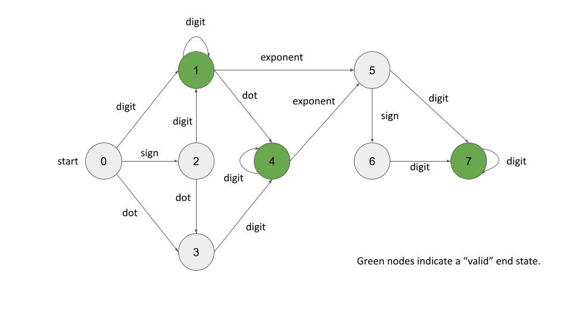

[65. Valid Number](https://leetcode.com/problems/valid-number/description/)

* String
* Facebook, LinkedIn, Amazon, Apple, Yahoo, Microsoft


## Method 1. Follow the rules
判断string `s`是否是valid number，主要有几个规则：
1. 如果有sign `+/-`，则sign必须为第一个字符，or指数符号`e/E`之后的第一个字符。
2. 指数符号`e/E`最多只能出现一次，并且如果有`e/E`，则其前面必须有有digits，即`+e`是invalid。
3. 符号`.`最多只能出现一次，并且不能出现在指数中，即`+1e1.1`是invalid。
```Java
class Solution {
    public boolean isNumber(String s) {
        boolean seenDigit = false;
        boolean seenExponent = false;
        boolean seenDot = false;

        for(int i=0; i<s.length(); i++) {
            char c = s.charAt(i);
            if(Character.isDigit(c)) {
                seenDigit = true;
            } else if(c == '+' || c == '-') {   // '+/-' can only be the first char or right after `e/E`
                if(i > 0 && s.charAt(i-1) != 'e' && s.charAt(i-1) != 'E') {
                    return false;
                }
            } else if(c == 'e' || c == 'E') {
                if(seenExponent || !seenDigit) {    // `e/E` can only apprear once and after digits
                    return false;
                }
                seenExponent = true;
                seenDigit = false;  // There must be digits after `e/E`
            } else if(c == '.') {
                if(seenDot || seenExponent) {   // `.` can only appear once and cannot exist in exponents
                    return false;
                }
                seenDot = true;
            } else {
                return false;
            }
        }
        return seenDigit;
    }
}
```
**Complexity Analysis:**
1. Time complexity: `O(N)`, where `N` is the length of `s`.
    * We simply iterate over the input once. The number of operations we perform for each character in the input is independent of the length of the string, and therefore only requires constant time. This results in `N⋅O(1)=O(N)`.
2. Space complexity: `O(1)`.
    * Regardless of the input size, we only store 3 variables, `seenDigit`, `seenExponent`, and `seenDot`.


## Method 2. DFA


```Java
class Solution {
    // A DFA is a finite number of states with transition rules to move between them.
    // Designed DFA
    private static final List<Map<String, Integer>> DFA = List.of(
        Map.of("digit", 1, "sign", 2, "dot", 3),
        Map.of("digit", 1, "dot", 4, "exponent", 5),
        Map.of("digit", 1, "dot", 3),
        Map.of("digit", 4),
        Map.of("digit", 4, "exponent", 5),
        Map.of("sign", 6, "digit", 7),
        Map.of("digit", 7),
        Map.of("digit", 7)
    );
    // These are all of the valid finishing states of our DFA
    private static final Set<Integer> validFinalStates = Set.of(1, 4, 7);

    public boolean isNumber(String s) {
        int currentState = 0;
        String group = "";

        for(int i=0; i<s.length(); i++) {
            char c = s.charAt(i);
            if(Character.isDigit(c)) {
                group = "digit";
            } else if(c == '+' || c == '-') {
                group = "sign";
            } else if(c == 'e' || c == 'E') {
                group = "exponent";
            } else if(c == '.') {
                group = "dot";
            } else {
                return false;
            }

            if(!DFA.get(currentState).containsKey(group)) {
                return false;
            }
            currentState = DFA.get(currentState).get(group);
        }

        return validFinalStates.contains(currentState);
    }
}
```
**Complexity Analysis:**
1. Time complexity: `O(N)`, where `N` is the length of s.
    * We simply iterate through the input once. The number of operations we perform for each character in the input is independent of the length of the string, and therefore each operation requires constant time. So we get `N⋅O(1)=O(N)`.
2. Space complexity: `O(1)`.
    * We will construct the same DFA regardless of the input size.


## Reference
* https://leetcode.com/problems/valid-number/editorial/