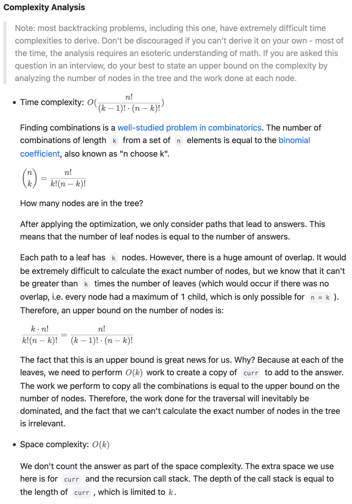

[77. Combinations](https://leetcode.com/problems/combinations/)

* Amazon, Microsoft, Google, Apple, Yahoo
* Backtracking
* Similar Questions:
    * [39. Combination Sum](https://leetcode.com/problems/combination-sum/)
    * [46. Permutations](https://leetcode.com/problems/permutations/)


> **Backtracking** is an algorithm for finding all solutions by exploring all potential candidates.
> If the solution candidates turns to be **not** a solution (or at least not the *last* one), backtracking algorithm discards it by making some changes on the previous step, **i.e. backtracks** and then try again.
>
> Here is a backtrack function which takes a first integer to add and a current combination as arguments backtrack(first, curr).
> * If the current combination is done - add it to output.
    >   *Iterate over the integers from first to n.
    >   * Add integer i into the current combination curr.
>   * Proceed to add more integers into the combination : backtrack(i + 1, curr).
>   * Backtrack by removing i from curr.


## Method 1. Backtracking (My solution)
```java
class Solution {
    public List<List<Integer>> combine(int n, int k) {
        List<List<Integer>> res = new ArrayList<>();
        combine(n, 1, k, new ArrayList<Integer>(), res);
        return res;
    }
    
    private void combine(int n, int idx, int k, List<Integer> ans, List<List<Integer>> res) {
        if(ans.size() == k) {   // When the list already has k numbers, then add to res
            res.add(new ArrayList<Integer>(ans));
            return;
        }
        for(int i=idx; i<=n; i++) {
            ans.add(i);         // Add current number and then do backtracking
            combine(n, i+1, k, ans, res);
            ans.remove(ans.size() - 1); // ans.removeLast();
        }
    }
}
```
**复杂度分析:**
* 时间复杂度：分析回溯问题的时间复杂度，有一个通用公式：路径长度×搜索树的叶子数。对于本题，它等于 `O(k⋅C(n,k))`。
* 空间复杂度：`O(k)`。返回值不计入。


## ✅⭐Method 2. Backtracking + Prune (15ms, beats 99%) (选哪一个)
```java
/**
res1 = List<String>, with size() = k

1

1,2
1,3
1,4
...
1,n

1,2,3
1,3,4
1,4,5
...
1,n-1,n
1,n

2,
3,
...
n,
*/
class Solution {
    public List<List<Integer>> combine(int n, int k) {
        List<List<Integer>> res = new ArrayList<>();

        combine(n, 1, k, res, new ArrayList<>());
        return res;
    }

    private void combine(int n, int curr, int k, List<List<Integer>> res, List<Integer> tmp) {
        // 剪枝：temp 长度加上区间 [cur, n] 的长度小于 k，不可能构造出长度为 k 的 temp
        if (tmp.size() + (n - curr + 1) < k) {
            return;
        }
        // 记录合法的答案
        if (tmp.size() == k) {
            res.add(new ArrayList<>(tmp));
            return;
        }
        for (int i = curr; i <= n; i++) {
            tmp.add(i);
            combine(n, i + 1, k, res, tmp);
            tmp.removeLast();
        }
    }
}
```


## Method 2. Improved Backtracking
> 一个 for 循环，添加，递归，删除，很经典的回溯框架了。在这里发现了一个优化方法。
> for 循环里 i 从 start 到 n，其实没必要到 n。比如，n = 5，k = 4，temp.size( ) == 1，此时代表我们还需要（4 - 1 = 3）个数字，如果 i = 4 的话，以后最多把 4 和 5 加入到 temp 中，而此时 temp.size() 才等于 1 + 2 = 3，不够 4 个，所以 i 没必要等于 4，i 循环到 3 就足够了。
> 所以 for 循环的结束条件可以改成， i <= n - ( k - temp.size ( ) ) + 1，k - temp.size ( ) 代表我们还需要的数字个数。因为我们最后取到了 n，所以还要加 1。

```java
class Solution {
    public List<List<Integer>> combine(int n, int k) {
        List<List<Integer>> res = new ArrayList<>();
        combine(n, 1, k, new ArrayList<Integer>(), res);
        return res;
    }
    
    private void combine(int n, int idx, int k, List<Integer> ans, List<List<Integer>> res) {
        if(ans.size() == k) {   // When the list already has k numbers, then add to res
            res.add(new ArrayList<Integer>(ans));
            return;
        }
        for(int i=idx; i<=n-(k - ans.size())+1; i++) {
            ans.add(i);         // Add current number and then do backtracking
            combine(n, i+1, k, ans, res);
            ans.remove(ans.size() - 1);
        }
    }
}
```


## ✅⭐Method 3. Backtracking + Prune (18ms, beats 81%)
```java
class Solution {
    public List<List<Integer>> combine(int n, int k) {
        List<List<Integer>> res = new ArrayList<>();

        backtracking(n, k, 1, res, new ArrayList<>());

        return res;
    }

    private void backtracking(int n, int k, int curr, List<List<Integer>> res, List<Integer> tmp) {
        // 剪枝：temp 长度加上区间 [cur, n] 的长度小于 k，不可能构造出长度为 k 的 temp
        if(tmp.size() + (n - curr + 1) < k) {
            return;
        }

        // 记录合法的答案
        if(tmp.size() == k) {
            res.add(new ArrayList<>(tmp));
            return;
        }

        // Without curr, 考虑不选择当前位置
        backtracking(n, k, curr+1, res, tmp);

        // With curr, 考虑选择当前位置
        tmp.add(curr);
        backtracking(n, k, curr+1, res, tmp);
        tmp.removeLast();
    }
}
```



## Reference
1. [77. Combinations](https://leetcode.wang/leetCode-77-Combinations.html)
2. LeetCodeCN: https://leetcode.com/problems/combinations/
3. 灵茶山艾府: [【视频】回溯不会写？套路在此！（Python/Java/C++/Go）](https://leetcode.cn/problems/combinations/solutions/2071017/hui-su-bu-hui-xie-tao-lu-zai-ci-pythonja-65lh/)