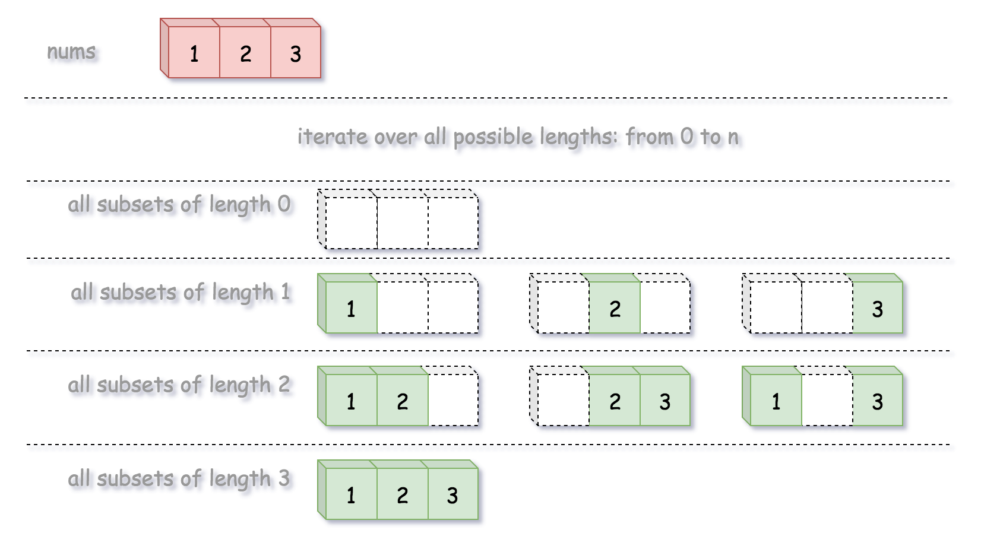
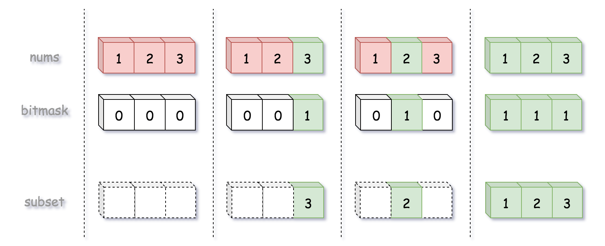

[78. Subsets](https://leetcode.com/problems/subsets/)


* Array, Backtracking, Bit Manipulation
* Meta, Amazon, Bloomberg, Google, TikTok, Microsoft, Wix, Uber, Coupang, Adobe, Apple, Yahoo, Zoho, tcs
* Similar Questions
    * [90. Subsets II](https://leetcode.com/problems/subsets-ii/)
    * [320. Generalized Abbreviation](https://leetcode.com/problems/generalized-abbreviation/)
    * [784. Letter Case Permutation](https://leetcode.com/problems/letter-case-permutation/)


# Solution Pattern
* Permutations: N!
* Combinations: k of N = N!/((N-k)! k!)
* Subsets: 2^N, since each element could be absent or present

There are generally three strategies to do it:
* Recursion
* Backtracking
* Lexicographic generation based on the mapping between binary bitmasks and the corresponding permutations/combinations/subsets.


## Method 1. Cascading (1ms, beats 60%)
Let's start from empty subset in output list. 
At each step, we takes new integer into consideration and generates new subsets from the existing ones.


即从empty subset开始，每个iteration添加一个新element
```java 
class Solution {
    public List<List<Integer>> subsets(int[] nums) {
        List<List<Integer>> res = new ArrayList<>();
        res.add(new ArrayList<Integer>());  // the empty set
        
        for(int num: nums) {
            List<List<Integer>> newSubsets = new ArrayList<>();
            for(List<Integer> curr: res) {
                newSubsets.add(new ArrayList<Integer>(curr){{ add(num); }});
            }
            for(List<Integer> curr: newSubsets) {
                res.add(curr);
            }
        }
        return res;
    }
}
```
**Complexity Analysis:**
1. Time complexity: `O(N×2^N)` to generate all subsets and then copy them into output list.
2. Space complexity: `O(N×2^N)`. This is exactly the number of solutions for subsets multiplied by the number `N` of elements to keep for each subset.
   * For a given number, it could be present or absent (i.e. binary choice) in a subset solution. As as result, for N numbers, we would have in total 2^N choices (solutions).

Step 1: [[]]
Step 2: num = 1, newSubsets = [1] ==> res = [[], [1]]
        num = 2, newSubsets = [2], [1, 2] ==> res = [[], [1], [2], [1, 2]]
        num = 3, newSubsets = [3], [1, 3], [2, 3], [1, 2, 3] ==> [[], [1], [2], [1, 2], [3], [1, 3], [2, 3], [1, 2, 3]]


## 🟨🌟Method 2. Backtracking (11ms, beats 60%)

```java 
class Solution {
    public List<List<Integer>> subsets(int[] nums) {
        List<List<Integer>> res = new ArrayList<List<Integer>>();
        
        if(nums==null || nums.length==0) {
            return res;
        }
        
        backtrack(nums, 0, new ArrayList<Integer>(), res);
        return res;
    }
    
    private void backtrack(int[] nums, int idx, List<Integer> tmp, List<List<Integer>> res) {
        res.add(new ArrayList<Integer>(tmp));
        for(int i=idx; i<nums.length; i++) {
            tmp.add(nums[i]);           // Add nums[i]
            backtrack(nums, i+1, tmp, res);
            tmp.remove(tmp.size() - 1); // Remove nums[i]
        }
    }
}
```
**Complexity Analysis:**
1. Time complexity: `O(N×(2^N))` to generate all subsets and then copy them into the output list.
2. Space complexity: `O(N)`. We are using `O(N)` space to maintain curr, and are modifying curr in-place with backtracking. Note that for space complexity analysis, we do not count space that is only used for the purpose of returning output, so the output array is ignored.


## Method 3. Lexicographic (Binary Sorted) Subsets

> The idea is that we map each subset to a bitmask of length n, where 1 on the i-th position in bitmask
> means the presence of `nums[i]` in the subset, and 0 means its absence.

```java 
class Solution {
    public List<List<Integer>> subsets(int[] nums) {
        List<List<Integer>> res = new ArrayList<>();
        int n = nums.length;
        
        for(int i=(int)Math.pow(2, n); i<(int)Math.pow(2, n+1); i++) {
            // Generate bitmask, from 0...00 to 1...111
            String bitmask = Integer.toBinaryString(i).substring(1);
            
            // append subset corresponding to that bitmask
            List<Integer> curr = new ArrayList<>();
            for(int j=0; j<n; j++) {
                if(bitmask.charAt(j) == '1') {
                    curr.add(nums[j]);
                }
            }
            res.add(curr);
        }
        return res;
    }
}
```


## Reference
* https://leetcode.com/problems/subsets/editorial/
* [CNoodle: [LeetCode] 78. Subsets](https://www.cnblogs.com/cnoodle/p/12710022.html)