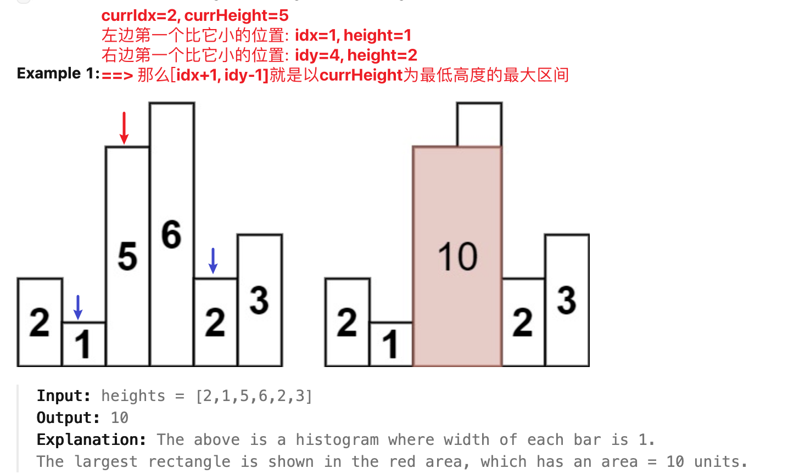

[84. Largest Rectangle in Histogram](https://leetcode.com/problems/largest-rectangle-in-histogram/)

* Array, Stack, Monotonic Stack
* Google, Amazon, Meta, Roblox, Microsoft, Bloomgerg, Apple, Zoho, Adobe, Uber
* Similar Questions:
    * [85. Maximal Rectangle](https://leetcode.com/problems/maximal-rectangle/)
    * [1793. Maximum Score of a Good Subarray](https://leetcode.com/problems/maximum-score-of-a-good-subarray/)


## Method 1. Using Monotonic Stack (22ms, beats 88%)
**⚠️要点:**
> 其实只要理解 当前高度对应的最大面积 的 宽度 是 右边比他小的第一个 - 左边比它小的第一个 - 1 ，剩下的只要固定right也就是i,更新当前的高度cur和left,就可以求出每个高度所对应的最大面积了

**例子:**


**Key Points:**
1. Initially, we push a `-1` onto the stack to mark the end.
2. We start with the leftmost bar and keep pushing the current bar's index onto the stack until
   **we get two successive numbers in descending order**, i.e. until we get `a[i-1] > a[i]`.
   从最左侧开始，不停的将 index push 到 `stack` 中，直到遇到出现连续递减的 bars。
3. `(i−stack[top−1]−1) × a[stack[top]].`
4. 在 `stack` 中保存的是**递增 histograms 的 indexes**。
5. 那么在 `stack` 中最底部的(除了-1)，代表的就是从其对应 index 开始到最后的 `minIndex`.
6. 在 `stack` 中的 indexes 对应的 bars 是递增的。
7. 在向 `stack` 中添加 index 的时候，如果出现递减的情况，就先进行处理，保证 `stack` 中的 bars 是递增的。
8. 当处理完所有的 bars 的时候，`stack` 中的第一个有效 `height` (i.e. the index on top of -1) 就是这个 `heights` array
   中最低的 `height`。

与LC 42的接雨水非常的类似，使用栈对元素进行存储，
1. 如果栈顶元素大于当前元素，则pop栈顶元素，计算栈顶元素的最大矩形面积，
2. 否则将当前元素入栈，为了使所有的元素都被计算过一遍，我们将数组前后各加入一个0。
* 时间复杂度O(N)，空间复杂度O(N)

```java
class Solution {
    public int largestRectangleArea(int[] heights) {
        if(heights == null || heights.length == 0) {
            return 0;
        }
        
        Deque<Integer> stack = new ArrayDeque<>();
        stack.push(-1);
        int maxArea = 0;
        for(int i=0; i<heights.length; i++) {
            while(stack.peek()!=-1 && heights[stack.peek()] >= heights[i]) {
                maxArea = Math.max(maxArea, heights[stack.pop()] * (i - stack.peek() - 1)); // (stack.peek(), i) ==> [stack.pop(), i) ==> len = i - stack.peek() - 1
            }
            stack.push(i);
        }
        while(stack.peek() != -1) {
            maxArea = Math.max(maxArea, heights[stack.pop()] * (heights.length - stack.peek() - 1));
        }
        return maxArea;
    }
}
```
**Complexity Analysis**
1. Time complexity : `O(n)`. nnn numbers are pushed and popped.
2. Space complexity : `O(n)`. Stack is used


## Method 2. Divide and Conquer (TLE)
Algorithm: This approach relies on the observation that the rectangle with maximum area will be
the maximum of:
1. The widest possible rectangle with height equal to the height of the shortest bar.
2. The largest rectangle confined to the left of the shortest bar(sub-problem).
3. The largest rectangle confined to the right of the shortest bar(sub-problem).
4. 注意避免 StackOverFlow，也就是避免死循环。`calculateArea(heights, minIndex+1, end)` not `calculate(heights,
   minIndex, end)`


```java
class Solution {
    public int largestRectangleArea(int[] heights) {
        if(heights == null || heights.length == 0) {
            return 0;
        }
        return calculateArea(heights, 0, heights.length - 1);
    }
    
    public int calculateArea(int[] heights, int start, int end) {
        if(start > end) {
            return 0;
        }
        int minIndex = start;
        for(int i=start; i<=end; i++) {
            if(heights[minIndex] > heights[i]) {
                minIndex = i;
            }
        }
        return Math.max(heights[minIndex] * (end - start + 1),
                       Math.max(calculateArea(heights, start, minIndex-1), calculateArea(heights, minIndex+1, end)));
    }
}
```
**Complexity Analysis:**
1. Time complexity : Average Case: `O(nlog n)`. The worst Case: `O(n^2)`. If the numbers in the
   array are sorted, we don't gain the advantage of divide and conquer.
2. Space complexity : `O(n)`. Recursion with worst case depth nnn.


## Method 3. Brute Force (Time Limit Exceeded)
Intuition:
1. Firstly, we need to take into account the fact that the height of the rectangle formed 
   between any two bars will always be limited by the height of the shortest bar lying between 
   them. 任何有两个 bar 围成的 rectangle 的高度总是由两个边之间最低的 bar 决定。
   
2. Then we can simply start off by considering possible pair of bars and finding the area of the 
   rectangle formed between them using the height of the shortest bar lying between them as the 
   height and the spacing between them as the width of the rectangle.
3. 遍历每个 subarray `heights[i,j]`, 在每个 subarray, i.e. `[i,j]`, 之间通过遍历再找到最小的 `height`。

```java
class Solution {
    public int largestRectangleArea(int[] heights) {
        if(heights == null || heights.length == 0) {
            return 0;
        }
        
        int maxArea = 0;
        for(int i=0; i<heights.length; i++) {
            for(int j=i; j<heights.length; j++) {
                int minHeight = Integer.MAX_VALUE;
                for(int k=i; k<=j; k++) {
                    minHeight = Math.min(minHeight, heights[k]);
                }
                maxArea = Math.max(maxArea, minHeight * (j - i + 1));
            }
        }
        return maxArea;
    }
}
```
Complexity Analysis
1. Time complexity : `O(n^3)`. We have to find the minimum height bar `O(n)` lying between every 
   pair `O(n^2)`. 
2. Space complexity : `O(1)`. Constant space is used. 


## Method 4. Better Brute Force (Time Limit Exceeded)
Intuition:
1. We can do one slight modification in the previous approach to optimize it to some extent.
2. We can find the bar of minimum height for current pair by using the minimum height bar of the 
   previous pairs. 使用 the height of previous height pairs，避免三重循环。 
3. In mathematical terms, `minHeight = min(minHeight, heights[j])`, where `height[j]` refers to 
   the height of the `j-th` bar. 

```java
class Solution {
    public int largestRectangleArea(int[] heights) {
        if(heights == null || heights.length == 0) {
            return 0;
        }
        
        int maxArea = 0;
        for(int i=0; i<heights.length; i++) {
            int minHeight = Integer.MAX_VALUE;
            for(int j=i; j<heights.length; j++) {
                minHeight = Math.min(minHeight, heights[j]);
                maxArea = Math.max(maxArea, minHeight * (j - i + 1));
            }
        }
        return maxArea;
    }
}
```
**Complexity Analysis:**
1. Time complexity : `O(n^2)`. Every possible pair is considered
2. Space complexity : `O(1)`. No extra space is used.


## Reference:
1. [Solution](https://leetcode.com/problems/largest-rectangle-in-histogram/solution/)
2. https://leetcode.com/problems/largest-rectangle-in-histogram/editorial/
3. LeetCodeCN: [暴力解法、栈（单调栈、哨兵技巧）](https://leetcode.cn/problems/largest-rectangle-in-histogram/solutions/142012/bao-li-jie-fa-zhan-by-liweiwei1419/)
4. LeetCode: https://leetcode.com/problems/largest-rectangle-in-histogram/editorial/
5. LeetCodeCN: https://leetcode.cn/problems/largest-rectangle-in-histogram/solutions/108083/84-by-ikaruga/
   * https://leetcode.cn/problems/largest-rectangle-in-histogram/solutions/108083/84-by-ikaruga/comments/2238698