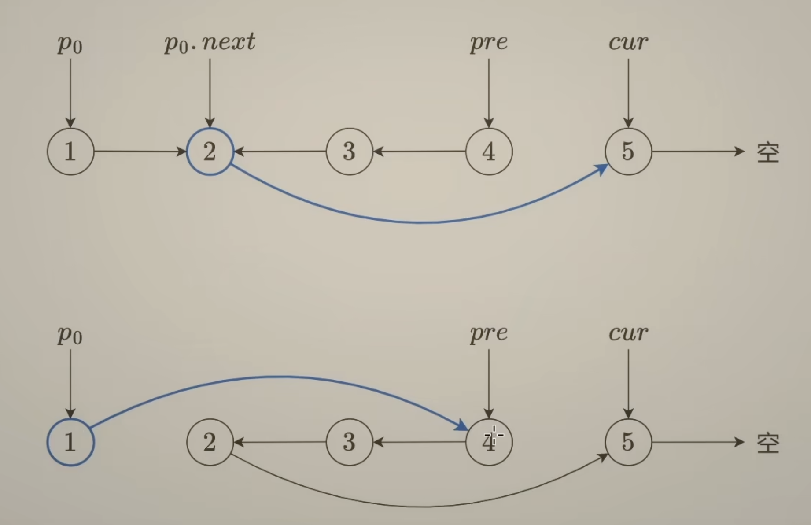
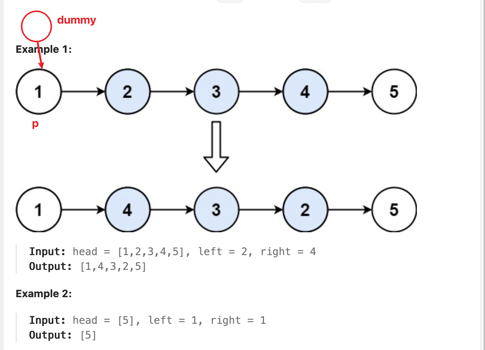

[92. Reverse Linked List II](https://leetcode.com/problems/reverse-linked-list-ii/description/)


## Method 1. Iterative Link Reversal

记住两句话，修改结束后: 
1. `prev` 指向这一段的末尾(i.e. reverse 之后的头)，`curr` 指向这一段的下一个节点
2. 头节点是否有特殊情况


```java
/*
1   [2   3   4]   5
* p = 1
* p.next = 2
* prev = 4
* curr = 5

1 -> 4 : p.next = prev
2 -> 5 : p.next.next = curr
*/
class Solution {
    public ListNode reverseBetween(ListNode head, int left, int right) {
        ListNode dummy = new ListNode(0, head);

        // With dummy node, after left-1 moves, p is right before the position starting reversing
        // In example 1, left=2, move (left-1), i.e. 1 time, the p will pointing to node 1
        ListNode p = dummy;
        for(int i=0; i<left-1; i++) {
            p = p.next;
        }

        // Reverse interval [left, right]
        // left=2, right=4, we need to update next pointer for (4 - 2 + 1) nodes
        ListNode prev = null;
        ListNode curr = p.next;
        for(int i=0; i<right-left+1; i++) {
            ListNode next = curr.next;
            curr.next = prev;   // 每次循环只修改一个next
            prev = curr;
            curr = next;
        }
        // After reversing range [left, right]
        // p.next = 2, i.e. the node before reversing
        // p.next.next = 
        // prev = 4, 
        // curr = 5

        p.next.next = curr;
        p.next = prev;
        return dummy.next;
    }
}
```
**复杂度分析**
* 时间复杂度：`O(n)`，其中 `n` 为链表节点个数。
* 空间复杂度：`O(1)`，仅用到若干额外变量。

or
```java
/**
 * We need to keep pointers of three nodes: 1, 4 (after reversed), 5
1. prev --> 1 (p0 --> 1), curr --> 2, and then start reverse
2. after reversing, prev --> 4, curr --> 5
3. p0 --> prev, p0.next --> curr
4. Since left could be 1, i.e. pointing to the first node, we need a dummy node

0   1   2   3   4   5
d   p0                      --> p0 moves 1 step, i.e. left-1
    prev        pre curr    --> prev moses 2 steps, i.e. right-left+1

 0 --> 1 --> 2 --> 3 --> 4 --> 5
      p0
                        pre   curr
*/
class Solution {
    public ListNode reverseBetween(ListNode head, int left, int right) {
        ListNode dummy = new ListNode(0, head);
        ListNode p0 = dummy;
        for(int i=0; i<left-1; i++) {
            p0 = p0.next;
        }

        ListNode prev = null;
        ListNode curr = p0.next;
        for(int i=0; i<right-left+1; i++) { // do reverse for 3 nodes, i.e. right-left+1
            ListNode next = curr.next;
            curr.next = prev;
            prev = curr;
            curr = next;
        }

        p0.next.next = curr;    // i.e. set 2's next as 5
        p0.next = prev;         // i.e. set 1's next as 4
        return dummy.next;
    }
}
```


## Reference
* 灵茶山艾府：https://leetcode.cn/problems/reverse-linked-list-ii/solutions/1992226/you-xie-cuo-liao-yi-ge-shi-pin-jiang-tou-teqq/
* https://www.bilibili.com/video/BV1sd4y1x7KN/
