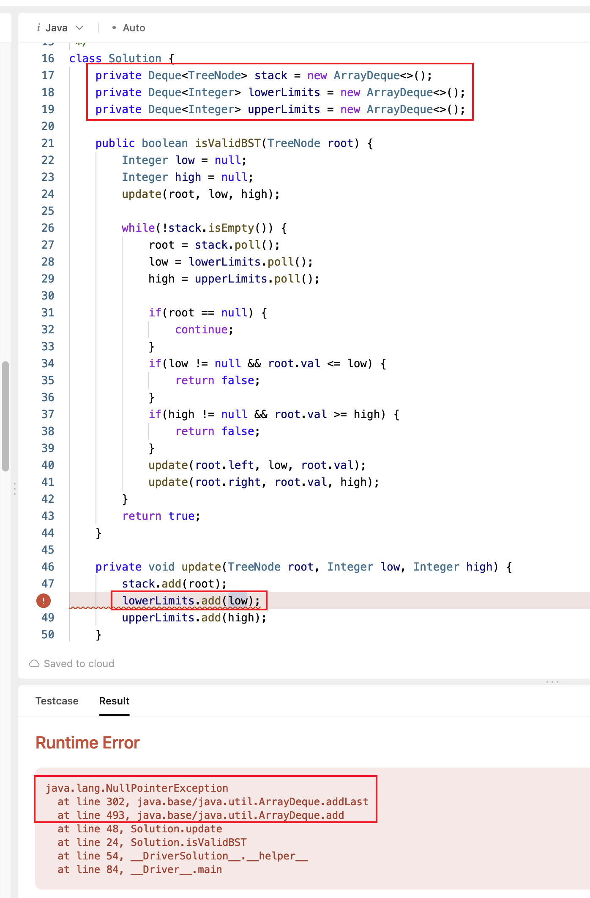

[98. Validate Binary Search Tree](https://leetcode.com/problems/validate-binary-search-tree/)

* Bloomberg, Facebook, Microsoft, Amazon, Asana, Atlassian, Yandex, Walmart Labs, VMware, Visa, eBay
* Tree, Depth-First Search
* Similar Questions:
    * 94.Binary Tree Inorder Traversal
    * 501.Find Mode in Binary Tree
    
    
**Valid BST:**
1. `node.left.val < node.val`
2. `node.val < node.right.val`


## Method 1. Recursive Traversal with Valid Range (1ms)
> One compares the node value with its upper and lower limits if they are available.
> Then one repeats the same step recursively for left and right subtrees.

```Java 
class Solution {
    public boolean isValidBST(TreeNode root) {
        if(root == null) {
            return true;
        }
        return isValidBST(root, Long.MIN_VALUE, Long.MAX_VALUE);
    }
    
    private boolean isValidBST(TreeNode node, long min, long max) {
        if(node == null) {
            return true;
        }
        if(node.val <= min || max <= node.val) {
            return false;
        }
        return isValidBST(node.left, min, node.val) && isValidBST(node.right, node.val, max);
    }
}
```
* 此方法中用`min`和`max`是long类型的。
  
问：为什么 Java 等语言要用 long 类型？题目不是只有 int 类型吗？
答：虽然题目是 int 类型，但开始递归的时候，left 需要比所有节点值都要小，right 需要比所有节点值都要大，如果节点值刚好是 int 的最小值/最大值，就没有这样的 left 和 right 了，所以需要用 long 类型。

or
```java
/**
left subtree < root.val < right subtree
 */
class Solution {
    public boolean isValidBST(TreeNode root) {
        return isValidBST(root, Long.MIN_VALUE, Long.MAX_VALUE);
    }

    private boolean isValidBST(TreeNode node, long left, long right) {
        if(node == null) {
            return true;
        }

        return left < node.val && node.val < right 
            && isValidBST(node.left, left, node.val)
            && isValidBST(node.right, node.val, right);
    }
}
```

> 作者：灵茶山艾府
> 链接：https://leetcode.cn/problems/validate-binary-search-tree/solutions/2020306/qian-xu-zhong-xu-hou-xu-san-chong-fang-f-yxvh/

**Complexity Analysis:**
1. Time complexity: `O(N)` since we visit each node exactly once.
2. Space complexity: `O(N)` since we keep up to the entire tree.

or

```Java
class Solution {
    public boolean isValidBST(TreeNode root) {
        return validate(root, null, null);
    }

    private boolean validate(TreeNode root, Integer low, Integer high) {
        // Empty tree is a valid BST
        if(root == null) {
            return true;
        }

        // The root.val must be between low and high
        if((low != null && root.val <= low) || (high != null && root.val >= high)) {
            return false;
        }

        // Return true is both left and right subtree are valid BST
        return validate(root.left, low, root.val) && validate(root.right, root.val, high);
    }
}
```
* 此处的`low`和`high`都是Integer类型的，使用Integer类是因为要传入`null`，int类型不可为`null`。


## Method 2. Iterative Traversal with Valid Range (6ms)
> DFS would be better than BFS since it works faster than.
```java 
class Solution {
    LinkedList<TreeNode> stack = new LinkedList<>();
    LinkedList<Integer> uppers = new LinkedList<>();
    LinkedList<Integer> lowers = new LinkedList<>();
    
    public boolean isValidBST(TreeNode root) {
        Integer lower = null;
        Integer upper = null;
        Integer val;
        update(root, lower, upper);
        
        while(!stack.isEmpty()) {
            root = stack.poll();
            lower = lowers.poll();
            upper = uppers.poll();
            
            if(root == null) {
                continue;
            }
            
            val = root.val;
            if(lower != null && val <= lower) {
                return false;
            }
            if(upper != null && val >= upper) {
                return false;
            }
            
            update(root.left, lower, val);
            update(root.right, val, upper);
        }
        
        return true;
    }
    
    private void update(TreeNode node, Integer lower, Integer upper) {
        stack.add(node);
        lowers.add(lower);
        uppers.add(upper);
    }

}
```
**Complexity Analysis:**
1. Time complexity: `O(N)` since we visit each node exactly once.
2. Space complexity: `O(N)` since we keep up to the entire tree.


## Method 3. Recursive Inorder Traversal
```Java
/**
 * Definition for a binary tree node.
 * public class TreeNode {
 *     int val;
 *     TreeNode left;
 *     TreeNode right;
 *     TreeNode() {}
 *     TreeNode(int val) { this.val = val; }
 *     TreeNode(int val, TreeNode left, TreeNode right) {
 *         this.val = val;
 *         this.left = left;
 *         this.right = right;
 *     }
 * }
 */
class Solution {
    // Use Integer instead of int as it supports a null value.
    private Integer prev = null;

    public boolean isValidBST(TreeNode root) {
        return inorder(root);
    }

    private boolean inorder(TreeNode root) {
        if(root == null) {
            return true;
        }
        if(!inorder(root.left)) {
            return false;
        }
        if(prev != null && root.val <= prev) {
            return false;
        }
        prev = root.val;
        return inorder(root.right);
    }
}
```

or
```java
class Solution {
    private long prev = Long.MIN_VALUE;

    public boolean isValidBST(TreeNode root) {
        if(root == null) {
            return true;
        }
        if(!isValidBST(root.left) || root.val <= prev) {
            return false;
        }
        prev = root.val;
        return isValidBST(root.right);
    }
}
```

**Complexity Analysis:**
1. Time complexity: `O(N)` in the worst case when the tree is a BST or the "bad" element is a rightmost leaf.
2. Space complexity: `O(N)` for the space on the run-time stack.


## Method 4. Iterative Inorder Traversal
> Let's use the **inorder traversal**: `left -> node -> right`

Key Points:
1. `double inorder = - Double.MAX_VALUE`. Since `static double 	MIN_VALUE: A constant holding the smallest positive nonzero value of type double, 2-1074.` 也就是 `Double.MIN_VALUE` 其实是大于 0 的数。

```java 
class Solution {
    public boolean isValidBST(TreeNode root) {
        Stack<TreeNode> stack = new Stack<>();
        double inorder = -Double.MAX_VALUE;
        
        while(!stack.isEmpty() || root != null) {
            while(root != null) {
                stack.push(root);
                root = root.left;
            }   // after the while, root = null, i.e. the left null of the leftmost leaf
            root = stack.pop();
            
            // If the next element in inorder traversal is smaller than then previous one, that's not BST.
            if(root.val <= inorder) {
                return false;
            }
            inorder = root.val;
            root = root.right;
        }
        return true;
    }
}
```

or

```Java
/**
 * Definition for a binary tree node.
 * public class TreeNode {
 *     int val;
 *     TreeNode left;
 *     TreeNode right;
 *     TreeNode() {}
 *     TreeNode(int val) { this.val = val; }
 *     TreeNode(int val, TreeNode left, TreeNode right) {
 *         this.val = val;
 *         this.left = left;
 *         this.right = right;
 *     }
 * }
 */
class Solution {
    public boolean isValidBST(TreeNode root) {
        Deque<TreeNode> stack = new ArrayDeque<>();
        Integer prev = null;

        while(!stack.isEmpty() || root != null) {
            while(root != null) {
                stack.push(root);
                root = root.left;
            }

            root = stack.pop();

            // If next element in inorder traversal is smaller than the previous one, that's not BST.
            if(prev != null && root.val <= prev) {
                return false;
            }
            prev = root.val;
            root = root.right;
        }
        return true;
    }
}
```
**Complexity Analysis:**
1. Time complexity: `O(N)` in the worst case when the tree is BST or the "bad" element is the rightmost leaf.
2. Space complexity: `O(N)` to keep stack.



* `ArrayDeque.add()` throws `NullPointerException` if the specified element is `null`


## Method. Postorder
```java
class Solution {
    public boolean isValidBST(TreeNode root) {
        return dfs(root)[1] != Long.MAX_VALUE;        
    }

    private long[] dfs(TreeNode node) {
        if(node == null) {
            return new long[]{Long.MAX_VALUE, Long.MIN_VALUE};
        }
        long[] left = dfs(node.left);
        long[] right = dfs(node.right);
        if(node.val <= left[1] || node.val >= right[0]) {
            return new long[]{Long.MIN_VALUE, Long.MAX_VALUE};
        }
        return new long[]{Math.min(left[0], node.val), Math.max(right[1], node.val)};
    }
}
```
**复杂度分析:**
* 时间复杂度：O(n)，其中 n 为二叉搜索树的节点个数。
* 空间复杂度：O(n)。最坏情况下，二叉搜索树退化成一条链（注意题目没有保证它是平衡树），因此递归需要 O(n) 的栈空间。

**点评:**
* **前序遍历**在某些数据下不需要递归到叶子节点就能返回（比如根节点左儿子的值大于根节点的值，左儿子就不会继续往下递归了），而中序遍历和后序遍历至少要递归到一个叶子节点。从这个角度上来说，前序遍历是最快的。
* **中序遍历**很好地利用了二叉搜索树的性质，使用到的变量最少。 
* **后序遍历**的思想是最通用的，即自底向上计算子问题的过程。想要学好动态规划的话，请务必掌握自底向上的思想。


## Reference
* https://leetcode.com/problems/validate-binary-search-tree/editorial/
* [【算法面试通关40讲】18 - 面试题：验证二叉搜索树](https://blog.nowcoder.net/n/8d142c9931ef471db2a5a1960018c9fd)
* ✅灵茶山艾府: [验证二叉搜索树【基础算法精讲 11】](https://www.bilibili.com/video/BV14G411P7C1/)