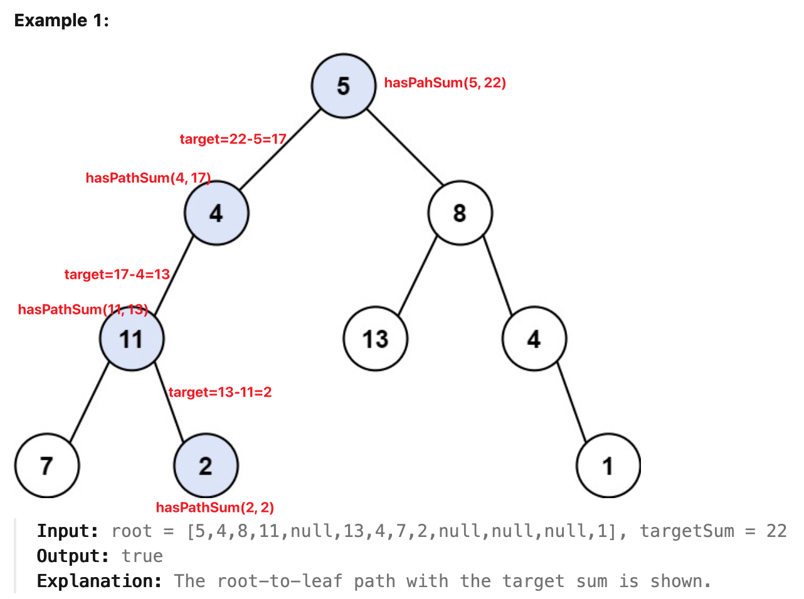

[112. Path Sum](https://leetcode.com/problems/path-sum/)

* Amazon, Microsoft, Facebook, Google, Bloomberg, Oracle, Adobe
* Tree, Depth-First Search
* Similar Questions:
    * [113. Path Sum II](https://leetcode.com/problems/path-sum-ii/)
    * [437. Path Sum III](https://leetcode.com/problems/path-sum-iii/)
    * [666. Path Sum IV](https://leetcode.com/problems/path-sum-iv/)
    * Binary Tree Maximum Path Sum
    * Sum Root to Leaf Numbers

从 `root` 到某个 `leaf` 的路径和等于某个给定的值。


## Method 1. Recursion
> One is going through the tree by considering at each step the node itself and its children.
> If node is *not* a leaf, one calls recursively `hasPathSum` method for its children with a sum decreased by the current node.
> If the current node is a leaf, one checks if the current sum is zero, i.e. the initial sum was discovered.
>
> Target sum 减去当前 `node.val`，然后判断当前 node 是不是 leaf node，并且减过的 sum 是否为 0；
> 如果是，则说明找到了；
> 如果不是，则继续根据 `node.left` and `node.right` 继续判断。
```java 
class Solution {
    public boolean hasPathSum(TreeNode root, int sum) {
        if(root == null) {
            return false;
        }
        
        sum -= root.val;
        if((root.left == null) && (root.right == null)) {
            return sum == 0;
        }
        
        return hasPathSum(root.left, sum) || hasPathSum(root.right, sum);
    }
}
```


**Complexity Analysis:**
1. Time complexity : we visit each node exactly once, thus the time complexity is `O(N)`, where `N` is the number of nodes.
2. Space complexity : in the worst case, the tree is completely unbalanced, e.g. each node has only one child node, the recursion call would occur N times (the height of the tree), therefore the storage to keep the call stack would be `O(N)`. But in the best case (the tree is completely balanced), the height of the tree would be `log⁡(N)`. Therefore, the space complexity in this case would be `O(log⁡(N))`. 

  
## Method 2. Iterations
**DFS would be better than BFS here since it works faster except in the worst case.** In the worst case the path `root -> leaf` with the given sum is the last considered one and in this case, DFS results in the same productivity as BFS.

> The idea is to visit each node with the DFS strategy, while updating the remaining sum to cumulate at each visit.

```Java 
class Solution {
    public boolean hasPathSum(TreeNode root, int sum) {
        if(root == null) {
            return false;
        }
        
        LinkedList<TreeNode> nodeStack = new LinkedList<>();
        LinkedList<Integer> sumStack = new LinkedList<>();
        nodeStack.add(root);
        sumStack.add(sum - root.val);
        
        TreeNode node;
        int curr;
        while(!nodeStack.isEmpty()) {
            node = nodeStack.pollLast();
            curr = sumStack.pollLast();
            
            if(node.left == null && node.right == null && curr == 0) {
                return true;
            }
            
            if(node.left != null) {
                nodeStack.push(node.left);
                sumStack.push(curr - node.left.val);
            }
            if(node.right != null) {
                nodeStack.push(node.right);
                sumStack.push(curr - node.right.val);
            }
        }
        return false;
    }
}
```

```Java
/**
 * Definition for a binary tree node.
 * public class TreeNode {
 *     int val;
 *     TreeNode left;
 *     TreeNode right;
 *     TreeNode() {}
 *     TreeNode(int val) { this.val = val; }
 *     TreeNode(int val, TreeNode left, TreeNode right) {
 *         this.val = val;
 *         this.left = left;
 *         this.right = right;
 *     }
 * }
 */
class Solution {
    public boolean hasPathSum(TreeNode root, int targetSum) {
        if(root == null) {
            return false;
        }

        LinkedList<TreeNode> nodeStack = new LinkedList<>();
        LinkedList<Integer> sumStack = new LinkedList<>();
        nodeStack.add(root);
        sumStack.add(targetSum - root.val);

        TreeNode currNode;
        int currSum;
        while(!nodeStack.isEmpty()) {
            currNode = nodeStack.pop();
            currSum = sumStack.pop();
            if(currNode.left == null && currNode.right == null && currSum == 0) {
                return true;
            }

            if(currNode.left != null) {
                nodeStack.push(currNode.left);
                sumStack.push(currSum - currNode.left.val);
            }
            if(currNode.right != null) {
                nodeStack.push(currNode.right);
                sumStack.push(currSum - currNode.right.val);
            }
        }
        return false;
    }
}
```

or using `Pair`

```Java
/**
 * Definition for a binary tree node.
 * public class TreeNode {
 *     int val;
 *     TreeNode left;
 *     TreeNode right;
 *     TreeNode() {}
 *     TreeNode(int val) { this.val = val; }
 *     TreeNode(int val, TreeNode left, TreeNode right) {
 *         this.val = val;
 *         this.left = left;
 *         this.right = right;
 *     }
 * }
 */
class Solution {
    public boolean hasPathSum(TreeNode root, int targetSum) {
        if(root == null) {
            return false;
        }

        Deque<Pair<TreeNode, Integer>> stack = new ArrayDeque<>();
        stack.push(new Pair(root, targetSum - root.val));
        while(!stack.isEmpty()) {
            Pair<TreeNode, Integer> pair = stack.pop();
            TreeNode node = pair.getKey();
            Integer currSum = pair.getValue();

            if(node.left == null && node.right == null) {
                if(currSum == 0) {
                    return true;
                }
            } else {
                if(node.left != null) {
                    stack.push(new Pair(node.left, currSum - node.left.val));
                }
                if(node.right != null) {
                    stack.push(new Pair(node.right, currSum - node.right.val));
                }
            }
        }
        return false;
    }
}
```

or self-defined `Pair`
```Java
/**
 * Definition for a binary tree node.
 * public class TreeNode {
 *     int val;
 *     TreeNode left;
 *     TreeNode right;
 *     TreeNode() {}
 *     TreeNode(int val) { this.val = val; }
 *     TreeNode(int val, TreeNode left, TreeNode right) {
 *         this.val = val;
 *         this.left = left;
 *         this.right = right;
 *     }
 * }
 */
class Solution {
    public boolean hasPathSum(TreeNode root, int targetSum) {
        if(root == null) {
            return false;
        }

        Deque<Pair> stack = new ArrayDeque<>();
        stack.push(new Pair(root, targetSum - root.val));

        while(!stack.isEmpty()) {
            Pair pair = stack.pop();
            TreeNode node = pair.node;
            int currSum = pair.currSum;

            if(node.left == null && node.right == null) {
                if(currSum == 0) {
                    return true;
                }
            } else {
                if(node.left != null) {
                    stack.push(new Pair(node.left, currSum - node.left.val));
                }
                if(node.right != null) {
                    stack.push(new Pair(node.right, currSum - node.right.val));
                }
            }
        }
        return false;
    }

    class Pair {
        TreeNode node;
        int currSum;

        public Pair(TreeNode node, int currSum) {
            this.node = node;
            this.currSum = currSum;
        }
    }
}
```
**Complexity Analysis::**
1. Time complexity : the same as the recursion approach `O(N)`.
2. Space complexity : `O(N)` since in the worst case, when the tree is completely unbalanced, e.g. each node has only one child node, we would keep all `N` nodes in the stack. But in the best case (the tree is balanced), the height of the tree would be `log⁡(N)`. Therefore, the space complexity in this case would be `O(log⁡(N))`.


## Reference
* https://leetcode.com/problems/path-sum/editorial/