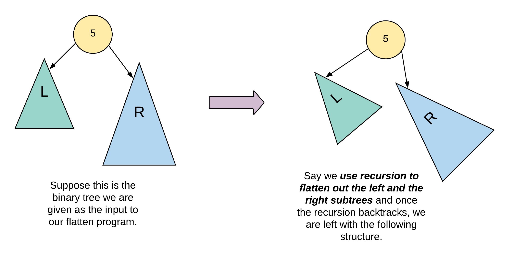
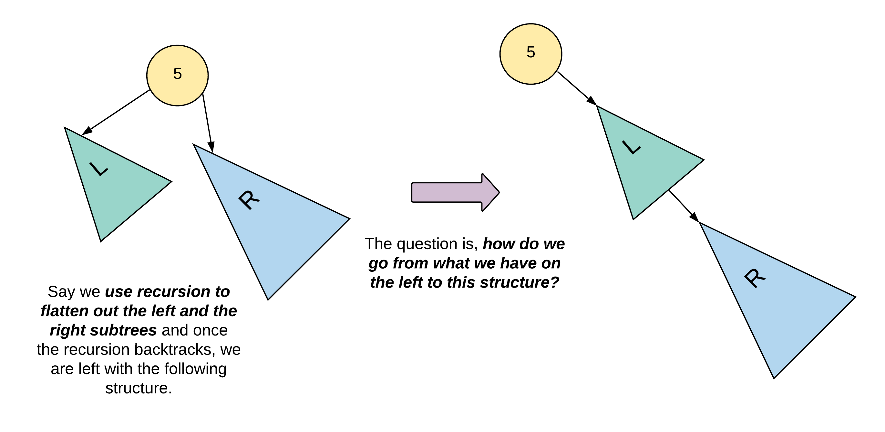

[114. Flatten Binary Tree to Linked List](https://leetcode.com/problems/flatten-binary-tree-to-linked-list/)

* Tree, Binary Tree, LinkedList, Stack, Depth-First Search
* Facebook, Yahoo, Amazon, Media.net, Microsoft, Adobe, Google, Apple, VMware
* Similar Questions:
    * [430. Flatten a Multilevel Doubly Linked List](https://leetcode.com/problems/flatten-a-multilevel-doubly-linked-list/description/)
    * [1660. Correct a Binary Tree](https://leetcode.com/problems/correct-a-binary-tree/description/)
* Hints:
    * If you notice carefully in the flattened tree, each node's right child points to the next node of a pre-order traversal.


## Method 1. Recursion
```java
class Solution {
    public void flatten(TreeNode root) {
        flat(root);
    }
    
    private TreeNode flat(TreeNode node) {
        if(node == null) {
            return null;
        }
        TreeNode right = flat(node.right);
        TreeNode left = flat(node.left);
        node.left = null;
        node.right = left;
        TreeNode curr = node;
        while(curr.right != null) {
            curr = curr.right;
        }
        curr.right = right;
        return node;
    }
}
```


## Method 2. Recursion


```java
class Solution {
    public void flatten(TreeNode root) {
        flattenTree(root);
    }

    public TreeNode flattenTree(TreeNode node) {
        // Handle the null scenarios
        if(node == null) {
            return null;
        }
        
        // For a leaf node, we simply return the node as is.
        if(node.left == null && node.right == null) {
            return node;
        }
        
        // Recursively flatten the left subtree and right subtree
        TreeNode leftTail = flattenTree(node.left);
        TreeNode rightTail = flattenTree(node.right);
        
        // If there is a left subtree, we shuffle the connections around
        // so that there is nothing on the left side anymore.
        if(leftTail != null) {
            leftTail.right = node.right;
            node.right = node.left;
            node.left = null;
        }
        // We need to return the "rightmost" node after we are doing wiring the new connection
        return (rightTail == null) ? leftTail : rightTail;
    }
}
```
**Complexity Analysis:**
1. Time Complexity: `O(N)` since we process each node of the tree exactly once.
2. Space Complexity: `O(N)` which is occupied by the recursion stack. The problem statement doesn't mention anything about the tree being balanced or not and hence, the tree could be e.g. left skewed and in that case the longest branch (and hence the number of nodes in the recursion stack) would be `N`. 


## Method 3. O(1) Iterative Solution
```java
class Solution {
    public void flatten(TreeNode root) {
        // Handle the null scenario
        if(root == null) {
            return;
        }
        
        TreeNode node = root;
        while(node != null) {
            // If the node has a left child
            if(node.left != null) {
                // Find the rightmost node
                TreeNode rightMost = node.left;
                while(rightMost.right != null) {
                    rightMost = rightMost.right;
                }
                // Rewire the connection
                rightMost.right = node.right;
                node.right = node.left;
                node.left = null;
            }
            // Move on to the right side of the tree
            node = node.right;
        }
    }
}
```


## Reference
* https://leetcode.com/problems/flatten-binary-tree-to-linked-list/editorial/
* [CNoodle: ]
* ✅ [力扣: 详细通俗的思路分析，多解法](https://leetcode.cn/problems/flatten-binary-tree-to-linked-list/solutions/17274/xiang-xi-tong-su-de-si-lu-fen-xi-duo-jie-fa-by--26/)
* LeetCode 94: Morris算法