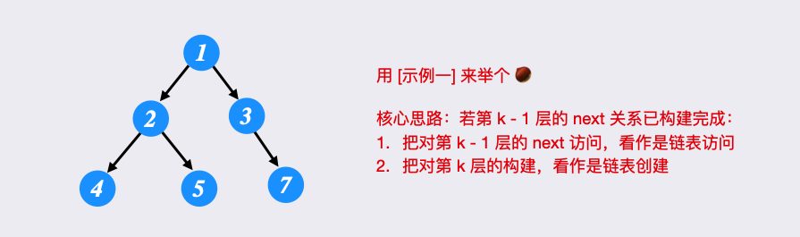
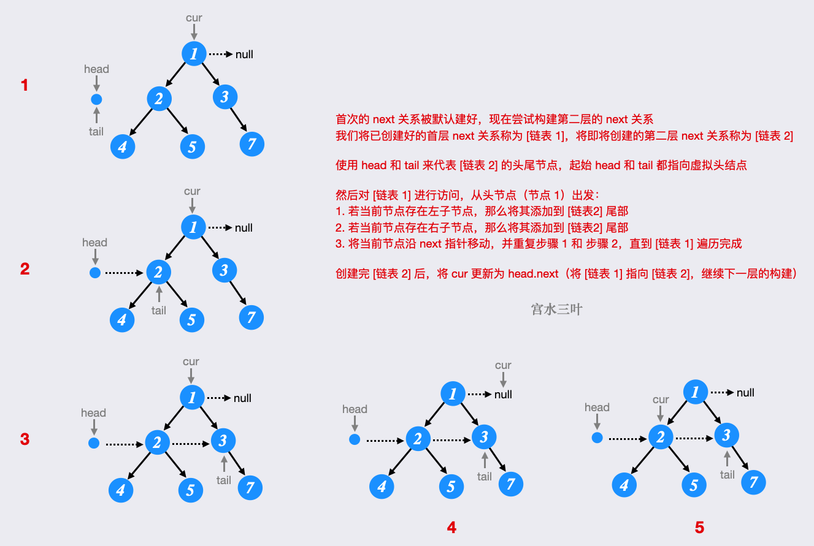
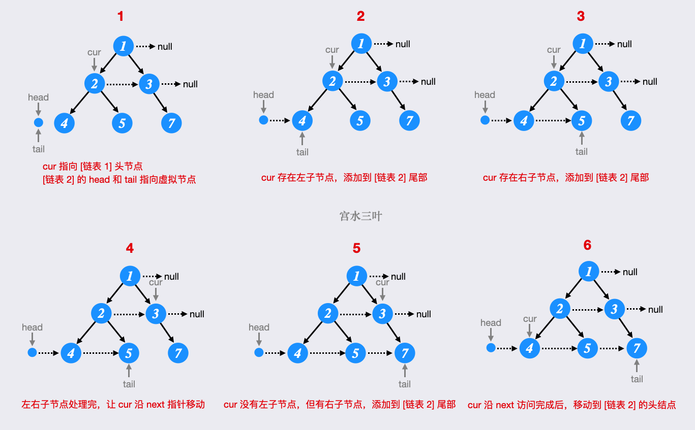

[117. Populating Next Right Pointers in Each Node II](https://leetcode.com/problems/populating-next-right-pointers-in-each-node-ii/)

* Bloomberg, Facebook, Amazon, Microsoft, Google
* Tree, Depth-First Search
* Similar Questions:
    * 116.Populating Next Right Pointers in Each Node
    

> There are two basic kinds of traversals on a tree or a graph:
> One is where we explore the tree in a depth first manner, i.e. one branch at a time;
> the other one is where we traverse the tree breadth-wise, i.e. we explore one level of the tree before moving on to the next one.    

与 116 相比，117 中的 Tree 并不是完整的二叉树，所以处理起来有些不同。

## Method 1. Level Order Traversal
* 与 116 Method 1 相似。
```java 
class Solution {
    public Node connect(Node root) {
        if(root == null) {
            return root;
        }
        
        Queue<Node> queue = new LinkedList<Node>(){{
            offer(root);
        }};
        while(!queue.isEmpty()) {
            int size = queue.size();
            for(int i=0; i<size; i++) {
                Node node = queue.poll();
                if(i < size - 1) {
                    node.next = queue.peek();
                }
                if(node.left != null) {
                    queue.offer(node.left);
                }
                if(node.right != null) {
                    queue.offer(node.right);
                }
            }
        }
        return root;
    }
}
```
or
```java
class Solution {
    public Node connect(Node root) {
        if(root == null) {
            return root;
        }

        List<Node> level = List.of(root);
        while(!level.isEmpty()) {
            List<Node> nextLevel = new ArrayList<>();

            for(int i=0; i<level.size(); i++) {
                Node curr = level.get(i);
                if(i > 0) {
                    level.get(i-1).next = curr;
                }

                if(curr.left != null) {
                    nextLevel.add(curr.left);
                }
                if(curr.right != null) {
                    nextLevel.add(curr.right);
                }
            }

            level = nextLevel;
        }
        return root;
    }
}
```
**Complexity Analysis**
* Time Complexity: O(N) since we process each node exactly once. Note that processing a node in this context means popping the node from the queue and then establishing the next pointers.
* Space Complexity: O(N). This is a perfect binary tree which means the last level contains N/2 nodes. The space complexity for breadth first traversal is the maximum space occupied and the space occupied by the queue is dependent upon the maximum number of nodes in particular level. So, in this case, the space complexity would be O(N).


## Method 2. Using previously established next pointers
> We only move on to the level N+1 when we are done establishing the next pointers for the level N. [只有当 level N 处理完之后，再处理 level N+1。]
>
```java 
class Solution {
    private Node prev;
    private Node leftMost;
    
    public Node connect(Node root) {
        if(root == null) {
            return root;
        }
        // The root node is the only node on the left level and hence its the leftmost node for the curr level
        this.leftMost = root;
        // Variable to keep track of leading node on the current level
        Node curr = leftMost;
        
        // We keep going until we do find the last level, i.e. the nodes on the last level won't have any children
        while(leftMost != null) {
            this.prev = null;   // 'prev' tracks the lastest node on the 'next' level,
            curr = leftMost;    // while 'curr' tracks the lastest node on the curr level.
            
            this.leftMost = null;
            while(curr != null) {
                processChild(curr.left);
                processChild(curr.right);
                
                curr = curr.next;
            }
        }
        return root;
    }
    
    private void processChild(Node childNode) {
        if(childNode != null) {
            if(this.prev != null) {
                this.prev.next = childNode;
            } else {
                this.leftMost = childNode;
            }
            this.prev = childNode;
        }
    }
}
```

## Method 3. 

public class Solution {
    public void connect(TreeLinkNode root) {
        if (root == null) return;
        TreeLinkNode curP = root;
        TreeLinkNode nextDummyHead = new TreeLinkNode(0);
        TreeLinkNode p = nextDummyHead;
        while (curP != null) {
            if (curP.left != null) {
                p.next = curP.left;
                p = p.next;
            }
            if (curP.right != null) {
                p.next = curP.right;
                p = p.next;
            }
            if (curP.next != null) {
                curP = curP.next;
            }
            else {
                curP = nextDummyHead.next;
                nextDummyHead.next = null;
                p = nextDummyHead;
            }
        }
    }
}


## Method 4. Recursive
1. 通过 recursive 的方法处理，先处理 curr 节点，也就是分别处理 `curr.left` and `rightMost` (could be `curr.left` or `curr.right`).
2. 当 `rightMost != null && curr.next != null` 的时候，`rightMost` 才有 `next`。
3. 当 `rightMost == null` 的时候，`curr` 平行地往右侧移动。当 `rightMost.next != null` 的时候，也就是 `rightMost` 处理完了，则结束 loop。
4. 处理完当前 `curr`，在分别处理 `curr.right` and `curr.left`。要注意顺序。
```java 
class Solution {
    public Node connect(Node root) {
        if(root == null) {
            return root;
        }
        
        if(root.left != null) {
            root.left.next = root.right;
        }
        
        Node curr = root;   // N level
        Node rightMost = (root.right != null) ? root.right : root.left; // N+1 level
        while(rightMost != null && curr.next != null) {
            if(curr.next.left != null) {
                rightMost.next = curr.next.left;
            } else if(curr.next.right != null) {
                rightMost.next = curr.next.right;
            }
            
            if(rightMost.next != null) {
                break;
            }
            curr = curr.next;
        }
        connect(root.right);    // recursive for root.right first
        connect(root.left);     // recursive for root.left later
        return root;
    }
}
```


## Method: BFS - 逐层构建 (宫水三叶)



```java
class Solution {
    public Node connect(Node root) {
        if(root == null) {
            return root;
        }

        Node res = root;
        Node curr = root;
        while(curr != null) {
            Node dummyHead = new Node();    // Refer to the prev pos of the leftMost node
            Node tail = head;
            while(curr != null) {
                if(curr.left != null) {
                    tail = curr.left;
                    tail = tail.next;
                }
                if(curr.right != null) {
                    tail.next = curr.right;
                    tail = tail.next;
                }
            }
            curr = head.next;
        }
    }
}
```
* 时间复杂度：O(n)
* 空间复杂度：O(1)


## Reference
* ✅灵茶山艾府: [三种方法：DFS/BFS/BFS+链表（附题单）Python/Java/C++/Go/JS](https://leetcode.cn/problems/populating-next-right-pointers-in-each-node-ii/solutions/2510360/san-chong-fang-fa-dfsbfsbfslian-biao-fu-1bmqp/)
* ✅[【宫水三叶】详细图解 O(1) 空间构建过程](https://leetcode.cn/problems/populating-next-right-pointers-in-each-node-ii/solutions/2510505/gong-shui-san-xie-xiang-xi-tu-jie-o1-kon-d6vg/)