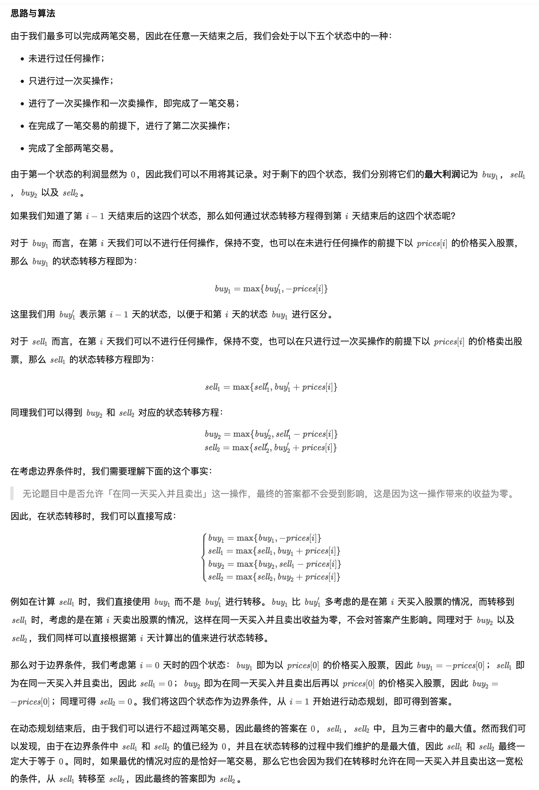

[123.Best Time to Buy and Sell Stock III](https://leetcode.com/problems/best-time-to-buy-and-sell-stock-iii/)

* Array, Dynamic Programming
* Meta, Microsoft, Bolt, Amazon, Bloomberg, Google, Adobe, Uber, Apple, Citadel, TikTok, PhonePe, ServiceNow
* Similar Questions:
    * [121. Best Time to Buy and Sell Stock](https://leetcode.com/problems/best-time-to-buy-and-sell-stock/)   
    * [122. Best Time to Buy and Sell Stock II](https://leetcode.com/problems/best-time-to-buy-and-sell-stock-ii/)
    * [123.Best Time to Buy and Sell Stock III](https://leetcode.com/problems/best-time-to-buy-and-sell-stock-iii/)
    * [188. Best Time to Buy and Sell Stock IV](https://leetcode.com/problems/best-time-to-buy-and-sell-stock-iv/)  


## Method 1. Bidirectional DP
> If one can make one transaction (i.e. buy and sell once), then better to make this **bet** count. 
> The best strategy would be to *buy* at the **lowest** and then *sell* at the **highest** price. 
> To put it simple, **buy low and sell high**.
>
> On the other hand, if one can make as many transactions as one would like, then in order to gain the maximal profits,
> one must *capture* each **augmentation** and *avoid* each **plunging** of stock price.
> 必须捕捉每一次增长，避免每一次股价暴跌.
>
> You may not engage in multiple transactions at the same time, (i.e. you must sell the stock before you buy again).        
> We could interpret this constraint as that there would be **no overlapping** in the sequence of transactions.
>
> Now, if we divide the sequence of prices around the element at the index `i`, into two subsequences, 
> with left subsequences as `Prices[0], Prices[1], ... Prices[i]` and the right subsequence as `Prices[i+1], ... Prices[N-1]`, 
> then the total maximum profits that we obtain from this division (denoted as `max_profits[i]`) can be expressed as follows: 
>`max_profits[i]=left_profits[i]+right_profits[i+1]`.

Note:
* `leftProfits[i]` is the max profit of subarray `prices[0, ..., i]`
* `rightProfits[j]` is the max profit of subarray `prices[j, ..., len-1]`
```java
class Solution {
    public int maxProfit(int[] prices) {
        if(prices == null || prices.length == 0) {
            return 0;
        }
        
        int len = prices.length;
        int leftMin = prices[0];
        int rightMax = prices[len-1];
        int[] leftProfits = new int[len];
        int[] rightProfits = new int[len + 1]; // Pad the right DP array with an addition zero for convenience.
        
        // Construct the bidirectional DP array
        for(int l=1; l<len; l++) {
            leftProfits[l] = Math.max(leftProfits[l-1], prices[l] - leftMin);
            leftMin = Math.min(leftMin, prices[l]);
            
            int r = len - 1 - l;
            rightProfits[r] = Math.max(rightProfits[r+1], rightMax - prices[r]);
            rightMax = Math.max(rightMax, prices[r]);
        }
        
        int maxProfit = 0;
        for(int i=0; i<len; i++) {
            maxProfit = Math.max(maxProfit, leftProfits[i] + rightProfits[i+1]);
        }
        return maxProfit;
    }
}
```
* Rather than constructing the two DP arrays in two separate loops, we do the calculation in a single loop (two birds with one stone). 
* We pad the `right_profits[i]` array with an additional zero, which indicates the maximum profits that we can gain from 
an empty right subsequence, so that we can compare the result of having only one transaction (i.e. `left_profits[N-1]`) with 
the profits gained from doing two transactions.

Complexity
1. Time Complexity: `O(N)` where NNN is the length of the input sequence, since we have two iterations of length N.
2. Space Complexity: `O(N)` for the two arrays that we keep in the algorithm.

or 


```java
class Solution {
    public int maxProfit(int[] prices) {
        if(prices == null || prices.length <= 1) {
            return 0;
        }
        
        int N = prices.length;
        int[] leftProfits = new int[N];
        int[] rightProfits = new int[N+1];  // pad the right DP array with an additional zero for convenience.
        int leftMin = prices[0];
        int rightMax = prices[N-1];
        // Construct the bidirectional DP array
        for(int i=1, j=N-2; i<N; i++, j--) {    // 从开始就将j设置为N-2，更易懂
            leftProfits[i] = Math.max(leftProfits[i-1], prices[i] - leftMin);
            leftMin = Math.min(leftMin, prices[i]);
            
            // int j = N - 1 - i;
            rightProfits[j] = Math.max(rightProfits[j+1], rightMax - prices[j]);
            rightMax = Math.max(rightMax, prices[j]);
        }
        
        int maxProfit = 0;
        for(int i=0; i<N; i++) {
            maxProfit = Math.max(maxProfit, leftProfits[i] + rightProfits[i+1]);
        }
        return maxProfit;
    }
}
```

or method 1 doesn't need to pad on rightProfits (2 for-loop是更容易理解的版本，可以简化成1 for-loop的版本)
```java
// solution 1 doesn't need to pad on rightProfits
class Solution {
    public int maxProfit(int[] prices) {
        if(prices == null || prices.length < 2) {
            return 0;
        }

        int N = prices.length;
        int leftMin = prices[0];
        int rightMax = prices[N-1];
        int[] leftProfits = new int[N];
        int[] rightProfits = new int[N];

        // Construct the bidirectional DP array
        for(int i=1; i<N; i++) {
            leftProfits[i] = Math.max(leftProfits[i-1], prices[i] - leftMin);
            leftMin = Math.min(leftMin, prices[i]);
        }
        for(int i=N-2; i>=0; i--) {
            rightProfits[i] = Math.max(rightProfits[i+1], rightMax - prices[i]);
            rightMax = Math.max(rightMax, prices[i]);
        }

        int maxProfit = 0;
        for(int i=0; i<N; i++) {
            maxProfit = Math.max(maxProfit, leftProfits[i] + rightProfits[i]);
        }
        return maxProfit;
    }
}
```
    
    
## Method 2. One-Pass Simulation
Key Points:
1. `t1Cost`, the **minimal** cost of buying the stock in transaction #1. The minimal cost to acquire a stock would be 
the minimal price value that we have seen so far at each step.
2. `t1Profit`, the **maximal** profit of selling the stock in transaction #1. Actually, at the end of the iteration, 
this value would be the answer for the first problem in the series, i.e. 121.Best Time to Buy and Sell Stock.
3. `t2Cost`, the **minimal** cost of buying the stock in transaction #2, while taking into account the profit gained 
from the previous transaction #1. One can consider this as the cost of reinvestment. Similar with t1_cost, 
we try to find the lowest price so far, which in addition would be partially compensated by the profits gained from the first transaction.
4. `t2Profit`, the **maximal** profit of selling the stock in transaction #2. With the help of t2_cost as we prepared so far, 
we would find out the maximal profits with at most two transactions at each step.

Notes: The reinvestment, i.e. we calculate the `t2Profit` exactly like `t1` at first, and then add `t1Profit` into `t2Profit`.
1. Without `t1Profit`, `t2Cost = Math.min(t2Cost, prices[i]), t2Profit = Math.max(prices[i] - t2Cost, t2Profit)`
2. With `t1Profit`, `t2Profit = Math.max(prices[i] - t2Cost + t1Profit, t2Profit) = Math.max(prices[i] - (t2Cost - t1Profit), t2Profit)`, 
then `t2Cost - t1Profit` has the same position as `t2Cost` in the equation without `t1Profit`.

```java
class Solution {
    public int maxProfit(int[] prices) {
        int t1Cost = Integer.MAX_VALUE;
        int t2Cost = Integer.MAX_VALUE;
        int t1Profit = 0;
        int t2Profit = 0;
        
        for(int price: prices) {
            // The maximum profit if only one transaction is allowed
            t1Cost = Math.min(t1Cost, price);
            t1Profit = Math.max(t1Profit, price - t1Cost);
            
            // Reinvest the grained profit in the second transaction
            t2Cost = Math.min(t2Cost, price - t1Profit);
            t2Profit = Math.max(t2Profit, price - t2Cost);
        }

        return t2Profit;
    }
}
```
Complexity
1. Time Complexity: `O(N)`, where NNN is the length of the input sequence.
2. Space Complexity: `O(1)`, only constant memory is required, which is invariant from the input sequence.
    

## Method 3. LeetCodeCN

```java
class Solution {
    public int maxProfit(int[] prices) {
        int n = prices.length;
        
        int buy1 = -prices[0];
        int sell1 = 0;
        int buy2 = -prices[0];
        int sell2 = 0;

        for(int i=1; i<n; i++) {
            buy1 = Math.max(buy1, -prices[i]);
            sell1 = Math.max(sell1, buy1 + prices[i]);
            buy2 = Math.max(buy2, sell1 - prices[i]);
            sell2 = Math.max(sell2, buy2 + prices[i]);
        }
        return sell2;
    }
}
```
**复杂度分析:**
* 时间复杂度：`O(n)`，其中 n 是数组 prices 的长度。
* 空间复杂度：`O(1)`。


## Reference:
1. [Solution](https://leetcode.com/problems/best-time-to-buy-and-sell-stock-iii/solution/)
2. LeetCode: https://leetcode.com/problems/best-time-to-buy-and-sell-stock-iii/editorial/comments/778945
2. LeetCodeCN: https://leetcode.cn/problems/best-time-to-buy-and-sell-stock-iii/solutions/552695/mai-mai-gu-piao-de-zui-jia-shi-ji-iii-by-wrnt/


### My Solution based on 121
```java
class Solution {
    public int maxProfit(int[] prices) {
        int profit = 0;
        for(int i=0; i<prices.length; i++) {
            profit = Math.max(profit, maxProfit(prices, 0, i) + maxProfit(prices, i+1, prices.length-1));
        }
        return profit;
    }
    
    private int maxProfit(int[] prices, int left, int right) {
        while(left >= right) {  // No element or just one element, then return 0
            return 0;
        }
        int minPrice = Integer.MAX_VALUE;
        int maxProfit = 0;
        for(int i=left; i<=right; i++) {
            if(prices[i] < minPrice) {
                minPrice = prices[i];
            } else {
                maxProfit = Math.max(maxProfit, prices[i] - minPrice);
            }
        }
        return maxProfit;
    }
}

/*
At most two transactions: could be 1 or 2 transactions
*/
```


## Method 3.
```java
class Solution {
    public int maxProfit(int[] prices) {
        int k = 2;
        int[][] dp = new int[k + 2][2];
        for(int j=1; j<=k+1; j++) {
            dp[j][1] = Integer.MIN_VALUE / 2;
        }
        dp[0][0] = Integer.MIN_VALUE / 2;
        for(int p: prices) {
            for(int j=k+1; j>0; j--) {
                dp[j][0] = Math.max(dp[j][0], dp[j][1] + p);
                dp[j][1] = Math.max(dp[j][1], dp[j-1][0] - p);
            }
        }

        return dp[k + 1][0];
    }
}
```
**复杂度分析:**
* 时间复杂度：O(n)，其中 n 为 prices 的长度。
* 空间复杂度：O(1)。


## Reference
* 灵茶山艾府: [188 题 k=2 的情况（Python/Java/C++/Go/JS/Rust）](https://leetcode.cn/problems/best-time-to-buy-and-sell-stock-iii/solutions/2974681/188-ti-k2-de-qing-kuang-pythonjavacgojsr-sg1z/)