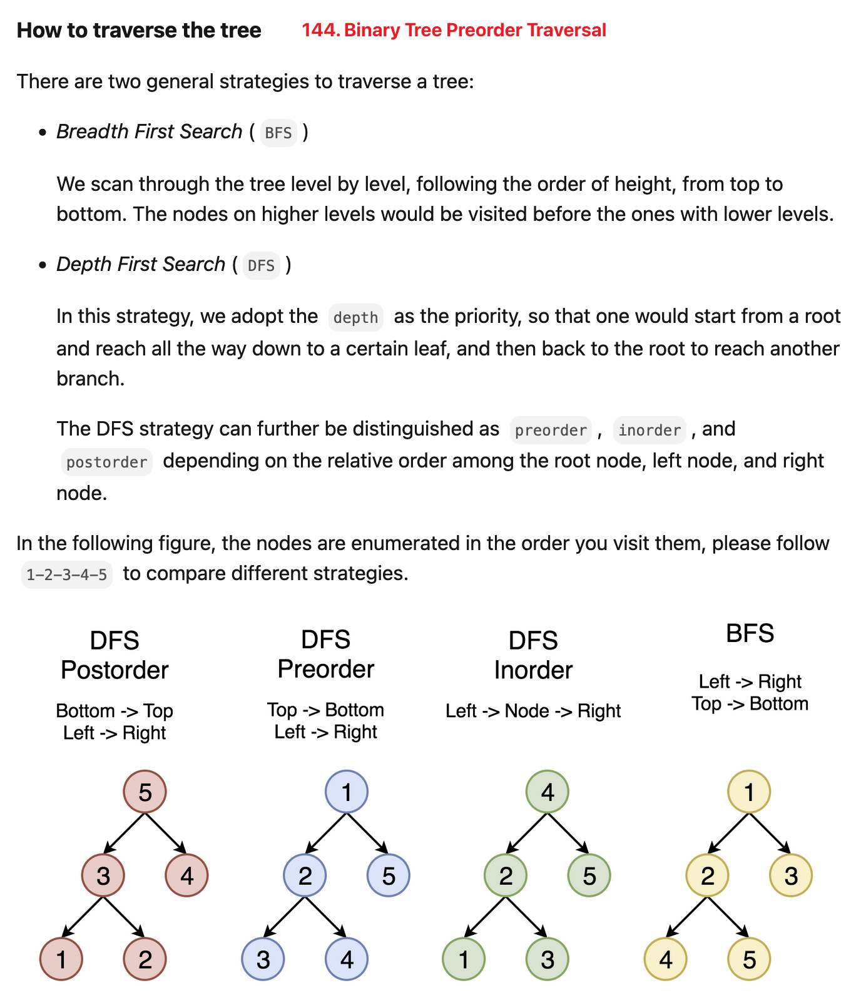

[144. Binary Tree Preorder Traversal](https://leetcode.com/problems/binary-tree-preorder-traversal/)

* Amazon, Google, Apple, Microsoft
* Stack, Tree, Depth-First Search, Binary Tree
* Similar Questions:
    * [94. Binary Tree Inorder Traversal](https://leetcode.com/problems/binary-tree-inorder-traversal/)
    * [145. Binary Tree Postorder Traversal](https://leetcode.com/problems/binary-tree-postorder-traversal/)
    * 255.Verify Preorder Sequence in Binary Search Tree
    * 589.N-ary Tree Preorder Traversal


## [How to traverse the tree](https://leetcode.com/problems/binary-tree-preorder-traversal/solution/)


## Method 1. Recursion (递归)
```java
class Solution {
    public List<Integer> preorderTraversal(TreeNode root) {
        List<Integer> res = new ArrayList<>();
        preorder(root, res);
        return res;
    }
    
    private void preorder(TreeNode node, List<Integer> res) {
        // Check if a node is null or not, therefore, we don't need check in main function, i.e. `preorderTraversal()`
        if(node == null) {  
            return;
        }
        res.add(node.val);
        preorder(node.left, res);
        preorder(node.right, res);
    }
}
```
**Complexity Analysis:**
1. Time complexity : we visit each node exactly once, thus the time complexity is `O(N)`, where 
   `N` is the number of nodes, i.e. the size of tree.
2. Space complexity : depending on the tree structure, we could keep up to the entire tree, 
   therefore, the space complexity is `O(N)`. 


## Method 2. Iteration (迭代)
> Let's start from the root and then at each itetation pop the current node out of the stack and push its child nodes.
> In the implemented strategy we push nodes into res list following the order `Top --> Bottom` and `Left --> Right`, that naturally reproduces preorder traversal. 

🟥⚠️: 因为Stack是先进后出，所有要先将`curr.right` push进Stack，然后才是`curr.left`。

```java
class Solution {
    public List<Integer> preorderTraversal(TreeNode root) {
        List<Integer> res = new ArrayList<>();
        if(root == null) {
            return res;
        }

        Deque<TreeNode> stack = new ArrayDeque<>();
        stack.add(root);
        while(!stack.isEmpty()) {
            // stack will pop the root of a tree/subtree, and since we want preorder traversal,
            // therefore, we need add curr to res as soon as popping nodes out
            TreeNode curr = stack.pop();
            res.add(curr.val);

            // Push curr.right into stack first, and this node will be popped last
            if(curr.right != null) {
                stack.add(curr.right);
            }
            // Push curr.left into stack last, and this node will be popped first
            if(curr.left != null) {
                stack.add(curr.left);
            }
        }
        return res;
    }
}
```
**Complexity Analysis：**
1. Time complexity: we visit each node exactly once, thus the time complexity is `O(N)`, where NNN is the number of nodes, i.e. the size of the tree.
2. Space complexity: depending on the tree structure, we could keep up to the entire tree, therefore, the space complexity is `O(N)`.


## Method 3. [Morris Traversal](https://www.sciencedirect.com/science/article/abs/pii/0020019079900681), 不明白
This approach is based on Morris's article which is intended **to optimize the space complexity**. The algorithm does not use additional space for the computation, and the memory is only used to keep the output. If one prints the output directly along the computation, the space complexity would be `O(1)`.

> The algorithm does not use additional space for the computation, and the memory is only used to keep the output.
> If one prints the the output directly along the computation, the space complexity would be `O(1)`.

```java
class Solution {
    public List<Integer> preorderTraversal(TreeNode root) {
        List<Integer> res = new ArrayList<>();
        
        TreeNode node = root;
        while(node != null) {
            if(node.left == null) {
                res.add(node.val);
                node = node.right;  // go back
            } else {    // node.left == null
                TreeNode predecessor = node.left;
                while((predecessor.right != null) && (predecessor.right != node)) {
                    predecessor = predecessor.right;
                }
                
                if(predecessor.right == null) {
                    res.add(node.val);
                    predecessor.right = node;
                    node = node.left;
                } else {    // predecessor.right == node
                    predecessor.right = null;
                    node = node.right;
                }
            }
        }
        return res;
    }
}
```
Complexity Analysis
1. Time complexity : we visit each predecessor exactly twice descending down from the node, thus 
   the time complexity is `O(N)`, where `N` is the number of nodes, i.e. the size of tree.
2. Space complexity : we use no additional memory for the computation itself, but output list 
   contains NNN elements, and thus space complexity is `O(N)`. 


## Method 3. Morris
```java
class Solution {
    public List<Integer> preorderTraversal(TreeNode root) {
        List<Integer> res = new ArrayList<>();
        if(root == null) {
            return res;
        }

        TreeNode curr = root;   // 当前的结点
        TreeNode predecessor = null;    // 当前结点的前驱节点，即左节点的最右侧节点

        while(curr != null) {
            predecessor = curr.left;
            if(predecessor != null) {   // 当前结点的左子树存在即可建立连接
                while(predecessor.right != null && predecessor.right != curr) { // 找到当前左子树的最右侧节点，并且不能沿着连接返回上层
                    predecessor = predecessor.right;
                }
                //最右侧节点的右指针没有指向根结点，创建连接并往下一个左子树的根结点进行连接操作
                if(predecessor.right == null) {
                    res.add(curr.val);
                    predecessor.right = curr;
                    curr = curr.left;
                    continue;   // 这个continue很关键
                } else {
                    // 当左子树的最右侧节点有指向根结点，此时说明我们已经进入到了返回上层的阶段，不再是一开始的建立连接阶段，
                    // 同时在回到根结点时我们应已输出过下层节点，直接断开连接即可
                    predecessor.right = null;
                }
            } else {
                res.add(curr.val);
            }
            curr = curr.right;
        }

        return res;
    }
}
```
**Complexity Analysis:**
* Time complexity: `O(n)`
* Space complexity: `O(1)`


## ✅⭐ Method 3. Morris (My template)
```java
class Solution {
    public List<Integer> preorderTraversal(TreeNode root) {
        List<Integer> res = new ArrayList<>();
        if(root == null) {
            return res;
        }

        TreeNode curr = root;
        TreeNode predecessor = null;

        while(curr != null) {
            if(curr.left == null) {
                res.add(curr.val);
                curr = curr.right;
            } else {
                predecessor = curr.left;
                while(predecessor.right != null && predecessor.right != curr) {
                    predecessor = predecessor.right;
                }

                if(predecessor.right == null) { // Build Morris link
                    res.add(curr.val);          // preorder: root --> left --> right
                    predecessor.right = curr;
                    curr = curr.left;
                } else {
                    predecessor.right = null;
                    curr = curr.right;
                }
            }
        }
        return res;
    }
}
```


## Reference
* https://leetcode.com/problems/binary-tree-preorder-traversal/editorial/
* [Traversing binary trees simply and cheaply, Morris](https://www.sciencedirect.com/science/article/abs/pii/0020019079900681)
* LeetCodeCN: [史上最全遍历二叉树详解](https://leetcode.cn/problems/binary-tree-preorder-traversal/solutions/87526/leetcodesuan-fa-xiu-lian-dong-hua-yan-shi-xbian-2/)