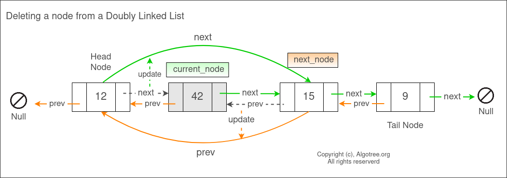

[146. LRU Cache](https://leetcode.com/problems/lru-cache/)

* Hash Table, Doubly Linked List, LinkedList, Design
* Amazon, Meta, Microsoft, Bloomberg, TikTok, Oracle, Google, Apple, ByteDance, Uber, Samsung, LinkedIn, Snap, Nvidia, Adobe, Saleforce
* Similar Questions:
  * [460. LFU Cache](https://leetcode.com/problems/lfu-cache/)


## Method 1. HashMap + Doubly-Linked List
```java
class LRUCache {

    private final int capacity;
    private final Map<Integer, Node> map;
    private final Node head;
    private final Node tail;

    public LRUCache(int capacity) {
        this.capacity = capacity;
        this.map = new HashMap<>();
        head = new Node(-1, -1);
        tail = new Node(-1, -1);
        head.next = tail;
        tail.prev = head;
    }
    
    public int get(int key) {
        Node node = map.get(key);
        if(node == null) {
            return -1;
        }
        moveToHead(node);   // Mark as the most recently visited
        return node.val;        
    }
    
    public void put(int key, int value) {
        Node node = map.get(key);
        if(node != null) {
            // Update the value and move to head
            node.val = value;
            moveToHead(node);
        } else {
            // Insert new node
            if(map.size() == capacity) {
                // Evict LRU
                Node nodeToRemove = tail.prev;
                removeNode(nodeToRemove);
                map.remove(nodeToRemove.key);
            }
            Node newNode = new Node(key, value);
            map.put(key, newNode);
            addAfterHead(newNode);
        }
    }

    private void moveToHead(Node node) {
        removeNode(node);
        addAfterHead(node);
    }

    private void removeNode(Node node) {
        node.prev.next = node.next;
        node.next.prev = node.prev;
    }

    private void addAfterHead(Node node) {
        node.next = head.next;
        node.prev = head;
        head.next.prev = node;
        head.next = node;
    }

    // Doubly-linked list node
    private static class Node {
        int key;
        int val;
        Node prev;
        Node next;
        Node(int k, int v) {
            this.key = k;
            this.val = v;
        }
    }
}
```

## Method 1. HashMap + Double Linked List
向 Doubly LinkedList 中添加一个新节点：


从 Doubly LinkedList 中删除一个节点：


For our `LRUCache` class, we need the following attributes:
* `capacity` - to detect when we need to start deleting key-value pairs.
* `dic` - short for dictionary, this will be our hash map that maps keys to nodes.
* `head` - the head of our linked list
* `tail` - the tail of our linked list

```Java
/*
1. The data structure supports deleting least recently used cache, so the elements should be saved in an ordered way. --> list
2. We need a map to store the index of each value: value --> index in the list
3. Delete the least recently used: --> delete the tail
4. Visit an element, put it into the head of the list
    Based on 3 and 4, we need a doubly linked list
*/
class LRUCache {
    private int capacity;
    private Map<Integer, ListNode> map;
    private ListNode head;
    private ListNode tail;

    public LRUCache(int capacity) {
        this.capacity = capacity;
        this.map = new HashMap<>();
        this.head = new ListNode(-1, -1);
        this.tail = new ListNode(-1, -1);
        this.head.next = this.tail;
        this.tail.prev = this.head;
    }
    
    public int get(int key) {
        if(!map.containsKey(key)) {
            return -1;
        }
        ListNode node = map.get(key);
        remove(node);   // Remove from the old position
        add(node);      // Add to the tail of the DLL
        return node.val;
    }
    
    public void put(int key, int value) {
        if(map.containsKey(key)) {
            ListNode oldNode = map.get(key);
            remove(oldNode);
        }
        ListNode node = new ListNode(key, value);
        map.put(key, node); // Update map
        add(node);  // Add the new node to the tail of DLL
        
        if(map.size() > capacity) {
            ListNode nodeToDelete = head.next;
            remove(nodeToDelete);
            map.remove(nodeToDelete.key);
        }
    }

    /* 在Doubly LinkedList中添加一个节点，涉及到四条边的修改。可以通过画图看的更清晰
     */
    private void add(ListNode node) {
        ListNode prevEnd = tail.prev;
        prevEnd.next = node;
        node.prev = prevEnd;
        node.next = tail;
        tail.prev = node;
    }

    private void remove(ListNode node) {
        node.prev.next = node.next;
        node.next.prev = node.prev;
    }
}

class ListNode {
    int key;
    int val;
    ListNode prev;
    ListNode next;

    public ListNode(int key, int val) {
        this.key = key;
        this.val = val;
    }
}

/**
 * Your LRUCache object will be instantiated and called as such:
 * LRUCache obj = new LRUCache(capacity);
 * int param_1 = obj.get(key);
 * obj.put(key,value);
 */
```
**Complexity Analysis:**
1. Time complexity: `O(1)` for both get and put.
    * For `get()`:
        * Check if a key is in a hash map. This costs `O(1)`.
        * Get a node associated with a key. This costs `O(1)`.
        * Call remove and add. Both methods cost `O(1)`.
    * For `put()`:
        * Check if a key is in a hash map. This costs `O(1)`.
        * If it is, we get a node associated with a key and call remove. Both cost `O(1)`.
        * Create a new node and insert it into the hash map. This costs `O(1)`.
        * Call add. This method costs `O(1)`.
        * If the capacity is exceeded, we call remove and delete from the hash map. Both cost `O(1)`
2. Space complexity: `O(capacity)`.  We use extra space for the hash map and for our linked list. Both cannot exceed a size of capacity.


## Method 2. Using build-in data structure
```Java
class LRUCache {
    private int capacity;
    private LinkedHashMap<Integer, Integer> map;

    public LRUCache(int capacity) {
        this.capacity = capacity;
        this.map = new LinkedHashMap<>(16, 0.75f, true) {
            @Override
            protected boolean removeEldestEntry(Map.Entry<Integer, Integer> eldest) {
                return size() > capacity;
            }
        };
    }
    
    public int get(int key) {
        return map.getOrDefault(key, -1);
    }
    
    public void put(int key, int value) {
        map.put(key, value);
    }
}
```
**Complexity Analysis:**
The complexity analysis is the same as in the first approach. We are implementing the same algorithm using the built-in data structures.
1. Time complexity: `O(1)` for both get and put.
2. Space complexity: `O(capacity)`

or
```java
class LRUCache extends LinkedHashMap<Integer, Integer>{
    private int capacity;
    
    public LRUCache(int capacity) {
        super(capacity, 0.75F, true);   // accessOrder - the ordering mode - true for access-order, false for insertion-order
        this.capacity = capacity;
    }

    public int get(int key) {
        return super.getOrDefault(key, -1);
    }

    // 这个可不写
    public void put(int key, int value) {
        super.put(key, value);
    }

    @Override
    protected boolean removeEldestEntry(Map.Entry<Integer, Integer> eldest) {
        return size() > capacity; 
    }
}
```

## Method 2. 循环链表 + dummy node
```java
/**
List: To store values. The recent used value is at the head, the least recent used at the tail. When eviction is needed, we can evict the tail directly.

Map: val --> ListNode, so that we can use the value to get the node for updating, deleting, etc.
 */
class LRUCache {

    private static class Node {
        int key;
        int value;
        Node prev;
        Node next;

        public Node(int key, int value) {
            this.key = key;
            this.value = value;
        }
    }

    private final int capacity;
    private final Node dummy = new Node(0, 0);
    private final Map<Integer, Node> keyToNode = new HashMap<>();

    public LRUCache(int capacity) {
        this.capacity = capacity;
        dummy.prev = dummy;
        dummy.next = dummy;
    }
    
    public int get(int key) {
        Node node = getNode(key);   // getNode() will move node to the head of linked list
        return node == null ? -1 : node.value;
    }
    
    public void put(int key, int value) {
        Node node = getNode(key);
        if(node != null) {
            node.value = value;
            return;
        }

        // Insert a new node
        node = new Node(key, value);
        keyToNode.put(key, node);
        pushFront(node);
        if(keyToNode.size() > capacity) {
            Node nodeToDelete = dummy.prev;
            keyToNode.remove(nodeToDelete.key);
            remove(nodeToDelete);
        }
    }

    // 获取 key 对应的节点，同时把该节点移动到 head of linked list
    private Node getNode(int key) {
        if(!keyToNode.containsKey(key)) {
            return null;
        }

        Node node = keyToNode.get(key);
        remove(node);
        pushFront(node);
        return node;
    }

    // 删除一个节点
    private void remove(Node node) {
        node.prev.next = node.next;
        node.next.prev = node.prev;
    }

    // 在链表头部添加一个节点
    private void pushFront(Node node) {
        node.prev = dummy;
        node.next = dummy.next;
        dummy.next.prev = node;
        dummy.next = node;        
    }
}
```

## Reference
* https://leetcode.com/problems/lru-cache/editorial/
* [Class java.util.LinkedHashMap<K,V>](https://docs.oracle.com/en/java/javase/17/docs/api/java.base/java/util/LinkedHashMap.html)
* LRU: Least Recently Used: 首先丢弃最近最少使用的项目。[Cache replacement policies](https://en.wikipedia.org/wiki/Cache_replacement_policies#LRU)
* [CNoodle: [LeetCode] 146. LRU Cache](https://www.cnblogs.com/cnoodle/p/12388160.html)
* LeetCodeCN: https://leetcode.cn/problems/lru-cache/solutions/259678/lruhuan-cun-ji-zhi-by-leetcode-solution/
* https://www.algotree.org/algorithms/linkedlists/doubly_linked_list/
  * 有张图很清晰的展示了要修改的四条边，即四个要修改的reference
* [源于 LinkedHashMap源码](https://leetcode.cn/problems/lru-cache/solutions/1/yuan-yu-linkedhashmapyuan-ma-by-jeromememory/)
* 灵茶山艾府: [【图解】一张图秒懂 LRU！（Python/Java/C++/Go/JS/Rust）](https://leetcode.cn/problems/lru-cache/solutions/2456294/tu-jie-yi-zhang-tu-miao-dong-lrupythonja-czgt/)