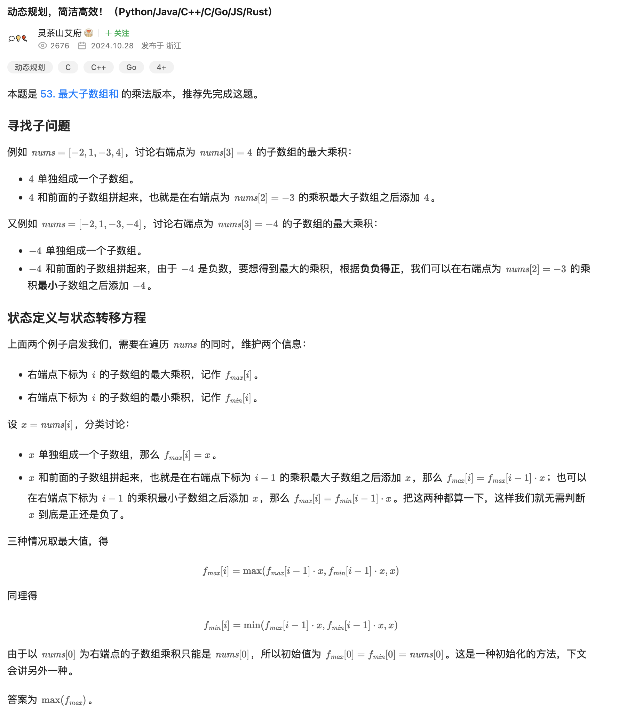

[152. Maximum Product Subarray](https://leetcode.com/problems/maximum-product-subarray/)   

* Amazon, Google, Bloomberg, Facebook, Adobe, ByteDance, Uber
* Array, Dynamic Programming
* Similar Questions:
    * [53. Maximum Subarray](https://leetcode.com/problems/maximum-subarray/)
    * House Robber
    * Product of Array Except Self
    * Maximum Product of Three Numbers
    * Subarray Product Less Than K

## 分析


## Method 1. One Pass with Two Array
```java
class Solution {
    public int maxProduct(int[] nums) {
        if(nums == null || nums.length == 0) {
            return 0;
        }
        
        int[] min = new int[nums.length];
        int[] max = new int[nums.length];
        min[0] = nums[0];
        max[0] = nums[0];
        
        int res = nums[0];
        for(int i=1; i<nums.length; i++) {
            min[i] = Math.min(nums[i], Math.min(min[i-1] * nums[i], max[i-1] * nums[i]));
            max[i] = Math.max(nums[i], Math.max(min[i-1] * nums[i], max[i-1] * nums[i]));
            res = Math.max(res, max[i]);
        }
        return res;
    }
}
```
**Complexity Analysis:**
1. Time complexity : `O(N)` where N is the size of nums. The algorithm achieves linear runtime since we are going through nums only once.
2. Space complexity : `O(N)` since no additional space is consumed rather than variables which keep track of the maximum product so far, 
the minimum product so far, current variable, temp variable, and placeholder variable for the result.


## Method 2. One Pass with Two Variable
With two variables to store the `maxSoFar` and `minSoFar`.

Key Points:
1. `maxSoFar = Math.max(nums[i], Math.max(maxSoFar * nums[i], minSoFar * nums[i]));`
2. Note: In the max function, `nums[i]` should not be replaced by `0`.

```java
class Solution {
    public int maxProduct(int[] nums) {
        if(nums == null || nums.length == 0) {
            return 0;
        }
        
        int minSoFar = nums[0];
        int maxSoFar = nums[0];
        int res = nums[0];
        for(int i=1; i<nums.length; i++) {
            int tmp = minSoFar;
            minSoFar = Math.min(nums[i], Math.min(minSoFar * nums[i], maxSoFar * nums[i]));
            maxSoFar = Math.max(nums[i], Math.max(tmp * nums[i], maxSoFar * nums[i]));
            res = Math.max(res, maxSoFar);
        }
        return res;
    }
}
```
or
```java
class Solution {
    public int maxProduct(int[] nums) {
        int ans = Integer.MIN_VALUE; // 注意答案可能是负数
        int fMax = 1;
        int fMin = 1;
        for (int x : nums) {
            int mx = fMax;
            fMax = Math.max(Math.max(fMax * x, fMin * x), x);
            fMin = Math.min(Math.min(mx * x, fMin * x), x);
            ans = Math.max(ans, fMax);
        }
        return ans;
    }
}
```
Complexity Analysis:
1. Time complexity : `O(N)` where N is the size of nums. The algorithm achieves linear runtime since we are going through nums only once.
2. Space complexity : `O(1)` since no additional space is consumed rather than variables which keep track of the maximum product so far, 
the minimum product so far, current variable, temp variable, and placeholder variable for the result.


## Reference
* LeetCodeCN: 灵茶山艾府: https://leetcode.cn/problems/maximum-product-subarray/solutions/2968916/dong-tai-gui-hua-jian-ji-gao-xiao-python-i778/