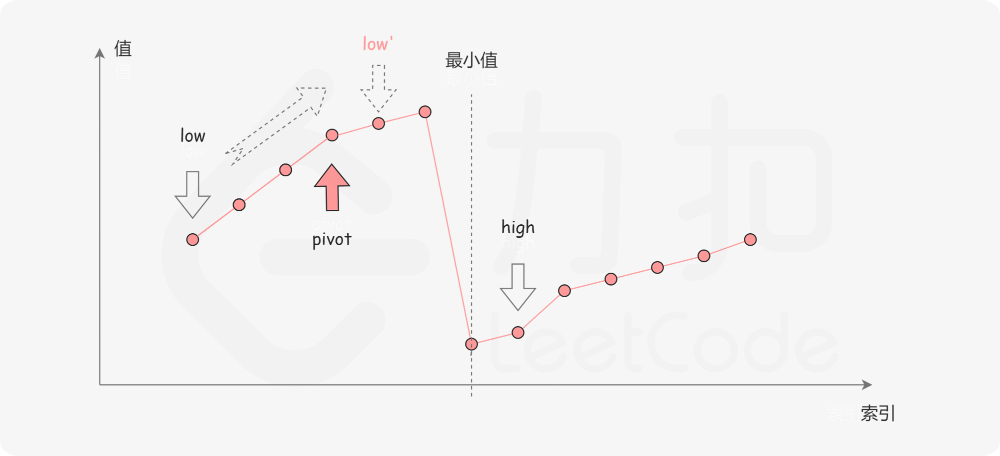

[153. Find Minimum in Rotated Sorted Array](https://leetcode.com/problems/find-minimum-in-rotated-sorted-array/)

* Amazon, Microsoft, Bloomberg, Google, Goldman Sachs, eBay, Apple
* Array, Binary Search
* Similar Questions:
    * Search in Rotated Sorted Array
    * Find Minimum in Rotated Sorted Array II
* Hints:
    * Array was originally in ascending order. Now that the array is rotated, there would be a point in the array where there is a small deflection from the increasing sequence. e.g. The array would be something like `[4, 5, 6, 7, 0, 1, 2]`.
    * You can divide the search space into two and see which direction to go. Can you think of an algorithm which has O(logN) search complexity?
    * All the elements to the left of inflection point > first element of the array; all the elements to right of inflect point < first element of the array.
    

## Binary Search
Algorithm:
1. Find the `mid` element of the array;
2. If `mid element > first element of array`, this means that we need to look for the inflection point(拐点) on the right of `mid` (也就是从 `lo` 到 `mid`，这是升序区间，因此不可能存在拐点); 
3. If `mid element < first element of array`, this means that we need to look for the inflection point on the left of `mid`.
4. We stop the search when we find the inflection point, when either of the two conditions is satisfied:
    * `nums[mid] > nums[mid+1]`, hence, `mid+1` is the smallest;
    * `nums[mid-1] > nums[mid+1]`, hence, `mid` is the smallest.
    

```java 
class Solution {
    public int findMin(int[] nums) {
        // If the list hash just one element then directly return this element.
        if(nums.length == 1) {
            return nums[0];
        }
        
        // Initializeing left and right pointers.
        int left = 0;
        int right = nums.length - 1;
        
        // If the last element is greater than the first element then there is no rotation.
        // e.g. 1 < 2 < 3 < 4 < 5 < 7. Already sorted array. 
        // Hence the smallest elelent is first element, nums[0].
        if(nums[right] > nums[0]) {
            return nums[0];
        }
        
        // Binary search way
        while(left <= right) {
            int mid = left + (right - left) / 2;
            
            // If the mid element is greater than its next element then mid+1 element is the smallest
            // This point would be the point of change. From higher to lower value
            if(nums[mid] > nums[mid+1]) {
                return nums[mid+1];
            }
            
            // If the mid element is less than its previous element then mid element is the smallest
            if(nums[mid-1] > nums[mid]) {
                return nums[mid];
            }
            
            // If the mid element value is greater than the 0-th element this means the least value is
            // still somewhere to the right as we are still dealing with elements greater than nums[0]
            if(nums[mid] > nums[0]) {
                left = mid + 1;
            } else {
                right = mid - 1;
            }
        }
        return -1;
    }
}
```
**Complexity Analysis:**
1. Time Complexity: Same as Binary Search `O(logN)`
2. Space Complexity: `O(1)`


## Method 2. Binary Search



**分析：**
1. 如果 `nums[mid] < nums[hi]`，说明从 `mid` 到 `hi` 之间是单调递增的，此时 `nums[mid]` 有可能是最小值。
2. 如果 `nums[mid] >= nums[hi]`，说明 valley 在 `mid` 和 `hi` 之间，并不包括 `nums[mid]`
```java 
class Solution {
    public int findMin(int[] nums) {
        int lo = 0;
        int hi = nums.length - 1;
        while(lo < hi) {    // 必须是 < , 才能保证至少有两个 element 用于比较
            int mid = lo + (hi - lo) / 2;
            if(nums[mid] < nums[hi]) {  // The right half part is ascending order
                hi = mid;
            } else {        // The range [lo, mid] is ascending order, therefore mid+1 cannot be the smallest element
                lo = mid + 1;
            }
        }
        return nums[lo];
    }
}
```


## Method 3. Binary Search
> 这道题最终要求返回的是 `nums[l]`。同样，可以写成 Edge Case 处理，也可以使用 `while l < r` or `while l+1 < r` 来解。
```java 
class Solution {
    public int findMin(int[] nums) {
        int l = 0;
        int r = nums.length - 1;
        while(l + 1 < r) {
            int mid = l + (r - l) / 2;
            if(nums[mid] > nums[r]) {   // the inflection point is between `mid` and `r`
                l = mid;
            } else {
                r = mid;
            }
        }
        return Math.min(nums[l], nums[r]);
    }
}
```


## ✅⭐Method 4. Binary Search, compare with the last element
```java
/*
[4,5,6,7,0,1,2]
Goal: To find the index of 0, which is 4, i.e. rotating 4 times
0 is the first element, which is smaller than its previous num
*/
class Solution {
    public int findMin(int[] nums) {
        if(nums == null || nums.length == 0) {
            return Integer.MIN_VALUE;
        }

        int left = 0;
        int right = nums.length - 1;
        while(left < right) {
            int mid = left + (right - left) / 2;
            if(nums[mid] < nums[nums.length-1]) {
                right = mid;
            } else {
                left = mid + 1;
            }
        }
        // after while-loop, left == right
        // [start, ..., right]
        // [right, ..., end] ascending order
        return nums[left];
    }
}
```


## Reference
* LeetCodeCN: [和最后一个数比大小，简洁二分（Python/Java/C++/Go）](https://leetcode.cn/problems/find-minimum-in-rotated-sorted-array/solutions/1987499/by-endlesscheng-owgd/)