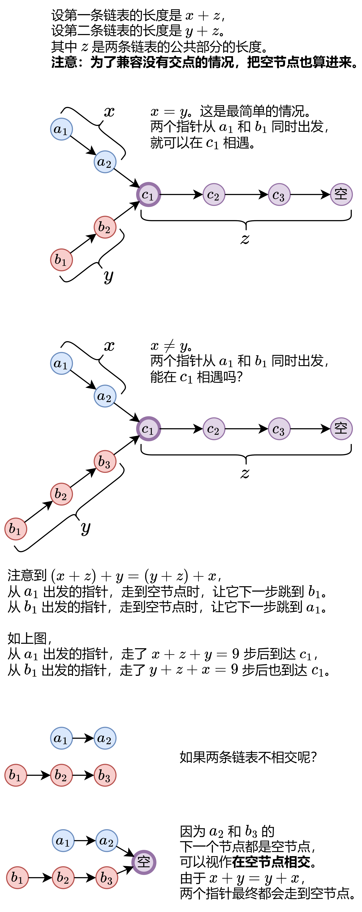

[160. Intersection of Two Linked Lists]()


## Method 1.

要点：
1. (x + z) + y = (y + z) + x
2. 为了兼容没有交点的情况，把空节点(`null`)也算进来。
```java
public class Solution {
    public ListNode getIntersectionNode(ListNode headA, ListNode headB) {
        ListNode p1 = headA;
        ListNode p2 = headB;

        while(p1 != p2) {
            p1 = (p1 == null) ? headB : p1.next;
            p2 = (p2 == null) ? headA : p2.next;
        }
        return p1;
    }
}
```
**复杂度分析**
* 时间复杂度：O(m+n)，其中 m 是第一条链表的长度，n 是第二条链表的长度。除了交点，每个节点会被指针 p 访问至多一次，每个节点会被指针 q 访问至多一次。
* 空间复杂度：O(1)。


## Reference
* 灵茶山艾府: [【图解】一张图秒懂相交链表！（Python/Java/C++/C/Go/JS）](https://leetcode.cn/problems/intersection-of-two-linked-lists/solutions/2958778/tu-jie-yi-zhang-tu-miao-dong-xiang-jiao-m6tg1/)