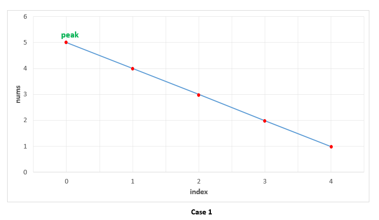
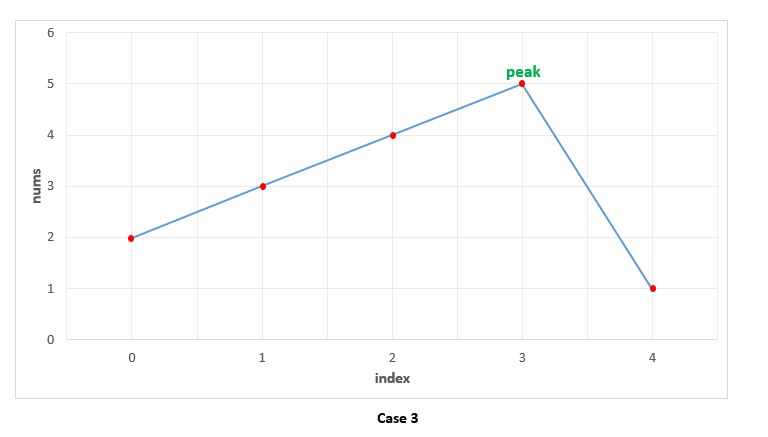

[162. Find Peak Element](https://leetcode.com/problems/find-peak-element/)


* Array, Binary Search
* Facebook, Amazon, Adobe, Google, Apple, TikTok, Uber, Bloomberg, Microsoft, SnapChat, Roblox, Goldman Sachs
* Similar Questions:
    * Peak Index in a Mountain Array
    * 1283
    * 1011
    * 875
    * 774
    

## Method 1. Linear Scan

* Case 1. All the numbers appear in a descending order. In this case, the first element corresponds to the peak element. 则`nums[0] > nums[1]`, `nums[0]`即为peak。


* Case 2. All the elements appear in ascending order. In this case, we keep on comparing `nums[i]` with `nums[i+1]` to determine if `nums[i]` is the peak element or not. None of the elements satisfy this criteria, indicating that we are currently on a rising slope and not on a peak. Thus, at the end, we need to return the last element as the peak element, which turns out to be correct. 整个数组是递增的，没有两个elements满足`nums[i] > nums[i+1]`，则最后一个element就是结果。


* Case 3. The peak appears somewhere in the middle. In this case, when we are traversing on the rising edge, as in Case 2, none of the elements will satisfy `nums[i]>nums[i+1]`.

```Java
class Solution {
    public int findPeakElement(int[] nums) {
        for(int i=0; i<nums.length-1; i++) {
            if(nums[i] > nums[i+1]) {
                return i;
            }
        }
        return nums.length - 1;
    }
}
```
**Complexity Analysis:**
1. Time complexity: `O(n)`. We traverse the `nums` array of size `n` once only.
2. Space complexity: `O(1)`. Constant extra space is used.


## Method 2. Iterative Binary Search
```java 
class Solution {
    public int findPeakElement(int[] nums) {
        int left = 0;
        int right = nums.length - 1;
        while(left < right) {
            int mid = left + ((right - left) >> 1);
            if(nums[mid] < nums[mid+1]) {   // nums[mid] cannot be the peak
                left = mid + 1;
            } else {    // nums[mid] >= nums[mid+1]
                right = mid;
            }
        }   // After the while loop, left >= right
        return left;
    }
}
```
**Complexity Analysis:**
1. Time complexity: `O(log2(n))`. We reduce the search space in half at every step. Thus, the total search space will be consumed in `log2(n)` steps. Here, `n` refers to the size of `nums` array.
2. Space complexity: `O(1)`. Constant extra space is used.

**✅ 分析:** `lo < hi` (`left < right`)
* 一种实现二分查找的高级方法。
* ✅ 查找条件需要访问元素的直接右邻居。比如，在本题中, `nums[i]`要和`nums[i+1]`进行比较,`nums[i+1]`是`nums[i]`的直接右邻居。
* 与元素的右邻居相互比较来确定是否满足条件，并决定是向左还是向右。
* 保证查找空间在每一步中至少有 2 个元素，即`lo < hi`。如果while-loop条件是`lo <= hi`,则最后一次进入while-loop，搜索空间只有一个element。
* 需要进行后处理。当你剩下 1 个元素时，循环/递归结束。需要评估剩余元素是否符合条件。


## Method 3. Recursive Binary Search
```Java 
class Solution {
    public int findPeakElement(int[] nums) {
        return search(nums, 0, nums.length-1);
    }
    
    private int search(int[] nums, int l, int r) {
        if(l == r) {
            return l;
        }
        int mid = l + (r - l) / 2;
        if(nums[mid] > nums[mid+1]) {
            return search(nums, l, mid);
        }
        return search(nums, mid+1, r);
    }
}
```
**Complexity Analysis:**
1. Time complexity: `O(log n)`. We reduce the search space in half at every step. Thus, the total search space will be consumed in `log2(n)` steps. Here, `n` refers to the size of `nums` array.
2. Space complexity: `O(log n)`. We reduce the search space in half at every step. Thus, the total search space will be consumed in `log2(n)` steps. Thus, the depth of recursion tree will go upto `log2(n)`. 


## 总结
> 除了本文所介绍的二分查找的应用方式，二分查找其实还有很多其他的变体和应用，但它们基本上是**循环条件**，**判断条件**，**边界更新方法**的不同组合，
> 例如，有的二分查找的循环条件可以是 `while(left + 1 < right)`，有的边界的更新的条件需要依赖 `nums[left]`, `nums[mid]`, `nums[mid+1]`, `nums[right]`四个值的相互关系。

| 查找方式        | 循环条件           | 左侧更新           | 右侧更新           | 中间点位置                             | 返回值         |
| :--------:     | :-------:         | :-------:         | :-------:         | :---------:                           | :-----:       |
| 标准二分查找    | `left <= right`   | `left = mid - 1`  | `right = mid + 1` | `left + ((right - left) >> 1)`        | `-1/mid`      |
| 二分找左边界    | `left < right`    | `left = mid - 1`  | `right = mid`     | `left + ((right - left) >> 1)`        | `-1/left`     |
| 二分找右边界    | `left < right`    | `left = mid`      | `right = mid - 1` | `left + ((right - left) >> 1) + 1`    | `-1/right`    |


## Reference
* https://leetcode.com/problems/find-peak-element/editorial/
* [CNoodle [LeetCode] 162. Find Peak Element](https://www.cnblogs.com/cnoodle/p/11791474.html)
* [[LeetCode] 二分查找模板 binary search](https://www.cnblogs.com/cnoodle/p/14267991.html)