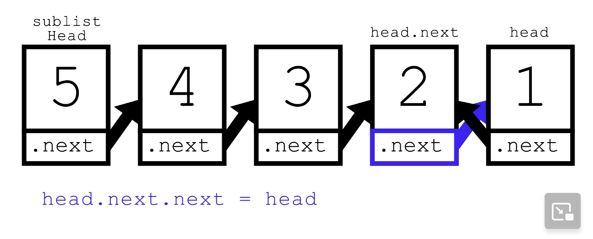

[206. Reverse Linked List](https://leetcode.com/problems/reverse-linked-list/description/)

* Amazon, Bloomberg, Microsoft, Apple, Adobe, Google, Yandex, TikTok
* LinkedList, Recursion


## Method 1. Iterative ✅(空间上更优)
```Java
/**
 * Definition for singly-linked list.
 * public class ListNode {
 *     int val;
 *     ListNode next;
 *     ListNode() {}
 *     ListNode(int val) { this.val = val; }
 *     ListNode(int val, ListNode next) { this.val = val; this.next = next; }
 * }
 */
/**
 1   2   3   4   5
 h
 prev        n

 Update:
 1. head.next = prev;
 2. head move to next (we need a pointer to track the original next, next prev)
 */
class Solution {
    public ListNode reverseList(ListNode head) {
        ListNode prev = null;
        while(head != null) {
            ListNode next = head.next;
            head.next = prev;
            prev = head;
            head = next;
        }
        return prev;
    }
}
```
**Complexity analysis:**
1. Time complexity : `O(n)`.  Assume that nnn is the list's length, the time complexity is `O(n)`.
2. Space complexity : `O(1)`


## Method 2. Recursive

```Java
class Solution {
    public ListNode reverseList(ListNode head) {
        // Base case
        if(head == null || head.next == null) {
            return head;
        }
        ListNode reversedSublist = reverseList(head.next);
        head.next.next = head;
        head.next = null;
        
        return reversedSublist;
    }
}
```
**Complexity Analysis:**
1. Time complexity : `O(n)`. Assume that `n` is the list's length, the time complexity is `O(n)`.
2. Space complexity : `O(n)`. The extra space comes from **implicit stack space** due to recursion. The recursion could go up to `n` levels deep.


## Conclusion
因为iteration的方法更好，因为space complexity是`O(1)`，而recursion的space complexity是`O(n)`，因为每次调用`reverseList()`都需要implicit stack。


## Reference
* https://leetcode.com/problems/reverse-linked-list/editorial/