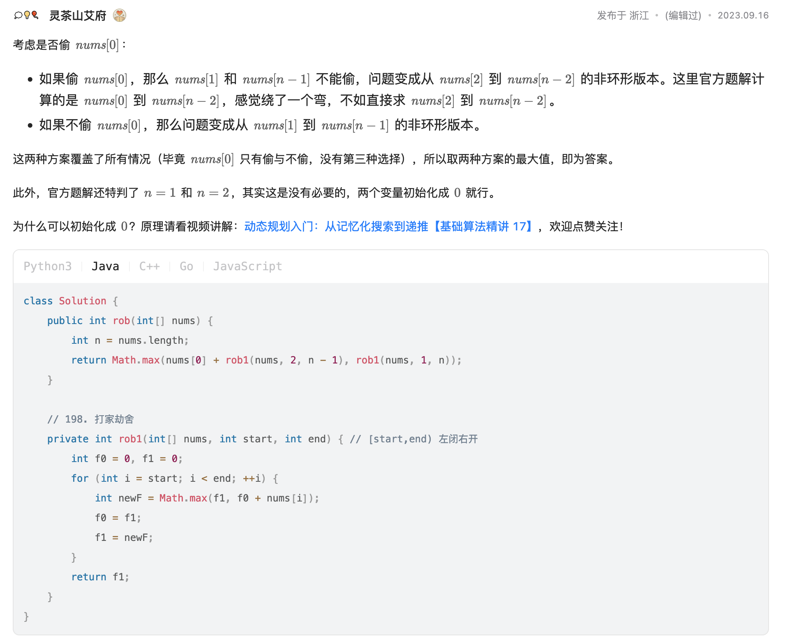

[213. House Robber II](https://leetcode.com/problems/house-robber-ii/)

* Array, Dynamic Programming
* Databricks, Microsoft, Amazon, Google, Apple, Bloomberg, TikTok, Uber


## Method 1. Dynamic Programming

```java
class Solution {
    public int rob(int[] nums) {
        int n = nums.length;
        return Math.max(nums[0] + rob(nums, 2, n-1), rob(nums, 1, n));
    }

    // [start,end) 左闭右开
    private int rob(int[] nums, int start, int end) {
        int prev1 = 0;
        int prev2 = 0;
        for(int i=start; i<end; i++) {
            int newValue = Math.max(prev2, prev1 + nums[i]);
            prev1 = prev2;
            prev2 = newValue;
        }

        return prev2;
    }
}
```
**复杂度分析:**
* 时间复杂度：O(n)，其中 n 是数组长度。需要对数组遍历两次，计算可以偷窃到的最高总金额。
* 空间复杂度：O(1)。


## Reference
* LeetCodeCN: https://leetcode.cn/problems/house-robber-ii/solutions/722767/da-jia-jie-she-ii-by-leetcode-solution-bwja/comments/2127790